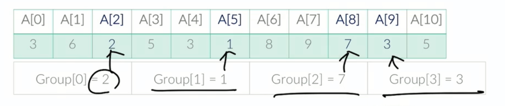
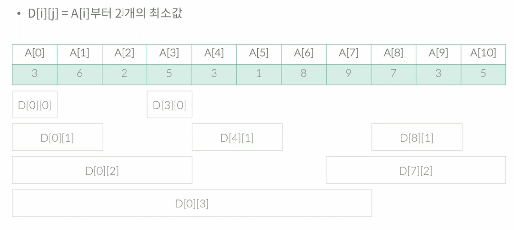
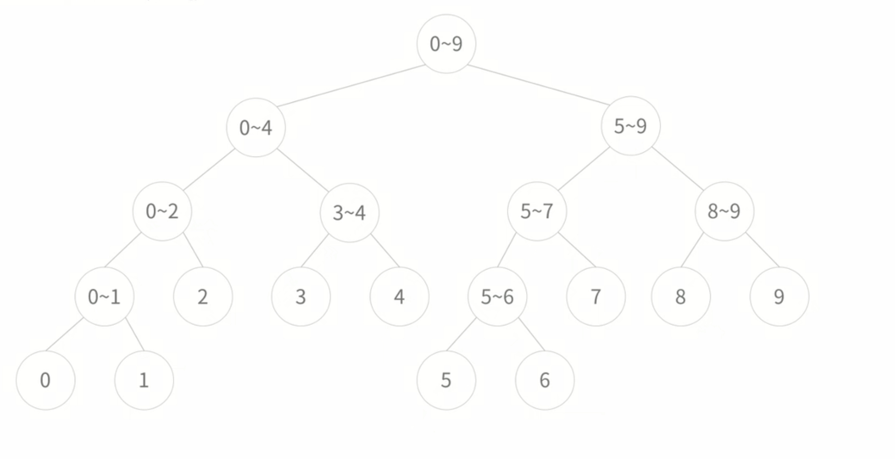

# Segment Tree

###### 2020.03.05

- segment tree란 RMQ라는 문제를 풀기 위한 자료구조이다.

## RMQ

- Range Minimum Query
- 구간의 최소값 구하기
- 배열 A[1], ..., A[N]이 있고, 다음과 같은 연산을 수행해야 한다.
  - 최소값 : A[i], ..., A[j] 중에서 최소값을 찾아 출력한다.
- 이러한 연산이 총 Q개 주어진다.
- 한번 하는데 주어지는데 걸리는 시간 : O(N)
- Q개 : O(NQ)

### 방법 1 : 루트 N으로 나누기

- sqrt decomposition
- N개의 수를 루트N개의 그룹으로 나누면, 그룹당 루트N개의 수가 있을 것이다.
- 그룹의 개수와 그룹에 들어있는 숫자의 수가 같다는 점을 이용한 것
- R = 루트 N이라고 했을 때
- A를 R개의 그룹으로 나눈 다음에, Group[i]에 번 그룹의 최소값을 저장하는 방식
    
- 선처리(preprocessing) : query를 실행하기 전에 query를 효율적으로 저장할수 있도록 하는 것 - O(N)
    ```python
    for i in range(n):
        # r : group의 갯수
        if i%r == 0:
            group[i//r] = a[i]
        else:
            group[i//r] = min(group[i//r], a[i])
    ```
- i부터 j까지중 최소 구하기
  - 최솟값을 구하는 쿼리 i, j는 두가지 경우가 있다. (i <= j)
    1. i와 j가 같은 그룹인 경우 : group[i]
    2. 아닌 경우
        - i가 있는 그룹, j가 있는 그룹, 사이에 있는 그룹 세개로 나누어야 한다.
        - i가 있는 그룹은 오른쪽으로 가면서 하나씩 비교해 가장 작은 값을
        - j가 있는 그룹은 왼쪽으로 가면서 하나씩 비교해 가장 작은 값을
        - 아이의 그룹들중에는 group[i//r]중 가장 작은 값을
        - 이 세 값들 중 가장 작은 값이 최솟값이다.
 - 시간복잡도 : O(N + Q*루트N)


### 방법 2 : 다이나믹 프로그래밍

- D[i][j] = A[i]부터 2**j개의 최소값
- A[i]부터 2^j개의 최소값은 A[i]부터 2^(j-1)개의 최소값과 A[i+2^(j-1)]부터 2^(j-1)개의 최소값과 같다.
- ```python
    D[i][j] = min(D[i][j-1], D[i+2**(j-1)][j-1])
    ```
- 전체 다이나믹 배열의 크기 : j의 최댓값은 logN이니까
  - 선처리시간 : O(NlogN)
  - 배열 크기 : NlogN
- 코드
    ```python
    # 전처리
    for i in range(n):
        d[i][0] = a[i]
    
    for j in range(1, 17):
        for i in range(n):
            if i + 2**j - 1 < n:
                d[i][j] = min(d[i][j], d[i+d**(j-1)][j-1])
            else:
                break

    # 값 구하기
    res = a[start]
    k = 16
    while start <= end and k >= 0:
        if start + 2**k -1 <= end:
            res = min(res, d[start][k])
            start += 2**k
        k -= 1
    ```
    > 위 소스에서 16은 문제의 N 제한이 10만이기 때문에, 임의로 정한 값 <br />
    > 2^16 = 65536이라, 2^17 크기를 가지는 경우는 없기 때문
- 시간복잡도 : O(NlogN + QlogN)


### 방법 3 : 세그먼트 트리
- 세그먼트 트리란 : 임의의 노드가 무조건 자식을 두개 가지고있거나 가지고 있지 않은 바이너리 트리
- 그리고 트리의 모든 노드는 구간을 담당하고 있다. 그 구간은 start부터 end까지 구간의 최소값을 가지고 있다.
    
- 세그먼트 트리를 저장하는 가장 좋은 방법 : 배열 (힙과 유사)
- 노드가 담당하는 구간의 크기가 2K라면, 왼쪽 자식과 오른쪽 자식의 크기는 K이다.
- 구간의 크기가 2K+1인 경우에는 왼쪽, 오른쪽 자식의 크기는 K+1, K가 된다.
- 따라서, 모든 리프 노드의 높이 차이는 0 또는 1이다.
- 각 노드에는 노드가 담당하는 구간 start, end와 저장되는 배열의 인덱스 num 세걔의 요소가 저장된다.
- 높이 H = logN을 ceiling한 값
- 필요한 배열의 크기 : 2^(H+1)
- 전처리 코드
    ```python
    # tree 초기화
    # tree: 트리 저장 배열
    # a : a[i] 에 들어있는 수
    def init(tree, a, idx, start, end):
        if start == end:
            tree[idx] = a[start]
        else:
            init(tree, a, idx*2, start, (start+end)/2)
            init(tree, a, idx*2+1, (start+end)/2+1, end)
            tree[idx] = min(tree[idx*2], tree(idx*2+1))
    ```
- 트리 만드는 시간 : O(NlogN)
- 최솟값 구하는 코드
    ```python
    def query(tree, idx, start, end, i, j):
        if i > end or j < start: return -1
        if i <= start and end <= j: return tree[idx]
        m1 = query(tree, 2*idx, start, (start+end)/2, i, j)
        m2 = query(tree, 2*node+1, (start+end)/2+1, end, i, j)
        if m1 == -1:
            return m2
        elif m2 == -1:
            return m1
        else:
            return min(m1, m2)
    ```
- 구간에 대한 연산은 세그먼트 트리로 뭐든 할 수 있다.