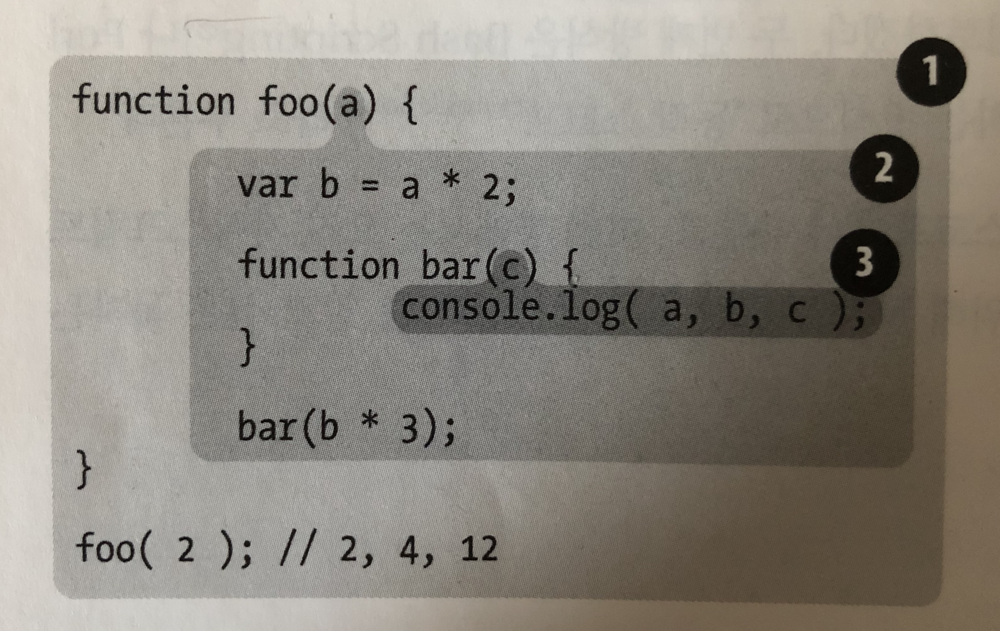

# Lexical Scope

###### 2020.04.08

## 렉싱 타임

- 렉시컬 스코프 : 렉싱타임에 정의되는 스코프
- 렉싱처리 과정에서는 소스 코드 문자열을 분석하여 상태 유지 파싱의 결과로 생성된 토큰에 의미를 부여하는데, 이 개념이 렉시컬 스코프의 바탕이 된다.
- 즉, 렉시컬 스코프는 프로그래머가 코드를 짤 때 변수와 스코프 블록을 어디서 작성하는가에 기초해서 렉서가 코드를 처리할 때 확정된다.

  - **버블1**은 글러벌 스코프를 감싸고 있고, 해당 스코프 안에는 오직 하나의 확인자(foo)만 있다.
  - **버블2**는 foo의 스코프를 감싸고 있고, 해당 스코프는 3개의 확인자(a, bar, b)를 포함한다.
  - **버블3**은 bar의 스코프를 감싸고 있고, 해당 스코프는 하나의 확인자(c)만을 포함한다.

## 검색
- 엔진은 스코프 버블의 구조와 상대적 위치를 통해 어디를 검색해야 확인자를 찾을 수 있는지 안다.
- 스코프는 목표와 일치하는 대상을 찾는 즉시 검색을 중단한다. ( 즉, 변수 `c`가 `bar()`와 `foo()` 내부에 모두 존재한다고 가정하면, `console.log()` 구문은 `bar()` 내부에 있는 `c`를 찾아서 사용하고 `foo()`에는 `c`를 찾으러 가지도 않는다.
- **섀도잉(Shadowing)**: 여러 중첩 스코프 층에 걸쳐 같은 확인자 이름을 정의하는 것
- 어떤 함수가 어디서 또는 어떻게 호출되는지에 상관없이 함수의 렉시컬 스코프는 함수가 선언된 위치에 따라 정의된다.
- 렉시컬 스코프의 검색 과정은 `a`, `b`, `c`와 같은 일차 확인자 검색에만 적용된다. (`foo.bar.baz`의 참조를 찾는다고 하면 렉시컬 스코프 검색은 `foo` 확인자를 찾는 데 사용되지만, 일단 `foo`를 찾고 나서는 객체 속성 접근 규칙을 통해서 `bar`와 `baz`의 속성을 각각 가져온다.)

## 렉시컬 스코프 속이기
- `eval()`함수나 `with`키워드는 렉시컬 스코프를 속이는 대표적인 방법이지만, **렉시컬 스코프를 속이는 방법은 성능을 떨어뜨리는 큰 이유이므로 사용하지 않는 편이 좋다.**