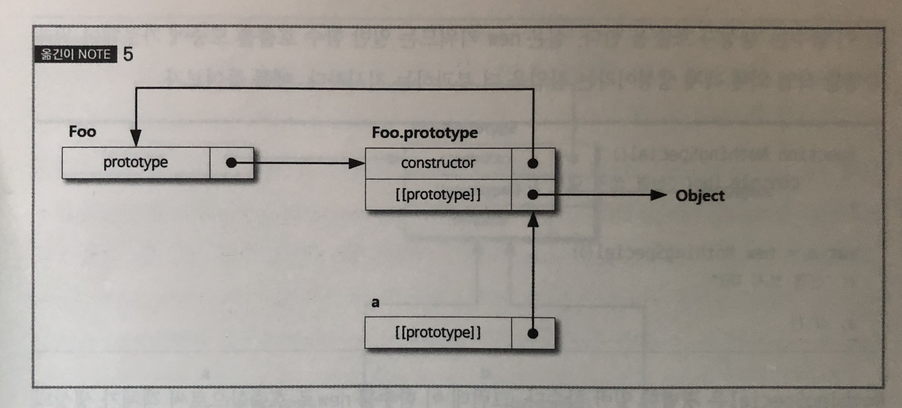

# 프로토타입 (Prototype)

###### 2020.05.23

## I. [[Prototype]]
- 자바스크립트는 객체가 생성되면, 무조건 그 안에 `[[Prototype]]`이라는 다른 객체를 참조하는 프로퍼티를 생성한다.
```js
var anotherObject = {
  a: 2
};

var myObject = Object.create(anotherObject);

myObject.a;   // 2
```
- `myObject.a`처럼 객체 프로퍼티 참조시 `[[Get]]`이 호출되는데, 기본적으로 객체 자체의 해당 프로퍼티가 존재하는지 찾아보고 존재하면 그 프로퍼티를 사용한다.
- `myObject`에 `a`란 프로퍼티가 없으면 이 객체의 `[[Prototype]]` 링크를 따라가서 수색한다.
- 이 경우, `[[anotherObject]]`에서 2라는 값을 대신 찾아서 프로퍼티 접근의 결괏값을 반환한다.
- 만약 `anotherOBject`에서도 못찾으면 `[[Prototype]]` 연쇄를 다시 따라 올라가고 연쇄 끝에 이르러서도 프로퍼티가 발견되지 않으면 `[[Get]]`은 결괏값으로 `undefined`를 반환한다.
- `for ... in` 루프에서 객체를 순회할 때도 `[[Prototype]]` 연쇄의 검색 과정과 비슷한 방식으로 연쇄를 통해 손길이 닿는 프로퍼티라면 죄다 열거한다.

### 1. `Object.prototype`
- `[[Prototype]]` 연쇄는 결국 내장 프로토타입 `Object.prototype`에서 끝난다.
- 모든 자바스크랩트 객체는 `Object.prototype` 객체의 자손이므로 여기에는 자바스크립트에서 두루 쓰이는 다수의 공통 유틸리티가 포함되어 있다. (`toString()`, `valueOf()`, `hasOwnProperty()`, `isPrototypeOf()`, ...)

### 2. 프로퍼티 세팅과 가려짐
```js
myObject.foo = "bar";
```
- 객체 프로퍼티 세팅은 단지 어떤 객체에 프로퍼티를 새로 추가하거나 기존 프로퍼티 값을 바꾸는 것 이상의 의미가 있다.
- `foo`라는 이름의 평범한 데이터 접근 프로퍼티가 `myObject` 객체에 직속된 경우 이 할당문은 기존 프로퍼티 값을 고치는 단순한 기능을 할 뿐이다.
- `foo`라는 프로퍼티명이 `myObject` 객체와 이 객체를 기점으로 한 `[[Prototype]]` 연쇄의 상위 수준 두곳에서 동시에 발견될 때, 이를 **가려짐**이라 한다. (`myObject`의 직속 프로퍼티로 인한 상위 연쇄의 `foo`가 가려진다.)
- 직속이 아니라면 `[[Prototype]]` 연쇄를 순회하기 시작하고 그렇게 해도 `foo`가 발견되지 않으면 그제야 `foo`라는 프로퍼티를 `myObject` 객체에 추가한 후 주어진 값을 할당한다. 이럴 경우 사실 미묘한 일들이 벌어지는데 아래와 같다.
  1. `[[Prototype]]` 연쇄의 상위 수준에서 `foo`라는 이름의 일반 데이터 접근 프로퍼티가 존재하는데, 읽기전용이 아닐 경우(writable: true), **`myObject`의 직속 프로퍼티 `foo`가 새로 추가되어 결국 가려짐 프로퍼티가 된다.**
  2. `[[Prototype]]` 연쇄의 상위 수준에서 `foo`라는 이름의 일반 데이터 접근 프로퍼티가 존재하는데, 읽기전용일 경우(writable: false), 어떠한 일도 일어나지 않는다. (엄격모드에서는 에러를 뱉는다.) **어쨋든 가려짐은 발생하지 않는다.**
  3. `[[Prototype]]` 연쇄의 상위 단계에서 발견된 `foo`가 세터일 경우, 항상 이 세터가 호출된다. `myObject`에 가려짐 프로퍼티 `foo`를 추가하지 않으며 `foo` 세터를 재정의하는 일 또한 없다.
- `2`, `3`번에서 `foo`를 가리려면 `=` 할당 연산자를 쓰면 안되고 `Object.defineProperty()` 메서드를 사용하여 `myObject`에 `foo`를 추가해야 한다.
- 가려짐은 이용 가치에 비해 지나치게 복잡하고 애매한 구석이 있어서 될 수 있으면 사용하지 않는게 좋다.
- `작동 위임`(나중에 설명)이라는 대안적인 디자인 패턴을 통해 좀 더 깔끔하게 가려짐을 대체할 수 있다.
- 가려짐은 아래와 같은 혼란을 가져올 수 있다.
  ```js
  var anotherObject = {
    a: 2
  };
  var myObject = Object.create(anotherObject);
  anotherObject.a;                      // 2
  myObject.a;                           // 2
  anotherObject.hasOwnProperty("a");    // true
  myObject.hasOwnProperty("a");         // false
  myObject.a++;                         // 허걱, 암시적인 가려짐이 발생한다!
  anotherObject.a;                      // 2
  myObject.a;                           // 3
  myObject.hasOwnProperty("a");         // true
  ```
  - 겉보기엔 `myObject.a++`이 `anotherObject.a` 프로퍼티를 찾아 1만큼 증가시킬 것 같지만 `++` 연산자는 결국 `myObject.a = myObject.a + 1`을 의미해 의도와 다른 결과를 만들어낸다.
  - `anotherObject.a`를 1만큼 증가시킬 의도라면 `anotherObject.a++`이 유일한 정답이다.


## II. 클래스

> 자바스크립트는 여타 클래스 지향 언어에서 제공하는 클래스라는 추상화된 패턴이나 설계가 전혀 없고, 다만 객체만 있을 뿐이다.

### 1. 클래스 함수
- **자바스크립트의 모든 함수는 기본적으로 프로토타입이라는 공용 & 열거불가 프로퍼티를 가진다.**
  ```js
  function Foo() {
    // ...
  }
  // 위와 같은 함수를 만들면 엔진은 함수의 내부에 Object.prototype을 프로토타입 링크하는 Foo.prototype이라는 객체 프로퍼티를 생성한다.

  var a = new Foo();
  Object.getPrototypeOf(a) === Foo.prototype; // true
  ```
  - 이 객체를 보통 `Foo`의 프로토타입이라고 하는데, `Foo.prototype`이라고 명명된 프로퍼티 레퍼런스를 통해 접근하기에 그렇게 부른다.
  - `new Foo()`로써 만들어진 모든 객체는 결국 `Foo.prototype` 객체와 `[[Prototype]]` 링크로 연결된다.
- 클래스 지향 (상속) vs 프로토타입 (위임)
  |클래스 지향 | 프로토타입 |
  |---|---|
  |상속 | 위임 |
  |한 클래스를 다중 복사(인스턴스화)할 수 있다. | 자바스크립트는 이러한 복사 과정이 전혀 없고 클래스에서 여러 인스턴스를 생성할 수도 없다. |
  |클래스 인스턴스화 자체가 *클래스 작동 계획을 실제 객체로 복사하는 것*이므로 인스턴스마다 복사가 일어난다. | 어떤 공용 객체에 `[[Prototype]]`으로 연결된 객체를 다수 생성하는 건 가능하지만 기본적으로 어떠한 복사도 일어나지 않아서 결과적으로 **자바스크립트에서 객체들은 서로 완전히 떨어져 분리되는 것이 아니라 끈끈하게 연결된다.**|
  |상속은 기본적으로 복사를 수반 | 두 객체에 링크를 걸어두고 한쪽이 다른 쪽의 프로퍼티/함수에 접근할 수 있도록 위임한다.|

### 2. 생성자
```js
function Foo() {
  // ...
}

Foo.prototype.constructor === Foo;  // true

var a = new Foo();
a.constructor === Foo;  // true
```
- `Foo` 함수는 생성자가 아닌 그냥 보통 함수일 뿐이고, `new` 키워드를 통해 호출했을 때 생성자로서의 역할을 한다.
- `Foo.prototype`객체에는 기본적으로 열거 불가능한 공용 프로퍼티 `.constructor`가 세팅되는데, 이는 객체 생성과 관련된 함수(`Foo`)를 다시 참조하기 위한 레퍼런스다.
- 마찬가지로 `new Foo()`로 생성한 객체 `a`도 `.constructor` 프로퍼티를 갖고 있어서 **자신을 생성한 함수를 가리킬 수 있다.**
- 하지만!!!!!!
  - `a.constructor === Foo`가 `true`임은 `a`에 `Foo`를 참조하는 `.constructor`라는 프로퍼티가 실재함을 의미할까???
  - 아니다.
  - 헷갈리게 보일 뿐 실은 `.constructor` 역시 `Foo.prototype`에 위임된 레퍼런스로서 `a.constructor`는 `Foo`를 가리킨다.
  - 즉, `.constructor` 프로퍼티는 '*~에 의해 생성됨*'이란 의미를 갖는게 아니다!
  
- `Foo.prototype`의 `.constructor` 프로퍼티는 기본적으로 선언된 `Foo` 함수에 의해 생성된 객체에만 존재한다. 즉, 아래와 같을 경우에는 존재하지 않는다.
  ```js
  function Foo() { /* ... */ }
  Foo.prototype = { /* ... */ }

  var a1 = new Foo();
  a1.constructor === Foo;     // false
  a1.constructor === Object;  // true
  ```
  > `a1`에서 constructor를 찾았는데 없어서 Foo.prototype에서 찾고, 그 객체는 Object.prototype을 가리키고 있으므로 Object.prototype.constructor를 찾는다.
- 그렇다고 `Object.defineProperty(Foo.prototype, "constructor", { enumerable: false, /* ... */ })`와 같이 손수 삽입하는 일은 정말 하면 안되는 짓이다.
- `.constructor`는 열거불가지만 값은 쓰기가 가능하며, [[Prototype]] 연쇄에 존재하는 `constructor`라는 이름의 프로퍼티를 추가하거나 다른 값으로 덮어쓰는 것도 가능하다.
- ***즉!!! `.constructor`와 같은 코드는 매우 불안정하고 신뢰할 수 없는 레퍼런스이므로, 될 수 있는 대로 코드에서 직접 사용하지 않는 게 좋다.***

## III. 프로토타입 상속
```js
function Foo(name) {
  this.name = name;
}

Foo.prototype.myName = function() {
  return this.name;
};

function Bar(name, label) {
  Foo.call(this, name);
  this.label = label;
}

// Bar.prototype을 Foo.prototype에 연결한다.
Bar.prototype = Object.create(Foo.prototype);

// 여기서 조심! 이제 Bar.prototype.constructor는 사라졌으니까
// 이 프로퍼티에 의존하는 코드가 있다면 수동으로 일일이 해결해야한다.
Bar.prototype.myLabel = function() {
  return this.label;
};

var a = new Bar("a", "obj a");

a.myName();     // "a"
a.myLabel();    // "obj a"
```
- `Object.create()`를 실행하면 난데없이 새로운 객체를 만들고 내부 `[[Prototype]]`을 인자로 받는 객체에 연결한다.
- `Bar() { }` 함수를 선언하면 `Bar`는 여타 함수처럼 기본으로 `Bar.prototype` 링크를 자신의 객체에 가지고 있다.
- 이 객체를 `Foo.prototype`과 연결하고 싶은데, 현재 그렇게 연결되어 있지는 않다. 따라서 애초 연결된 객체와 헤어지고 `Foo.prototype`과 연결된 새로운 객체를 생성해 배당한 것이다.

### 1. 상속하는 방법
- `Object.create()`를 사용해서 새로운 객체를 적절히 링크하는 방법 (주어진 기존 객체 자신을 수정하는 게 아니라 아예 내던지고 새로운 객체를 만들어 써야 한다는 단점이 있다.)
- `.__proto__` 프로퍼티를 거친 비표준적/비호환 방법
- ES6 이후의 `Object.setPrototypeOf()` 유틸리티
  ```js
  // ES6 이전
  // 기존 기본 'Bar.prototype'를 던져 버린다.
  Bar.prototype = Object.create(Foo.prototype);

  // ES6 이후
  // 기존 'Bar.prototype`을 수정한다.
  Object.setPrototypeOf(Bar.prototype, Foo.prototype);
  ```

### 2. 클래스 관계 조사
```js
b.isPrototypeOf(c);
```
- `c`의 전체 `[[Prototype]]` 연쇄 어딘가 b가 존재하는가?
