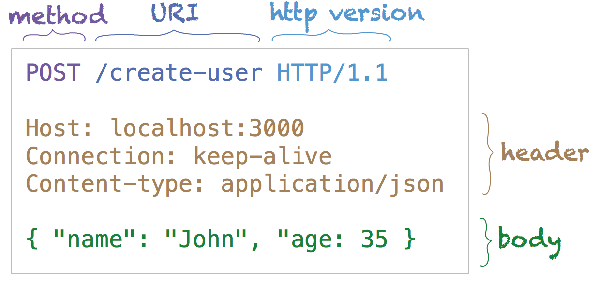
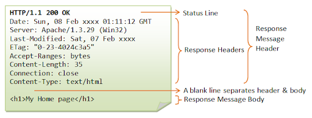

# JSP & Servet 개요

###### 2020.02.03

### I. 웹 프로그래밍이란 ?

- 웹 상에서 사용자와 기업 또는 사용자들간의 연결을 가능하게 하는 프로그래밍

- 텍스트 기반의 정적인 웹 문서인 HTML의 약점을 보안하기 위해 CGI, ASP, PHP, JSP 등의 기술 등장

- 웹 프로그래밍은 클라이언트 - 서버 방식으로 구축

- 사용자가 어떤 결과를 보여달라는 요청(Request)을 서버에 보내게 되면, 서버는 그 요청을 받아들여서 데이터를 처리한 후 결과를 응답(Response)형태로 클라이언트에게 보내고 사용자는 그 결과를 받아 보게된다.

 

### II. 웹 프로그래밍 언어

#### 1) CGI
- Common Gateway Interface
- 응용프로그램과 웹 서버 사이의 정보를 주고받는 방식이나 규약들을 정해 놓은 것
- ASP, PHP, Perl, JSP 모두 CGI의 범주에 들어간다.
- 서버측에서 동적인 데이터를 처리해 클라이언트에 HTML 문서로 전송해 줄 수 있는 응용프로그램의 필요성으로 인해 등장

#### 2) ASP
- Active Server Page
- Visual Basic 언어를 기반으로 만들어진 VBScript라는 스크립트 언어를 사용해서 구성된 웹 프로그래밍 기술
- 웹 서버로 Windows 기반의 IIS 만을 사용할수 있다는 불편함. (효율성 및 확장성 떨어짐)

#### 3) PHP
- C 기반으로 만들어진 언어로 빠른 속도를 가지고 있다.
- 다양한 플랫폼에서 사용이 가능하며 무료!
- 서버측 지원 인프라가 부족해 확장성이 떨어지고, 복잡한 시스템 구조에 적용하기 힘들며 보안 취약

#### 4) JSP
- 객체지향적이며 플랫폼 독립적인 자바를 기반으로 만들어졌으며 스레드 기반의 요청 처리 방식을 채택한 서블릿과 함께 구동하는 웹 프로그래밍 기술
- 서블릿의 기능을 그대로 사용할 수 있고 자바빈즈, EJB 같은 기술로 보다 강력한 객체지향적 지원이 가능
- 가독성이 좋고 유지 및 보수가 쉽다.

 

### II. JSP와  Servlet

#### 1) JSP
- Sun Microsystems사에서 초창기에 서블릿이라는 동적 웹 구현 기술 발표
- 서블릿은 객체지향적이고 플랫폼 독립적이었으며 스레드 기반의 요청 처리 방식을 채택해 사용자가 많을수록 효율적으로 동작했다.
- 하지만 자바에 대한 지식을 필요로 했고, 화면 인터페이스 구현에 너무 많은 코드가 비효율적
- 곧 Sun Microsystems사는 ASP의 장점을 수용한 JSP 개발
- Java를 이용하여 동적인 웹 페이지를 만들기 위한 기술
- JSP는 자바 언어의 특성상 어떤 운영체제에서도 어떤 JSP 컨테이너에서도 사용이 가능하므로 한번 작성하면 코드를 별다를 수정 없이 다른 플랫폼으로 이식이 가능하다.
- 스레드 기반의 아키텍처를 사용해 서버 자원을 효율적으로 사용한다.
    - 최초의 요청이 들어오면 서버는 그 요청에 맞는 JSP 페이지에 대한 서블릿 인스턴스를 단 한 번 생성하고 이후 같은 페이지를 요청하는 사용자가 있을 경우 이미 생성되어 있는 인스턴스에 스레드 단위로 요청을 전송하여 처리한다. 
- 간편한 MVC (화면 View - 비즈니스 로직 Model - View와 Model 연결 Controller로 구성)
    - 이러한 MVC를 JSP(View)와 자바빈즈(Model), 서블릿(Controller)를 이용해 쉽게 구현 가능

#### 2) Servlet
- 웹 서버측에서 사용자의 요구에 따라 자동으로 생성된 HTML 형식의 페이지를 생산해 전송해주는 기술
- 웹 서버 상에서 실행되는 자바의 클래스 파일
- 기본적으로 자바의 모든 API를 그대로 사용
- **서블릿은 반드시 javax.servlet.Servlet 인터페이스를 구현해서 작성해야만 하며 입력과 출력을 HTTP 프로토콜의 요청과 응답의 형태로 다룬다**
- 클라이언트가 요청을 보내면 웹 서버는 그 요청에 해당하는 서블릿 클래스 파일을 실행하고 서블릿 클래스에서는 요청을 처리해 결과물을 만들어내면 웹 서버가 그 페이지를 클라이언트에 전송한다.
- JSP로 요청이 전송되면 컨테이너는 JSP 파일을 서블릿 형태의 자바 코드로 자동변환한 후 서블릿의 라이프사이클을 거치면서 크라이언트의 요청을 처리해 준다.

 

### III. HTTP 프로토콜

>웹브라우저의 통신에 대한 규약

#### 1) HTTP 프로토콜의 구조

- HTTP 프로토콜은 요청과 응답의 형태로 이루어졌다.
- e.g. 사용자가 웹 페이지의 링크를 클릭했을 때 브라우저는 HTTP 프로토콜의 요청 형태로 HTTP 메세지를 작성하여 웹 서버에 전송한다. 웹서버는 방금 받은 메세지가 요청 메세지임을 판단하고 그 데이터를 분석해 HTTP 프로토콜의 응답 형태로 메세지를 작성하여 브라우저로 보낸다.

#### 2) HTTP 요청 메세지

- 요청 메세지는 기본적으로 HTTP 메서드, 접근할 주소(URL), 서버에 전달할 데이터인 폼 파라미터로 구성
- GET 메서드
    - 전송할 파라미터 값들을 시작 라인의 URL 정보에 붙여서 전송
    - 파라미터의 길이가 256byte 넘을수 없음
    - 본문(Body)가 없어서 전송 속도가 POST 방식보다 빠름
- POST 메서드
    - GET방식의 경우 파라미터가 URL 뒤에 붙어 전송되므로 사용자가 브라우저의 주소 창을 통해 확인할수 있는데 비해 POST 방식은 파라미터를 사용자가 확인할 수 없으므로 보안상 더 유용한 전송 방식이다.
    

#### 3) HTTP 응답 메세지
- HTTP 응답 메세지는 요청에 대한 서버의 처리 성공 여부를 표시하는 상태코드 번호와 웹 서버가 응답해주는 컨텐츠의 타입정보, 콘텐츠의 내용으로 구성된다.
- 실제로 서블릿 클래스가 요청을 처리해 생성하는 페이지는 웹 서버에서 응답 메세지의 형태로 작성되어 사용자의 브라우저로 전송된다.
    

 

### IV. 웹 컨테이너

>JSP와 서블릿을 사용한 웹 서버는 크게 URL 주소의 해석을 담당하는 HTTP 서버와 서블릿 클래스 또는 JSP 파일의 실행 요청을 처리해주는 웹 컨테이너로 구성된다.
- **HTTP 서버**는 단순히 어떤 URL 요청이 들어왔을 경우 그 주소에 미리 매핑되어 있는 콘텐츠를 사용자의 브라우저에 응답 형태로 전송한다.
  - URL을 해석하고 필요한 파일 혹은 동작에 매핑
  - ex) nginx
  - 이 때 요청된 URL이 서블릿 클래스 또는 JSP 파일일 경우 HTTP 서버는 이를 웹 컨테이너에서 처리하도록 클라이언트의 요청을 넘겨준다.
- 웹 컨테이너는 요청된 URL에 맞는 서블릿 클래스 또는 JSP 파일을 실행하여 그 결과를 HTTP 서버에 넘겨주게 되고 이는 응답 메세지의 형태로 사용자에게 전송된다.
  - HTTP 서버로부터 동작을 해야한다는 요청이 오면 그에 맞는 동작을 하고 HTTP에 전달한다.
  - ex) DRF
- 웹 컨테이너란 웹 서버 내부에서 서블릿 클래스 또는 JSP 파일을 실행하기 위한 실행 환경을 제공하는 역할을 하며, 서블릿에 대한 컨테이너를 서블릿 컨테이너, JSP에 대한 컨테이너를 JSP 컨테이너라고 한다.
- 대표적인 웹 컨테이너 : tomcat

 

### V. 서블릿 동작원리

>서블릿은 서블릿 컨테이너라는 실행 환경에서만 동작할 수 있다.

1. 사용자의 URL 요청
  - 어떤 사용자가 URL 요청이 서블릿 요청이라는 것을 웹 서버가 알기 위해서는 사전에 웹 서버측에 URL과 서블릿 클래스를 미리 매핑시켜놓은 배포 서술자가 필요하다.
  - 웹서버(HTTP 서버 - nginx같은 것)가 배포 서술자를 통해 지금받은 요청이 서블릿 요청이라는 것을 알게 되면 서블릿을 담당하는 웹 컨테이너(서블릿 컨테이너)로 그 요청을 전달한다.
2. request, response 객체 생성
  - 웹 컨테이너는 받은 요청을 처리하기 위해 HTTP 요청을 처리하기 위한 request 객체와 HTTP 응답을 위한 response 객체를 생성한다.
  - request 객체는 javax.servlet.http.HttpServletRequest 객체 타입으로 생성되며, response 객체는 javax.servlet.http.HttpServletResponse 객체 타입으로 생성된다.
  - request 객체는 요청에 관련된 멤버나 메서드들을 가지고 있을 것이고 (body 값이나 variable routing 변수 등을 가지고 있을 것으로 예상), response 역시 응답에 관련된 멤버나 메서드들을 가지고 있을 것이다(header, body 등을 가지고 있을 것으로 예상).
  - 나중에 이 두 객체는 자동으로 인자로 들어가진다.
3. 서블릿 인스턴스와 스레드 생성
  - 배포서술자로부터 어떤 서블릿 클래스를 필요로 하는지 알아내면
  - 만약 그 클래스가 웹 컨테이너에서 한 번도 실행된 적이 없거나 현재 메모리에 생성된 인스턴스가 없다면 새로 인스턴스를 생성하고 init() 메서드를 실행하여 초기화한 뒤 스레드를 하나 생성한다.
  - 이미 인스턴스가 존재할 경우에는 기존의 인스턴스에 스레드만 하나 새로 생성한다.
  - 여기서 스레드란 힙 메모리를 공유하는 하나의 스택 메모리를 말한다.
4. service() 메서드 호출과 서블릿 클래스 실행
  - 스레드가 생성되면 각 스레드에서 service() 메서드가 호출된다.
  - service() 메서드가 호출되면 HTTP 요청 방식이 GET 방식일 경우에는 서블릿 클래스의 doGet() 메서드가, POST 방식일 경우에는 doPost() 메서드가 request, response 객체를 인자로 자동으로 호출된다.
  - 따라서 개발자가 실제로 동적인 웹 페이지를 생성할 수 있는 코드를 만들어야 할는 부분이 doGet()과 doPost() 메서드 부분이라고 할 수 있다.
5. 응답과 스레드 소멸
  - doGet() 또는 doPost() 메서드가 호출되어 사용자의 요청에 따른 동적인 웹 페이지를 생성하면 그 결과물이 담긴 response 객체를 웹 컨테이너가 HTTP 응답 형태로 바꾸어 웹 서버로 전송하게 된다.
  - 그리고 사용이 끝난 request와 response 객체를 소멸시키고 스레드를 종료하게 된다.