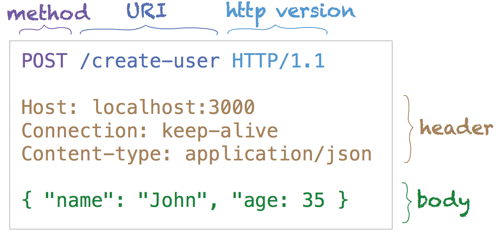
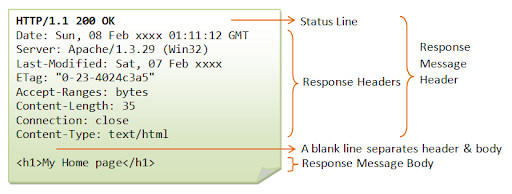

# JSP & Servet 개요

###### 2020.02.03

### I. 웹 프로그래밍이란 ?

- 웹 상에서 사용자와 기업 또는 사용자들간의 연결을 가능하게 하는 프로그래밍

- 텍스트 기반의 정적인 웹 문서인 HTML의 약점을 보안하기 위해 CGI, ASP, PHP, JSP 등의 기술 등장

- 웹 프로그래밍은 클라이언트 - 서버 방식으로 구축

- 사용자가 어떤 결과를 보여달라는 요청(Request)을 서버에 보내게 되면, 서버는 그 요청을 받아들여서 데이터를 처리한 후 결과를 응답(Response)형태로 클라이언트에게 보내고 사용자는 그 결과를 받아 보게된다.

 

### II. 웹 프로그래밍 언어

#### 1) CGI

- Common Gateway Interface

- 응용프로그램과 웹 서버 사이의 정보를 주고받는 방식이나 규약들을 정해 놓은 것

- ASP, PHP, Perl, JSP 모두 CGI의 범주에 들어간다.

- 서버측에서 동적인 데이터를 처리해 클라이언트에 HTML 문서로 전소애 줄 수 있는 응용프로그램의 필요성으로 인해 등장

#### 2) ASP

- Active Server Page

- Visual Basic 언어를 기반으로 만들어진 VBScript라는 스크립트 언어를 사용해서 구성된 웹 프로그래밍 기술

- 웹 서버로 Windows 기반의 IIS 만을 사용할수 있다는 불편함. (효율성 및 확장성 떨어짐)

#### 3) PHP

- C 기반으로 만들어진 언어로 빠른 속도를 가지고 있다.

- 다양한 플랫폼에서 사용이 가능하며 무료!

- 서버측 지원 인프라가 부족해 확장성이 떨어지고, 복잡한 시스템 구조에 적용하기 힘들며 보안 취약

#### 4) JSP

- 객체지향적이며 플랫폼 독립적인 자바를 기반으로 만들어졌으며 스레드 기반의 요청 처리 방식을 채택한 서블릿과 함께 구동하는 웹 프로그래밍 기술

- 서블릿의 기능을 그대로 사용할 수 있고 자바빈즈, EJB 같은 기술로 보다 강력한 객체지향적 지원이 가능

- 가독성이 좋고 유지 및 보수가 쉽다.

 

### II. JSP와  Servlet

#### 1) JSP

- Java를 이용하여 동적인 웹 페이지를 만들기 위한 기술

- JSP는 자바 언어의 특성상 어떤 운영체제에서도 어떤 JSP 컨테이너에서도 사용이 가능하므로 한번 작성하면 코드를 별다를 수정 없이 다른 플랫폼으로 이식이 가능하다.

- 스레드 기반의 아키텍처를 사용해 서버 자원을 효율적으로 사용한다.

    - 최초의 요청이 들어오면 서버는 그 요청에 맞는 JSP 페이지에 대한 서블릿 인스턴스를 단 한 번 생성하고 이후 같은 페이지를 요청하는 사용자가 있을 경우 이미 생성되어 있는 인스턴스에 스레드 단위로 요청을 전송하여 처리한다.

- 간편한 MVC (화면 View - 비즈니스 로직 Model - View와 Model 연결 Controller로 구성)

    - 이러한 MVC를 JSP(View)와 자바빈즈(Model), 서블릿(Controller)를 이용해 쉽게 구현 가능

#### 2) Servlet

- 웹 서버측에서 사용자의 요구에 따라 자동으로 생성된 HTML 형식의 페이지를 생산해 전송해주는 기술

- 웹 서버 상에서 실행되는 자바의 클래스 파일

- 기본적으로 자바의 모든 API를 그대로 사용

- **서블릿은 반드시 javax.servlet.Servlet 인터페이스를 구현해서 작성해야만 하며 입력과 출력을 HTTP 프로토콜의 요청과 응답의 형태로 다룬다**

- 클라이언트가 요청을 보내면 웹 서버는 그 요청에 해당하는 서블릿 클래스 파일을 실행하고 서블릿 클래스에서는 요청을 처리해 결과물을 만들어내면 웹 서버가 그 페이지를 클라이언트에 전송한다.

- JSP로 요청이 전송되면 컨테이너는 JSP 파일을 서블릿 형태의 자바 코드로 자동변환한 후 서블릿의 라이프사이클을 거치면서 크라이언트의 요청을 처리해 준다.

 

### III. HTTP 프로토콜

>웹브라우저의 통신에 대한 규약

#### 1) HTTP 프로토콜의 구조

- HTTP 프로토콜은 요청과 응답의 형태로 이루어졌다.

- e.g. 사용자가 웹 페이지의 링크를 클릭했을 때 브라우저는 HTTP 프로토콜의 요청 형태로 HTTP 메세지를 작성하여 웹 서버에 전송한다. 웹서버는 방금 받은 메세지가 요청 메세지임을 판단하고 그 데이터를 분석해 HTTP 프로토콜의 응답 형태로 메세지를 작성하여 브라우저로 보낸다.

#### 2) HTTP 요청 메세지

- 요청 메세지는 기본적으로 HTTP 메서드, 접근할 주소(URL), 서버에 전달할 데이터인 폼 파라미터로 구성

- GET 메서드
    - 전송할 파라미터 값들을 시작 라인의 URL 정보에 붙여서 전송
    - 파라미터의 길이가 256byte 넘을수 없음
    - 본문(Body)가 없어서 전송 속도가 POST 방식보다 빠름

- POST 메서드
    - GET방식의 경우 파라미터가 URL 뒤에 붙어 전송되므로 사용자가 브라우저의 주소 창을 통해 확인할수 있는데 비해 POST 방식은 파라미터를 사용자가 확인할 수 없으므로 보안상 더 유용한 전송 방식이다.

    

#### 3) HTTP 응답 메세지

- HTTP 응답 메세지는 요청에 대한 서버의 처리 성공 여부를 표시하는 상태코드 번호와 웹 서버가 응답해주는 컨텐츠의 타입정보, 콘텐츠의 내용으로 구성된다.

- 실제로 서블릿 클래스가 요청을 처리해 생성하는 페이지는 웹 서버에서 응답 메세지의 형태로 작성되어 사용자의 브라우저로 전송된다.

    

 

### IV. 웹 컨테이너

>JSP와 서블릿을 사용한 웹 서버는 크게 URL 주소의 해석을 담당하는 HTTP 서버와 서블릿 클래스 또는 JSP 파일의 실행 요청을 처리해주는 웹 컨테이너로 구성된다.

- HTTP 서버는 단순히 어떤 URL 요청이 들어왔을 경우 그 주소에 미리 매핑되어 있는 콘텐츠를 사용자의 브라우저에 응답 형태로 전송한다.

- 이 때 요청된 URL이 서블릿 클래스 또는 JSP 파일일 경우 HTTP 서버는 이를 웹 컨테이너에서 처리하도록 클라이언트의 요청을 넘겨준다.

- 웹 컨테이너는 요청된 URL에 맞는 서블릿 클래스 또는 JSP 파일을 실행하여 그 결과를 HTTP 서버에 넘겨주게 되고 이는 응답 메세지의 형태로 사용자에게 전송된다.

- **웹 컨테이너란 웹 서버 내부에서 서블릿 클래스 또는 JSP 파일을 실행하기 위한 실행 환경을 제공하는 역할을 하며, 서블릿에 대한 컨테이너를 서블릿 컨테이너, JSP 에대한 컨테이너를 JSP컨테이너라고 한다.**

- 대표적인 웹 컨테이너 : tomcat

 

### V. 서블릿 동작원리

>서블릿은 서블릿 컨테이너라는 실행 환경에서만 동작할 수 있다.

1. 사용자의 URL 요청

2. request, response 객체 생성

3. 서블릿 인스턴스와 스레드 생성

4. service() 메서드 호출과 서블릿 클래스 실행

5. 응답과 스레드 소멸