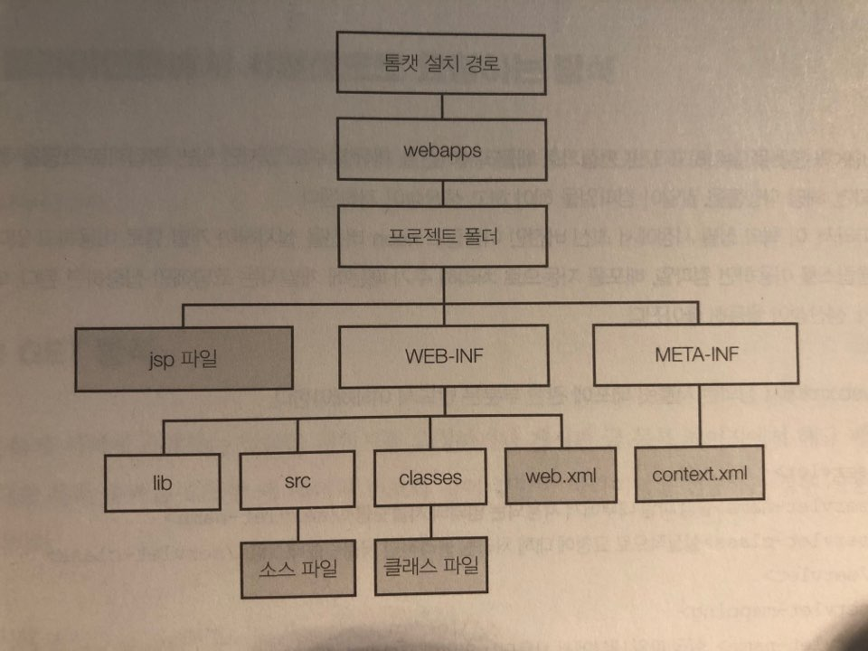

# 개발 환경 설정

###### 2020.06.13

## I. Java SE 8 설치
> 서블릿과 JSP를 구동시키는 것은 웹 컨테이너라고 할 수 있다. 하지만 JSP를 이용할수 있는 웹 컨테이너를 구동하기 위해서는 JAVA의 컴파일러와 실행 환경이 필요하다. 컴파일러와 실행환경을 설치한다는 것은 JDK를 설치한다는 것을 의미한다. JDK 안에 자바 컴파일러와 실행 환경이 포함되어 있기 때문이다.

### 1) JDK 다운로드 및 설치
- JDK는 크게 세 가지로 구분할 수 있다.
  - Java SE (일반적인 PC용 프로그램 개발) **
  - Java EE (엔터프라이즈급 개발)
  - Java Me (모바일 플랫폼 등 임베디드 시스템용 개발)


### 2) 웹 컨테이너 설치 (아파치 톰캣)
- JDK 설치가 끝났으면 실질적으로 JSP와 서블릿을 동작시킬 웹 컨테이너를 설치해야 한다.
- 톰캣 홈페이지에서 다운로드
- Monitor tomcat 실행 후, tomcat start service


## II. eclipse 설치

### 1) 설치
- `www.eclipse.org/downloads/`로 들어가 다운로드 받고 Eclipse IDE for Enterprise Java Developers 로 설치

### 2) 이클립스에 톰캣 서버 등록하기
- 서블릿이나 JSP는 웹 컨테이너에서 실행되기 때문에 이클립스에서 실행될 때 서블릿이나 JSP가 실행될수 있는 환경을 설정해야 한다.
- 이 책에서는 웹 서버로 Tomcat을 사용하므로 이클립스에 톰캣을 서버로 등록하면 된다.
- [Window] - [Preferences] 메뉴를 선택하면 다음과 같은 대화 상자가 열린다.
- 대화 상자에서 서버 설정을 위해 [Server] - [Runtime Environments] 메뉴를 선택해 Server Runtime Environments 화면을 연 후 `<Add>` 버튼을 클릭한다
- 현재 톰캣 버전을 선택하고 Installed JRE 중 현재 사용하는 JDK 버전의 JRE를 선택한 후 `<Finish>`

### 3) 서버 만들기
- 아래의 탭중 Servers를 클릭 후 "No servers are available. Click this link to create a new server..."를 클릭하고 톰캣 버전을 선택 한 수 클릭한다.


## III. 웹 프로젝트 생성하고 애플리케이션 실행하기

1. Project Explorer 뷰에서 마우스 우측 버튼을 클릭한 후 [New] - [Dynamic Web Project]를 선택한다.
2. Project name을 jspProject로 지정하고 완료
3. [WebContent] - [New] - [JSP File] 메뉴를 실행
4. File Name을 hello로 지정하고 완료 (확장자 생략 가능)
5. `<body>` 태그에 텍스트를 입력하고 jsp 파일에 우클릭 후 [Run As] - [Run on Server]를 누르거나 상단 툴바의 재생 모양 버튼을 눌러도 된다. (단 모니터 톰캣의 서버는 중지되어 있어야 한다.)
6. 실행 브라우저를 변경하려면 [Window] - [Web Browser] 메뉴의 하위 메뉴에서 JSP를 실행하고자 하는 브라우저를 선택하면 된다.
7. Servlet을 생성하고 실행해보자.
8. 프로젝트의 src 디렉터리에서 마우스 우측 버튼을 누르고 [New] - [Servlet] 메뉴를 선택한다.
9. 대화상자에서 Class Name 항목의 값을 "HelloServlet"으로 지정하고 `<Next>` 클릭
10. 다음 화면의 대화상자에서 Name 항목의 값은 web.xml 파일의 `<servlet-name>` 엘리먼트의 값과 동일하며 URL mappings 항목의 값은 web.xml 파일의 `<url-pattern>` 엘리먼트의 값과 동일한 역할을 한다. URL 상에서 요청하는 서블릿 이름을 간단하게 변경하고 싶으면 URL mappings 항목에 지정된 값을 선택하고 `<Edit>` 버튼을 눌러 바꿔준다.
11. 다음 화면에서 서블릿을 실행하기 위해서 코드 편집기상에서 [Run As] - [Run On Server] 메뉴를 선택한다.


## IV. 정리
- 기본적으로 Tomcat에서는 웹 애플리케이션이 존재하는 디렉터리로 tomcat_dir\webapps를 인식하기 때문에 웹 애플리케이션 디렉토리가 webapps 디렉터리의 하위 디렉터리로 존재해야한다.
- 특정 디렉터리가 웹 애플리케이션 디렉터리로 인식이 되려면 다음과 같은 특정한 구로를 가지고 있어야 한다.

- 위 그림에서 src 폴더는 옵션이다. 단순히 소스파일을 저장하는 부분이다.
- 위 그림에서 반드시 존재해야 하는 필수 디렉터리는 실행될 클래스가 존재하는 classes 디렉터리와 서블릿 배포에 관한 정의를 설정하는 web.xml 파일이다.
- 서블릿을 실행하면서 특정한 라이브러리 파일이 필요하다면 WEB-INF 디렉터리 밑에 lib이라는 디렉터리를 생성하고 lib/디렉터리 안에 라이브러리 파일을 위치시키면 서블릿에서 해당 라이브러리 파일을 인식할 수 있다.
- web.xml에서 정의한 서블릿 배포에 관한 부븐은 반드시 이해해야 한다.
  ```xml
  <servlet>
    <servlet-name>설정 파일 내부에서 사용되는 임의의 서블릿명</servlet-name>
    <servlet-class>실질적으로 요청에 대해 처리될 물리적인 서블릿클래스명</servlet-class>
  </servlet>

  <servlet-mapping>
    <servlet-name>
      설정파일 내부에서 사용되는 임의의 서블릿명 '<servlet>' 엘리먼트에 정의된 이름과 일치해야 함
    </servlet-name>
    <ul-pattern>url 상에서 실질적으로 요청되는 서블릿명</url-pattern>
  </servlet-mapping>
  ```