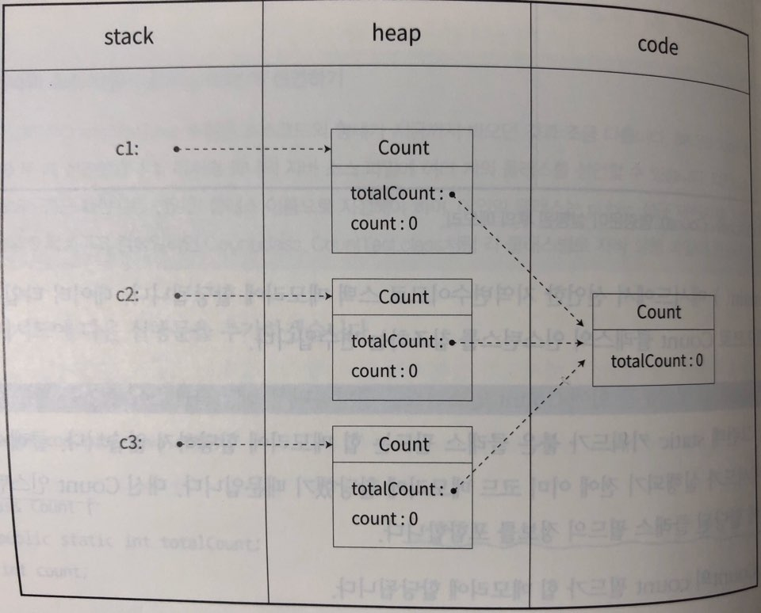

# 객체지향 II

```java
// 현 클래스가 com.ruby.java.ch06에 속해있다는 것을 선언
package com.ruby.java.ch06;


// Armor 클래스를 어디서나 가져다 사용할 수 있도록 공개
public class Armor {
    
    // 필드를 현재 클래스 내부에서만 사용 가능
    private String name;
    private int height;
    
    // 필드를 리턴하는 메서드
    public String getName() {
        return name;
    }
    
    // 필드를 바꾸는 메서드
    public void setName(String value) {
        name = value;
    }
    
    public int getHeight() {
        return height;
    }
    
    public void setHeight(int value) {
        height = value;
    }
}
```

### I. 객체지향 설계 방법

- 일반적으로 객체지향 프로그래밍에서는 클래스의 필드를 비공개(private)로 선언해  아무나 필드에 접근해 데이터를 변경하지 못하게 막는다.
- 필드를 비공개로 선언한 대신 `getter`와 `setter`메서드를 통해 검증된 접근만 가능하게 한다.
  - `getter` : private로 선언된 필드값을 반환하는 메서드
  - `setter` : private로 선언된 필드에 데이터를 설정하는 메서드


### II. 객체 생성

> 지금까지는 클래스를 정의했을 뿐 아직 사용할 수 있는 객체는 아니다.
>
> 객체를 사용하려면 반드시 메모리에 생성해야 한다.

- **`new`** : 메모리에 객체를 생성하는 명령문

  ```java
  // 메모리에 Armor클래스를 틀로 사용하여 객체 2개 생성하는 명령문
  new Armor();
  new Armor();
  ```

- **인스턴스** : 클래스를 **`new`** 명령문으로 메모리에 생성한 객체


### III. 자바의 메모리

> JVM은 자바 프로그램을 실행하면서 필요한 데이터를 메모리에 생성 후 사용하는데, 메모리를 세가지 영역으로 구분하여 사용(Code영역, Heap영역, Stack영역)

1. **코드영역**

   바이트코드 파일을 메모리에 올릴 때, 소스파일에서 정의한 클래스에 관한 정보와 코드가 들어가는 공간

2. **힙영역**

   인스턴스가 생성되는 공간

   > 사실 인스턴스의 **속성(필드)**은 힙 영역에 저장되지만, **동작(메서드)**은 코드영역의 클래스에 있는 내용을 사용한다. 

3. **스택영역**

   메서드가 호출되어 실행될 때, 내부의 지역 변수(매개변수 포함)를 임시적으로 저장하는 공간

   메서드가 끝나면 스택 내의 지역변수는 자동으로 삭제된다.

   > **필드 초기화**
   >
   > | 필드 타입     | 값       |
   > | ------------- | -------- |
   > | byte          | 0        |
   > | short         | 0        |
   > | int           | 0        |
   > | long          | 0L       |
   > | float         | 0.0F     |
   > | double        | 0.0D     |
   > | char          | '\u0000' |
   > | boolean       | false    |
   > | 모든 참조변수 | null     |


### IV. 참조변수를 이용한 인스턴스 접근

> 자바 프로그램은 힙 메모리에 직접 접근할수 없고, **오로지 스택 메모리에만 접근할 수 있다.**
>
> 스택 메모리에 참조변수를 선언하고 이 변수에 힙 메모리에 생성된 인스턴스의 참조정보를 저장해서 접근하는 방식을 사용한다.

- 참조변수 선언

  `클래스명 참조변수명 = new 클래스명();`

  ```java
  public void test() {
      Armor suit1 = new Armor();
  }
  ```

- 참조가 끊긴 인스턴스들은 가비지컬렉션에 의해 힙 메모리에서 삭제된다.


### V. 정적 멤버

- 클래스의 모든 인스턴스가 공유하는 멤버

- 프로그램이 시작될 때, 딱 한번 코드영역에 할당되고 프로그램이 종료될 때까지 유지된다.

  ```java
  class Count {
      public static int totalCount;
      int count;
  }
  ```

- 인스턴스 필드와 클래스 필드 비교

  |     구분      | 메모리 할당 시점 | 메모리 할당 위치 | 메모리 해제 시점 |
  | :-----------: | :--------------: | :--------------: | :--------------: |
  | 인스턴스 필드 | 인스턴스 생성 시 |    힙 메모리     | 인스턴스 소멸 시 |
  |  클래스 필드  | 프로그램 시작 시 |   코드 메모리    | 프로그램 종료 시 |

- 메모리 내 구조

  ```java
  package com.ruby.java.ch06;
  
  class Count {
      public static int totalCount;
      int Count;
  }
  
  public class CountTest {
      public static void main(String[] args) {
          System.out.println("실행 시작");
          Count c1 = new Count();
          Count c2 = new Count();
          Count c3 = new Count();
      }
  }
  ```

  

- 클래스 필드를 사용할 때는 인스턴스가 필요없다. (이미 메모리에 할당 되었기 때문)

  ```java
  Count.totalCount++
  ```


### VI. 클래스 메서드

> 메서드 선언부에 static 키워드가 선언된 메서드
>
> 변수든 메서드든 static으로 선언하면 무조건 main() 메서드가 실행됙 전에 코드 메모리 영역에 생성되어 사용 준비를 완료한다.

- 클래스 메서드를 사용할 땐 인스턴스가 필요없다.(main()메서드가 실행되기전 이미 사용준비를 마쳤기 때문)

  ```java
  StaticMethodTest.print1();
  ```

- 클래스 메서드 내에서는 시작부터 생성되지 않는 변수를 사용하지 않는다. (에러 발생)

- 정적 코드 블럭 : 메인 메서드가 실행되기 전에 먼저 실행되는 블럭

  ```java
  package com.uby.java.ch06;
  
  public class StaticBlockTest {
      static {
          System.out.println("Hello");
          System.out.println("java");
      }
      
      public static void main(String[] args) {
          System.out.println("world")
      }
  }
  ```

  > **<결과>**
  >
  > hello
  >
  > java
  >
  > world


### VII. 생성자

> 클래스에 선언하는 메서드 중 하나로 일반 메서드와는 몇 가지 차이점이 있다.
>
> 1. 인스턴스 생성시 자동으로 호출된다.
> 2. 반환값이 없다.
> 3. 클래스 이름과 같다. 그래서 일반 메서드와는 다르게 대문자로 시작한다.

```java
package com.ruby.java.ch06;

public class Member {
    private String name;
    private int age;
    
    // 생성자 함수
    // 리턴타입 누락
    // 클래스와 동일한 이름
    // 필드의 초기화 담당
    public Member() {}
    
    public void setName(String name) {}
}
```

> 사실 `new` 연산자는 두가지 일을 한다.
>
> 1. 필드를 힙 메모리에 생성
> 2. `new` 다음에 선언된 생성자를 호출

- **생성자 오버로딩**

  생성자도 다른 메서드와 같이 여러개를 선언할 수 있다.

  ```java
  public Member() {}
  
  public Member(String name) {}
  
  public Member(String name, int age) {}
  ```

  > `new Member();` or `new Member("jngcii")` or `new Member("jngcii", 29)` 로 호출 

- **기본생성자**

  매개변수가 없는 생성자

  ```java
  public Member() {}
  ```

  > 모든 클래스는 반드시 하나 이상의 생성자가 있어야 한다.
  >
  > 생성자를 작성하지 않으면 컴파일러가 자동으로 기본 생성자를 추가하기 때문이다.
  >
  > **기본 생성자** : 접근제어자는 클래스를 따르고 본문과 매개변수가 없는 생성자

- **this**

  - 자바에서 사용하는 예약어로, 현재 실행 중인 인스턴스의 주소값을 나타낸다.

  - 클래스의 멤버를 가리킬 때, 생성자를 호출할 때, 자신의 주솟값을 전달하고 싶을 때 주로 사용된다.

  - 메서드가 실행될 때, 스택에 해당 메서드 영역이 새롭게 생성되는데, 이때 this키워드가 사용되면 this라는 변수를 자동으로 선언한다. 이 this 변수는 실행중인 메서드가 속한 인스턴스를 가리킨다(참조한다).

  - 사용 목적 : 필드와 지역변수를 구분하기 위함

  - 생성자에서의 this 사용

    ***ver.1***

    ```java
    public class Member {
        private String name;
        private int age;
        
        public Member() {
            this.name = "guest";
            this.age = 0;
        }
        
        public Member(String name) {
            this.name = name;
            this.age = 0;
        }
        
        public Member(String name, int age) {
            this.name = name;
            this.age = age;
        }
        
        public static void main(String[] agrs) {
            Member m1 = new Member();
            Member m2 = new Member("jngcii");
            Member m3 = new Member("jngcii", 29)
        }
    }
    ```

    ***ver.2***

    ```java
    public class Member {
        private String name;
        private int age;
        
        public Member() {
            this("guest")
        }
        
        public Member(String name) {
            this(name, 0)
        }
        
        public Member(String name, int age) {
            this.name = name;
            this.age = age;
        }
        
        public static void main(String[] agrs) {
            Member m1 = new Member();
            Member m2 = new Member("jngcii");
            Member m3 = new Member("jngcii", 29)
        }
    }
    ```

    > `Member()`가 `Member(String name)`를,
    >
    > `Member(String name)`가 `Member(String name, int age)`를 호출

