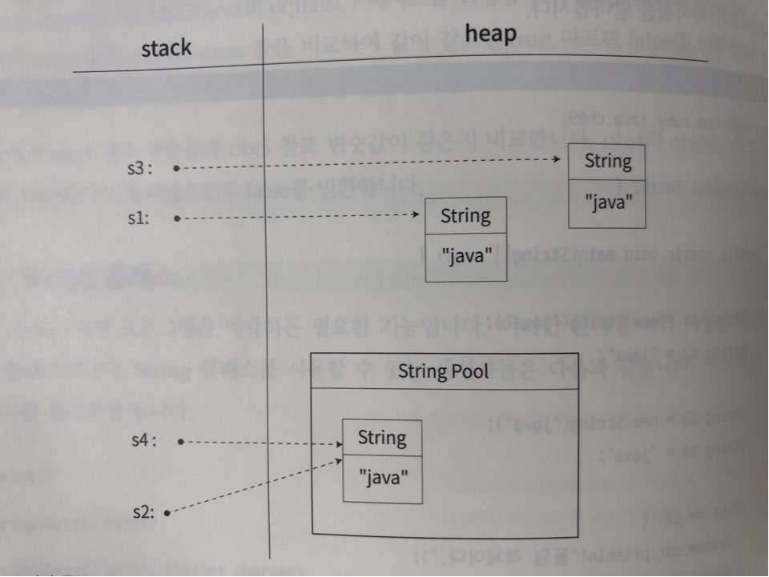

# 기본 API 활용하기

###### 2020.01.22


### I. 자바 API

- 자바에서 제공하는 라이브러리

    > 라이브러리 : 여러가지 기능을 구현하여 제공하는 파일

- 자바클래스파일(`*.class`)로 구성되어 있다.

- Java SE에서 제공하는 API는 자바 프로그램을 개발하기 위해 설치한 JDK에 포함되어 있다.

- API는 `&JAVA_HOME%/jmods` 폴더에 jmod 파일 형태로 저장

    >jmod파일 : 자바 9 에서 도입된 모듈 파일
    >
    >모듈 : 관련있는 여러 개의 자바 패키지를 묶어놓은 단위

- [Java API 문서](https://docs.oracle.com/en/java/javase/11/docs/api/index.html)


#### (1) Docs 이용법  e.g.기본모듈(java.base)

- java.base에서 자주 사용하는 패키지 : java.io, java.lang, java.util

- 생성자 : API를 사용하기 위해서는 해당 클래스의 인스턴스를 생성해야 한다.

    - Object
    - String
    - ...

- 필드

- 메서드

</br>


### II. 기본 API
> java.lang 패키지에 있는 기본 API 중 Object, String, StringBuffer, StringBuilder, Math 클래스

#### (1) Object 클래스

- 모든 자바 클래스의 상속구조에서 가장 루트에 있는 클래스

- 모든 객체는 이 클래스의 메서드를 상속받는다.

    1. 해시 코드 메서드

        `public int hashCode()`

        - 자바에서 new 명령문으로 힙 메모리에 새로운 인스턴스를 만들면 해당 인스턴스에 일련번호가 만들어지는데, 그런 역할을 하는 메서드 

        - `hashCode()` 메서드가 반환하는 일련번호 : 해시 코드

        - 메모리에 생성되는 주솟값을 기초로 만들어진다.

        - 유니크값이다.


    2. 클래스 정보 리턴 메서드

        `public final Class<?> getClass()`

        - getClass() 메서드는 Class 타입의 인스턴스를 생성해 반환

        - 클래스에 대한 정보만 담는 객체를 새로 생성하여 활용하고자 할 때 사용횐다.

        - e.g.

            ```java
            public class Test01 {
                public static void main(String[] args) {
                    // ...

                    Class c = obj1.getClass();

                    System.out.println(c.getName());

                    // ...
                }
            }
            ```
            >실행 결과 : java.lang.Object

            >obj1.getClass()는 obj1 인스턴스 정보를 가지는 Class 객체를 생성하여 반환해 Class 타입 변수 c 에 저장


    3. 문자열로 표현하는 메서드

        `public String toString()`

        - 인스턴스에 대한 정보를 문자열로 반환하는 메서드

        - 형식 : `getClass().getName() + 'a' + Integer.toHexString(hashCode())`

        - 참조변수를 출력할 때, `toString()`메서드를 명시하지 않으면 컴파일러가 자동으로 `toString()` 메서드를 호출하는 코드로 변환

        - e.g.

            ```java
            public class Test01 {
                public static void main(String[] args) {
                    System.out.println(obj1.toString());
                    System.out.println(obj2.toString());

                    System.out.println(obj1);
                    System.out.println(obj2);
                }
            }
            ```
            >java.lang.Object@15db9742
            >java.lang.Object@6d06d69c
            >
            >java.lang.Object@15db9742
            >java.lang.Object@6d06d69c


        - `toString()` 메서드 오버라이딩

            만약 객체 정보값을 다른 값으로 출력하고 싶다면, toString() 메서드를 오버라이딩하여 원하는 문자열을 반환하게 하면 된다.

        - e.g.
            ```java
            package com.ruby.java.ch09;

            public class Test01 {
                public static void main(String[] args) {
                    MyObject obj4 = new MyObject();
                    System.out.println(obj4);
                }
            }
            ```
            >실행 결과 : com.ruby.java.ch09.MyObject@4e25154f

            ```java
            package com.ruby.java.ch09;

            public class MyObject {
                public String toString() {
                    return "MyObject";
                }
            }
            ```
            >실행 결과 : MyObject

    4. 같은지 비교하는 메서드

        `public boolean equals(Object obj)`

        - equals()메서드는 인자로 전달된 객체와 현재 객체가 같은지 판단한다.

        - 어떤 클래스로부터 만들었는지가 아닌, **해시코드를 비교한다.**

<br />

#### (2) String 클래스

- 문자열 처리를 돕는 API

- 문자열을 생성하는 방법 : 2가지

    ```java
    String s1 = new String("java");
    String s2 = "java";
    String s3 = new String("java");
    String s4 = "java";
    ```
    >new 연산자를 사용해 만든 String 객체는 모두 다른 힙 메모리에 저장된다.
    >
    >반면, `""`로 생성된 String 객체는 모두 같은 인스턴스이다.

    

    1. 문자열 비교 메서드

        `boolean equals(Object anObject)`

        `boolean equalsIgnoreCase(String anotherString)`

        - String 클래스는 Object로부터 상속받은 equals()메서드를 오버라이딩 했다.

        - String의 equals()메서드는 String 인스턴스의 문자열을 비교하여 같으면 true, 다르면 false를 반환한다.

        - equalsIgnoreCase() 메서드는 대소문자를 상관하지 않는다.

    2. 문자열 출력 메서드

        `String toString()`

        - 역시 Object로부터 toString() 메서드를 오버라이딩 했다.

        - 참조변수를 출력할 때는 자동으로 toString() 메서드가 호출된다.

    3. 문자열 정보 반환 메서드

        `int length()`

        `char charAt(int index)`

        - length()메서드는 문자열의 전체 길이를, charAt() 메서드는 인자값을 전달받은 인덱스의 문자를 반환

    4. 문자열 공백 관련 메서드

        `String trim()`

        `boolean isEmpty()`

        - trim()메서드는 문자열 양 끝에 있는 공백을 제거

        - isEmpty() 메서드는 문자열의 길이가 0인지 판단

    5. 문자열 검색 메서드

        ```java
        int indexOf(int ch)
        int indexOf(int ch, int fromIndex)
        int indexOf(String str)
        int indexOf(String str, int fromIndex)
        int lastIndexOf(int ch)
        // ...
        ```

        - indexOf()는 인자로 지정된 문자 또는 문자열이 시작되는 인덱스를 문자열의 처음부터 검색

        - lastIndexOf()는 인자로 지정된 문자 또는 문자열이 시작되는 인덱스를 문자열의 끝부터 검색

        - 만약 검색한 문자열이 없으면 `-1` 반환

        ```java
        boolean startsWith(String prefix)
        boolean startsWith(String prefix, int toffset)
        boolean endsWith(String suffix)
        ```

        - startsWith()는 인자로 전달받은 문자열이 대상 문자열의 시작부분에 포함되었는지를 판단한다.
        
        - endsWith()는 인자로 전달받은 문자열이 대상 문자열의 끝부분에 포함되었는지를 판단한다.

    6. 문자열 편집 메서드
        
        ```java
        Strint concat(String str)
        String replace(char oldChar, char newChar)
        String replaceAll(String regex, String replacement)
        String replaceFirst(String regex, String replacement)
        String toLowerCase()
        String toUpperCase()
        ```

        - concat() : 새로운 문자열 추가
        - replace() : 기존 문자열 변경
        - toLowerCase() : 소문자로
        - toUpperCase() : 대문자로

    7. 문자열 추출 메서드

        ```java
        String[] split(String regex)
        String[] split(String regex, int limit)
        String substring(int beginIndex)
        String substring(int beginIndex, int endIndex)
        ```

        - split()의 regex : 문자열을 구분할 구분자
        
        - 구분자로 문자열을 잘라서 배열로 반환

        - substring() : 문자열 슬라이싱

        - beginIndex부터 잘라서 endIndex-1까지 자름 (파이썬 슬라이싱 인덱스와 같음)

        - 두번째 인자가 없다면 끝까지 자름

    8. 문자열로 변환하는 메서드

        `static String valueOf(뭐든 다)`

        - 어떤 데이터 타입이던지 들어온 그대로를 문자열로 바꿔서 리턴한다.

        - `static` 으로 선언되어 있어서 `String.valueOf()`로 사용할수 있다.