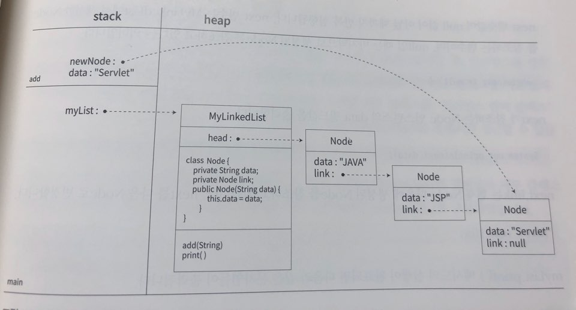

# 내부 클래스

###### 2020.01.20

```java
제어자 class 클래스명 {
    필드선언;
    생성자선언
    메서드선언
    클래스선언
}
```

- 클래스를 어떤 클래스의 멤버로 중첩해서 선언하는 것
- 특정 클래스에만 사용할 클래스를 구현하기 위해 사용
- 내부 클래스는 클래스이면서 동시에 다른 클래스의 멤버
- 외부 클래스를 컴파일하면서 자동으로 컴파일되어 독립적인 클래스 파일이 아닌 외부 클래스에 종속적으로 생성된다.
- `외부클래스$내부클래스` 형식으로 클래스 이름이 생성된다.

<br />

### I. 내부 클래스 예제

```java
public class MyLinkedList {
    
    private Node head = null;
    
    private class Node {
        private String data;
        private Node link;
        
        public Node(String data) {
            this.data = data;
        }
    }
    
    public void add(String data) {
        Node newNode = new Node(data);
        
        if(head == null) {
            // 처음 들어온 노드면 link==null인 데이터를 만들고 head로 설정
            head = newNode;
        } else {
            // link가 null인 Node 찾기 (head 부터)
            // head가 가리키고 있는 걸 바꾸지 않게 하기 위해
            // 계속 바꿀 새로운 레퍼런스를 만든다.
            Node next = head;
            while(next.link != null) {
                next = next.link;
            }
            next.link = newNode;
        }
    }
    
    public void print() {
        if(head==null) {
            System.out.println("등록된 데이터가 없습니다.");
        } else {
            System.out.println("등록된 데이터는 다음과 같습니다.");
            Node next = head;
            while(next != null) {
                System.out.println(next.data);
                next = next.link;
            }
        }
    }
}
```

- 메모리 내에서의 코드 동작

  

<br />

### II. 내부 클래스 종류

#### (1) 인스턴스 멤버 클래스

- 가장 일반적인 클래스

- `static` 키워드가 붙지 않는다.

  ```java
  public class OuterClass {
      class InstanceClass {
          int a;
          void method2() {
              System.out.println("Instance Class : " + a);
          }
      }
  }
  
  public class OuterClassTest {
      public static void main(String[] args) {
          OuterClass outer = new OUterClass();
          //외부클래스.내부클래스 변수명 = 외부클래스참조변수.new 내부클래스();
          OuterClass.InstanceClass inner01 = outer.new InstanceClass();
          innter01.a = 123;
          innter01.method2();
      }
  }
  ```

#### (2) 정적 멤버 클래스

- 공유에 목적이 있는 클래스

- `main()` 메서드가 실행되기 전에 메모리에 사용 준비가 완료된다.

- **정적 멤버 클래스**는 **인스턴스필드와 메서드**, **static필드와 메서드**를 선언할 수 있다.

  ```java
  public class OuterClass {
      static class StaticClass {
          int b;
          static int c;
          void method3() {
              System.out.println("Static Class : " + b);
          }
          static void method4() {
              System.out.println("Static Class : " + c);
          }
      }
  }
  
  public class OuterClassTest {
      public static void main(String[] args) {
          //외부클래스.내부클래스 변수명 = new 외부클래스.내부클래스();
          OuterClass.StaticClass inner02 = new OuterClass.StaticClass();
          inner02.b = 456;
          inner02.method3();
          OuterClass.StaticClass.c = 789;
          OuterClass.StaticClass.method4();
      }
  }
  ```
  
  > 인스턴스멤버 클래스와 비교하면 `OuterClass outer = new OuterClass()`(외부클래스의 인스턴스)가 필요 없다.

#### (3) 로컬 클래스

- 메서드에서 사용하기 위해 메서드 내부에 선언하는 내부 클래스

- 접근 제한자를 지정할 수 없다.

- 필드와 메서드를 `static`으로 지정할 수 없다.

  ```java
  public class OuterClass {
      public void method1() {
          class LocalClass {
              int d;
              void method5() {
                  System.out.println("LocalClass : " + d);
              }
          }
          LocalClass inner = new LocalClass();
          inner.d = 1004;
          inner.method5();
      }
  }
  ```

#### (4) 익명 클래스

- 인터페이스를 구현한 클래스를 사용할 때, 반복적으로 사용하지 않고 일회용으로 사용할 클래스를 만들 때 이름 없이 만들 수 있다.

- 구현 방법

  ***인터페이스 : Messenger***

  ```java
  public interface Messenger {
      String getMessage();
      void setMessage(String msg);
  }
  ```

  ***기존 구현 방법*** 

  ```java
  public class KakaoMessenger implements Messenger {
      public String getMessage() {
          // 실행;
      }
      
     public void setMessage(String msg) {
         // 실행;
     }
      
     public void changeKeyboard() {
         // 실행;
     }
  }
  ```

  ```java
  public static void main(String[] args) {
      KakaoMessenger km = new KakaoMessenger();
  }
  ```

  ***익명 클래스 구현 방법***

  ```java
  public static void main(String[] args) {
      Messenger m = new Messenger() {
          public String getMessage() {
              // 실행;
          }
  
         public void setMessage(String msg) {
             // 실행;
         }
  
         public void changeKeyboard() {
             // 실행;
         }
      }
  }
  ```

