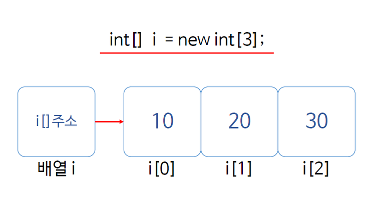

# 배열

###### 2020.01.19

> 타입이 같은 데이터 그룹


### I. 배열 생성 방법

1. 데이터 타입[] <변수명> = new 데이터 타입[요소 수];

   ```java
   int[] a = new int[5];
   // 혹은 int a[] = new int[5];
   ```

   > 컴퓨터는 new 연산자를 만나면 메모리에 저장 공간을 마련하고 준비한다.
   >
   > new 연산자로 배열을 생성할 경우, 기본타입으로 생성하면 모든 요소가 0으로, 참조 타입으로 생성하면 모든 요소는 null로 초기화된다.

   

2. 데이터 타입[] <변수명> = {데이터1, 데이터2, ...}

   ```java
   int[] a = {90, 85, 78. 100, 98}
   
   // 하지만 이 방법은 반드시 선언과 동시에 초기화해줘야 한다.
   // 아래와 같은 방법을 사용하면 에러 발생
   int[] a;
   a = {90, 85, 78, 100, 98}
   ```

   > **배열 선언과 동시에 초기화해야 하는 이유**
   >
   > 메모리에 배열이 생성되지 않기 때문


### II. 배열 사용

> 배열이름을 `a`로 가정

- **a.length** : 배열 길이 구하기

- **확장 for 문** : 배열 `a`에서 요소를 하나씩(`ai`)꺼내서 실행

  ```java
  for(ai : a) {
      //실행문
  }
  ```

- **2차원 배열** : new 데이터 타입 [ 행의 수 ] [ 열의 수 ]

  1. 방법 1

     ```java
     // 일정한 길이의 배열을 요소로 갖음
     int arr[][] = new int[5][2];
     ```

  2. 방법 2

     ```java
     // 각자 다른 길이의 배열을 요소로 갖음
     int arr[][] = new int[5][];
     arr[0] = new int[2];
     arr[1] = new int[4];
     arr[2] = new int[6];
     arr[3] = new int[3];
     arr[4] = new int[4];
     ```

     > `new int[][5]`는 성립되지 않음

  3. 방법 3

     ```java
     // 리터럴을 직접 입력해 초기화를 동시에 하는 방법
     int arr[][] = {{0,1}, {10, 11, 12, 13}, {20, 21, 22}}
     ```


### III. 배열의 메모리 구조

- 컴퓨터는 배열을 생성할때 주어진 크기의 메모리를 할당한다.

- 변수는 배열의 첫번째 요소의 주소값을 가리킨다. (참조)

- 이를 변수가 배열 첫번째 요소의 레퍼런스값을 갖는다고 한다.

  