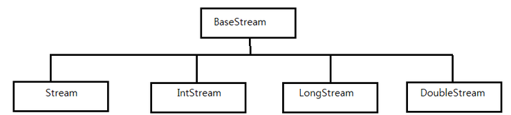

# 스트림 API (Stream)

###### 2020.01.27

### I. 스트림이란?

- 스트림 API는 배열이나 컬렉션처럼 데이터 그룹을 간단하고 효율적으로 처리할 목적으로 JDK 8부터 지원하는 API이다.

- java.util.stream 패키지에 정의되어 있다.

- 배열과 컬렉션 데이터는 메모리에 저장되지만, 스트림 데이터는 처리 과정에서 임시로 존재 (작업 후 자동 소멸)

- 스트림을 이용하면 데이터 소스 원본을 변경하지 않고서도 데이터 처리 작업을 수행할 수 있다.

- 지연 연산을 수행

#### (1) 스트림 사용 3단계

1. **스트림 생성** : 배열이나 컬렉션 요소들을 스트림으로 처리하려면, 요소들을 갖는 스트림을 생성해야한다.

2. **중개 연산** : 데이터를 추출, 변환, 조합하는 작업 등을 수행. 여러개의 중개 연산을 지정할 수 있으며 일반적으로 지연 연산을 수행

3. **최종 연산** : 결과를 산출하기 위한 최종 연산


#### (2) 스트림 특징

- 명령형 프로그래밍에서는 배열이나 컬렉션 요소를 처리하기 위해 외부 반복( 인덱스를 사용한 반복문 )을 사용하지만 ***스트림 구현방식은 반복문이 필요 없다. (내부반복)***

    `int sum = Arrays.stream(num).filter((n) -> n%2==1).sum();`

    > Arrays.stream(num) 코드는 num 배열의 요솟값을 입력으로 스트림을 생성한다.
    >
    > filter() 메서드는 스트림을 대상으로 요소의 개수만큼 괄호 안의 명령문을 반복해서 실행한다.
    >
    > sum() 메서드는 최종 연산으로 홀수만 더한 값을 반환한다.

1. **파이프 필터 패턴**

    - 위처럼 각종 중개 연산을 수행하고 최종연산을 수행해 결괏값을 산출하는 방식

2. **지연 연산**

    - 위의 경우 filter()함수의 리턴값들은 바로바로 더해지지 않고 마지막 함수sum()이 실행될때까지 계산을 미루고 있다가 최종 연산이 수행될 때 미뤘던 중개 연산을 수행한다.

3. 스트림 데이터는 데이터를 처리한 다음에 자동 소멸된다. (어디 메모리에 저장해놓는것이 아니고, 연산 완료후 바로 없어진다.)

    ~~...당연한거 아닌가...~~


<br />

### II. 스트림 종류



- BaseStream : 모든 스트림 API의 상위 객체로서 가장 기본 스트림
- Stream<T> : T 타입의 데이터를 처리하기 위한 스트림
- DoubleStream : double 타입의 데이터를 처리하기 위한 스트림
- IntStream : int 타입의 데이터를 처리하기 위한 스트림
- LongStream : long 타입의 데이터를 처리하기 위한 스트림

#### (1) 스트림 생성 방법

> 스트림은 소스의 종류에 따라 스트림을 생성하는 방법이 다르다.

- 컬렉션

    컬렉션으로부터 스트림을 생성하려면 java.util.Collection의 stream() 메서드를 사용해야한다.

    stream() 메서드는 Collection 인터페이스에 기본 메서드로 선언되어있으며 순차 스트림을 생성하여 반환한다.

    `default Stream<E> stream()`

    `default Stream<E> parallelStream()` ( 병렬 처리 스트림을 생성하는 메서드 )

    - 예시

        ```java
        ArrayList<Integer> myList = new ArrayList<>();
        myList.add(50);
        myList.add(10);
        myList.add(10);

        Stream<Integer> myStream = myList.stream();
        ```

- 배열

    배열로부터 스트림을 생성하려면 java.util.Arrays의 stream() 메서드를 사용한다.

    `static <T> Stream<T> stream(T[] array)`

    - 예시

        ```java
        String[] str = {"one", "two", "three"};
        Stream<String> myStream = Arrays.stream(str);
        ```

    - 기본 타입 스트림

        ```java
        int[] score = {50, 10, 20, 80, 10};
        IntStream is = Arrays.stream(score);

        // 기본 타입 스트림을 생성할때는 java.util.stream의 기본 타입 스트림에서 제공하는 of메서드를 사용할 수도 있다.
        IntStream is = IntStream.of(score);
        ```

- 직접 범위 지정

    배열과 컬렉션이 없어도 정수라면 범위를 직접 지정할수도 있다.

    ```java
    IntStream.range(1,5)            // 1, 2, 3, 4
    IntStream.rangeClosed(1, 5)     // 1, 2, 3, 4, 5
    ```

    직접 입력도 가능하다.
    ```java
    String[] str = {"one", "two", "three"};
    Stream<String> myStream1 = Stream.of(str);
    Stream<String> myStream2 = Stream.of("four", "five", "six");

    IntStream is = IntStream.of(10, 20, 30, 40);


#### (2) 각 스트림 인터페이스 메서드

- **BaseStream 인터페이스** (모든 스트림 API에서 공통으로 사용되는 메서드)

    : close(), isparallel(), iterator(), onClose(), parallel() ...

- **Stream 인터페이스**

    - R **collect**(Collector<? super T, A, R> collector) : 스트림 요소들을 기반으로 새로운 컬렉션 생성
    - long **count** : 스트림 요소들 개수 반환
    - Stream<T> **filter**(Predicate<? super T> predicate) : 조건에 만족하는 것들로만 새로운 스트림 생성
    - void **forEach**(Consumer<? super T> action) : 스트림의 모든 요소에 대한 순회문 실행
    - <R> Stream<R> **map**(Function<? super T, ? extends R> mapper) : 스트림 요소들을 지정된 값으로 변환하여 새로운 스트림 생성
    - 등등 많은 것들이 있다. ( 필요할 때 찾아 쓰기 )

    