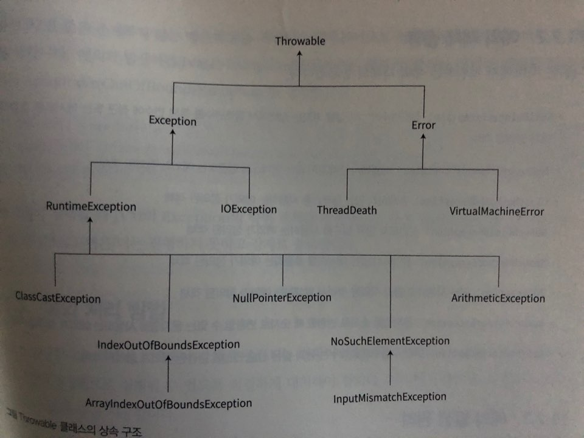

# 예외 처리

###### 2020.01.25

>프로그램을 구현 할 때 오류가 발생하여도 프로그램이 강제로 중단되지 않도록 예외 처리를 해야한다.
>
>자바는 객체지향 언어로 예외 처리 또한 객체로 처리하며, 예외 처리에 관련된 API를 Java SE에서 제공한다.
>
>java.lang 패키지의 **Exeption** 항목과 **Error** 항목으로 구분되어 있다. 

### I. 예외처리 객체 구조

- Java 프로그램에서 발생하는 모든 오류는 Throwable 클래스의 하위 객체로 정의됐다.

- Throwable은 Exception과 Error 계열로 분류되는데, **Error** 는 JVM 내에서 발생하는 에러로 프로그램 내에서 처리가 불가능하고 우리는 프로그램 내에서 발생하는 예외로서 **Exception**을 통해 오류를 처리할 수 있다.

- Exception 계열 예외는 `확인된 예외` 와 `미확인 예외`로 분류된다.

- `확인된 예외`는 존재하지 않는 외부 파일을 사용할때 등 통제할 수 없는 조건 때문에 발생한다.

- `확인된 예외`에 대한 예외 처리를 구현하지 않으면 컴파일 시 오류가 발생한다.

- `미확인 예외`는 존재하진 않는 배열 인덱스에 접근하거나 어떤 수를 0으로 나누는 등의 오류이다.

- 예외 객체 종류

    - `NullPointerException` : 참조변수가 null값을 가지는 상태에서 참조변수에 접근 혹은 메서드 호출

    - `IndexOutOfBoundsException` : 배열에서 존재하지 않는 인덱스에 접근

    - `ClassNotFoundException` : 존재하지 않는 클래스를 사용

    - `NoSuchFieldException` : 선언되지 않는 필드를 사용

    - `NoSuchMethodException` : 선언되지 않는 메서드 호출

    - `IOException` : 외부 자원과 입출력 작업을 하면서 발생

    - `NuberFormatException` : 문자열을 숫자로 변환할 때, 숫자로 변환할 수 없는 문자열 사용

    - `ArithmeticException` : 어떤 수를 0으로 나누는 등 산술 연산 관련 오류

- 객체 구조 다이어그램

    

<br />


### II. 예외 처리 방법

#### (1) try-catch 문

    ```java
    try {
        // 실행문
    } catch (변수 선언) {
        // 예외 처리
    }
    ```
- try 블록 안에 작성한 명령문에서 예외가 발생하면 catch 블록이 실행된다.

- 정상적일때는 catch 블록실행 안됨.

- try 블록에서 예외가 발생하면 JVM은 해당 예외 객체를 생성하고 예외 처리를 했는지 살펴본다.

- 만약 try 블록에서 발생한 예외를 catch 블록에서 처리하지 않았다면 프로그램은 그대로 종료된다.

- 다중블록도 가능하다.

    *e.g 배열 인덱스 예외 처리*

    ```java
    try {
        int arr[] = new int[3];
        arr[3] = 30;
        System.out.println("OK");
    } catch (ArrayIndexOfBoundsException e) {
        // ArrayIndexOutOfBoundsException에 대응하는 실행문
    }

    try {
        String s = new String("java");
        s = null;
        s.length(); // 예외 발생

        int arr[] = new int[3];
        arr[3] = 30;
        System.out.println("OK");
    } catch (NullPointerException e1) {
        // NullPointerException에 대응하는 실행문
    } catch (ArrayIndexOfBoundsException e2) {
        // ArrayIndexOutOfBoundsException에 대응하는 실행문
    } catch (Exception e) {
        // 모든 예외에 대응하는 실행문
    }
    ```

#### (2) 예외처리 메서드

- 모든 예외 객체가 상속받는 객체인 Throwable에서 자주 사용되는 메서드

    |제어자 및 타입 | 메서드 | 설명 |
    |---|---|---|
    |String | getMessage() | 발생한 예외 객체의 메세지 추출 |
    |void | printStackTrace() | 예외가 발생하기까지 호출된 순서를 거꾸로 출력 |
    |String | toString() | 발생한 예외 객체를 문자열로 출력 |

    >**e.g.**
    `e.getMessage()`
    `e.printStackTrace()`


#### (3) finally 문

- finally 문은 catch 문 다음에 선언한다.

- try 블록에서 사용했던 자원을 해제하기 위해 사용

- try 블록에서 파일 열기, 네트워크 연결, 데이터베이스 연결과 같은 작업을 했다면 작업이 완료된 후에 파일 닫기, 네트워크 연결 종료, 데이터베이스 연결 종료와 같은 자원 해제 작업을 해야한다.

- 자원 해제 기능을 담당하므로 예외 발생과는 상관없이 항상 실행된다.

    ```java
    try {
        System.out.println("1");
        System.out.println("2");
        System.out.println("3");
    } catch (Exception e) {
        System.out.println("오류 발생");
    } finally {
        System.out.println("OK");
    }
    System.out.println("4");
    ```
    > \>\>\> 1
    >
    > \>\>\> 2
    >
    > \>\>\> 3
    >
    > \>\>\> OK
    >
    > \>\>\> 4
    
    ```java
    try {
        System.out.println("1");
        String s = null;
        s.length();
        System.out.println("2");
        System.out.println("3");
    } catch (Exception e) {
        System.out.println("오류 발생");
    } finally {
        System.out.println("OK");
    }
    System.out.println("4");
    ```
    > \>\>\> 1
    >
    > \>\>\> 오류 발생
    >
    > \>\>\> OK
    >
    > \>\>\> 4


#### (4) try-with-resources 문

- try-catch-finally 문을 간단하게 쓸수 있도록 자원을 자동으로 해제해주는 구문

    ***resources 문 사용 전 : finally문 사용***
    ```java
    try {
        // 파일 처리 명령문
    } catch(Exception e) {
        // 에러 대응 명령문
    } finally {
        fi.close();
    }
    ```

    ***resources 문 사용 후 ***
    ```java
    try(FileInputStream fi = new FileInputStream("a.txt")){
        // 파일 처리 명령문
    } catch(Exception e) {
        // 에러 대응 명령문
    }
    ```

<br />

### III. 예외 던지기 : throws 문

- 메서드에서 직접 예외처리를 실행하지 않고, 만일 메서드가 실행될 때! 그 메서드 호출부에 예외를 던져
호출부에서 예외를 처리할 Exception 객체를 선언하는 것

    ```java
    public void c() throws Exception {
        // 예외 발생
    }

    public void b() {
        try {
            c();
        } catch(Exception e) {
            // 예외 처리
        }
    }
    ```

<br />

### IV. 사용자 정의 예외 객체

- 사용자 정의 예외 객체는 Exception 클래스를 상속하는데 Exception 클래스의 생성자는 다음과 같아서 인자를 예외 메서지로 지정한다.

    `Exception(String message)`

    ```java
    public class NagativeNumberException extends Exception {
        public NagativeNumberException() {
            super("음수를 허용하지 않습니다.");
        }
    }
    ```

    ```java
    public void charge(int time) {
        if (time<0) {
            try {
                // 강제로 예외 발생시키는 방법
                throw new NagativeNumberExeption();
            } catch(NagativeNumberException e) {
                // 예외 처리
            }
            
        }
    }
    ```

    

