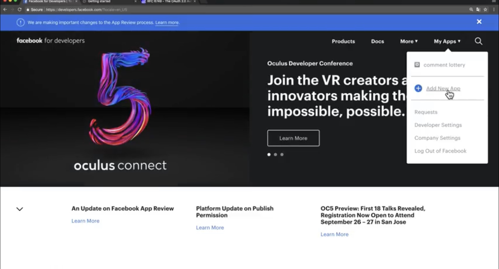

# 개념

###### 2020.03.09

### I. OAuth의 세 주체
- 우리가 만든 서비스 : **Client**
- 우리 서비스를 이용하는 사용자 : **Resouce Owner**
- 사용자가 회원가입되어있는 다른 서비스 (Google, Facebook, ...) : **Resouce Server**

### II. OAuth를 등록하는 절차

#### 1) 등록
- Client가 Resouce Server를 이용하기위 위해서는, Resouce Server의 승인을 사전에 받아놔야 한다.
- 등록하는 방법
  - Client ID, Client Secret, Authorized redirect URLs 세가지를 공통적으로 받는다.
  - Client Secret은 절대로 외부에 노출되면 절대절대 안된다.
  - Authorized redirect Urls : Resouce Server가 권한을 부여하는 과정에서 우리한테 Autorized code를 저달하는데, 이 주소로 전달해주세요! 하고 알려준 것.
- 예시 (Facebook)
  1. 페이스북 개발자 페이지 들어가기.
    
  2. My Apps - Add New App
    
  3. Display Name에다가 나의 사이트를 적는다. (i.e opentutorials) - Create App ID
    
  4. 원하는 기능 에 `set up` 누르기
    
  5. web을 할거니까 web(www)선택
    
  6. site url 입력하기 - `save`
    
  7. Facebook login - settigns
    
  8. Redirect URI to check 부분넣기 (사진의 주소는 그냥 예시)
    
  9. settings - Basic으로 들어가면 App ID, App Secret을 볼 수 있다.
    

- 예시 2 (Google)
    1. Google Cloud Platform 들어가기
    2. Select a project - New Project
    3. Project의 이름 적고 Create
    4. Select a project - [my project]
    5. 왼쪽 상단 햄버거 메뉴 클릭 - API & Services를 클릭
    6. Credentials 클릭
    7. `Create credentials` 클릭 - OAuth client ID 클릭
    8. `Configure conset screen` 클릭 (사용자가 인증하는 과정에서 보여지는 화면을 세팅해 달라)
       1. Project 이름, url, 등등 적기
       2. save
    9. Application type - web application으러 선택
    10. Name, Authorized redirect URIs 입력
    11. `create`
    12. 그럼 Client ID와 Client secret을 보여준다. (나만 알고있어야한다.)