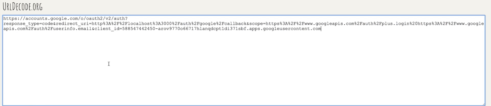

# 인증

###### 2020.03.09

## Resource Owner의 승인 과정
- 등록을 하게 되면 Client, Resouce Server모두 Client ID, Client Secret, redirect uri를 알게된다.
- 클라이언트는 redirect uri에 해당하는 endpoint를 준비해놔야한다.
- Resouce Owner(user)가 우리의 Resource Server에 접근하는 기능을 이용하기 위해서는 사용자인증을 거쳐야 한다.
- 그래서 나타는 화면이 `구글로 로그인`, `페이스북으로 로그인` 등의 화면이다.
- 각각의 `구글로 로그인`, `페이스북으로 로그인` 등의 버튼은 **그냥 링크다!!**
  - i.e. https://resource.server/?client_id=1&scope=B,C&redirect_uri=https://client/callback
    
- 만약 resource owner가 resource server에 로그인이 안되어있으면 로그인하라는 화면을 보여준다.(i.e. 구글에서!)
- Resouce Owner가 링크를 타고 들어가 로그인을 하면, 해당 link의 client_id값과 같은 clientID가 있는지 확인한다.
- 그리고 자신이 가지고 있는 가지고 있는 clientId에 상응하는 redirect url과 요청(link)의 redirect url과 같은지 확인하고 다르면 작업을 끝내버린다.
- 같다면, Resource Owner에게 Scope의 기능을 Client가 사용해도 되는지 확인하는 메세지를 전송한다.
- user가 허용하면 허용했다는 data를 resource server에 전달한다.
- resource server는 해당 user(resource owner)가 해당 scope 기능들을 허용했다는 것을 저장한다.

## Resource Server의 승인 과정
- Resource Server는 Owner의 승인을 받았다고 바로 access token을 발급하지 않는다.
- Resource server는 authorization code를 Resource owner에게 redirect url을 통해 전송한다.
  - 헤더를 통해 - Location:https://client/callback?code=3
  - 웹브라우저한테 https://client/callback?code=3 이라는 주소로 이동하라는 명령을 보내는 **리다이렉션 응답**이다.
- 이로 인해 Client(내 앱)은 authorization code를 알게 된다.
- Client는 Resource Server에 직접 접속한다.
  - 이와 같은 주소를 통해
  - https://resource.server/token?grant_type=authorization_code=3&redirect_uri=https://client/callback&client_id=1&client_secret=2
- Resource server 는 redirect uri, client id, client secret, authorization code를 모두 확인하고 일치하면!!! access token을 발급한다.

## Access token 발급
- 인증이 완료되었으므로 Resource Server, client는 Authorization code 값을 지운다.
- Resource Server는 access token을 생성해 Client에게 보내고
- Client는 db혹은 file을 통해 해당 token을 저장한다.