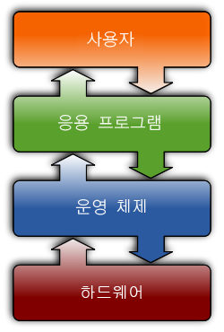
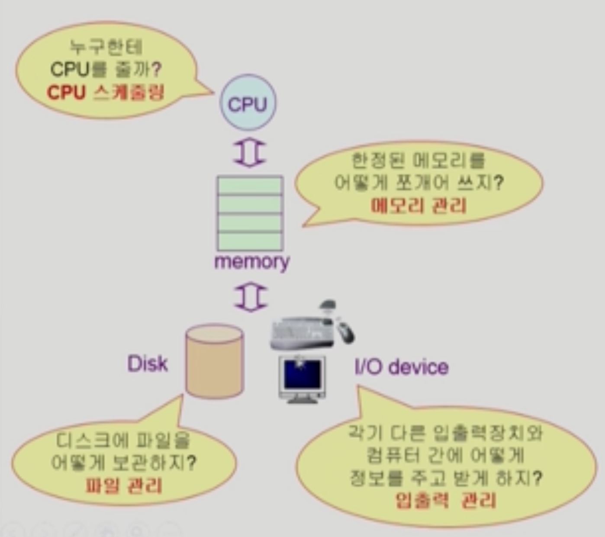

# OS Introduction

###### 2020.02.08

### I. 운영체제의 개념
- 컴퓨터 하드웨어 바로 위에 설치되어 사용자 및 다른모든 소프트웨어와 하드웨어를 연결하는 소프트웨어 계층
- 좁은 의미 : 컨널
- 넓은 의미 : 커널 + 주변 스스템 유틸리티

 

### II. 목적
- 컴퓨터 시스템의 자원을 효율적으로 관리
  - cpu, memory, i/o 장치 등의 효율적 관리 (하드웨어 자원)
  - 사용자 및 운영체제 자신 보호
  - 프로레스, 파일, 메세지 등을 관리 (소프트웨어 자원)

- 컴퓨터 시스템을 편하게 사용할 수 있는 환경 제공
  - 동시에 사용자/프로그램이 각각 독자적으로 컴퓨터에서 수행되는것 같은 환상 제공
  - 하드웨어를 직접 다루는 복잡한 부분을 운영체제가 대행

 

### III. 분류

#### 1) 동시작업 가능 여부

- 단일 작업 : 한번에 하나의 작업만 처리 (MS-DOS)
- 다중 작업 : 동시에 두개 이상의 작업 처리 (UNIX, MS Windows)

#### 2) 사용자의 수

- 단일 사용자 (MS-Dos, MS Windows)
- 다중 사용자 (UNIX, NT server)

#### 3) 처리 방식

- 일괄 처리 (batch processing) : 작업을 모아서 한꺼번에 처리
- **시분할 방식** (time sharing)
  - 여러 작업을 수행할 때 컴퓨터 처리 능력을 일정한 시간 단위로 분할하여 사용
  - interactive한 방식
  - 사람 중심의 방식
- 실시간 처리 방식
  - 데드라인이 있어서 정해진 시간안에 반드시 결과를 보장해주는 시스템
  - 원자로 공장 제어, 미사일 제어, 로봇 제어 등 특정한 목적을 가진 시스템에서 사용

 

### IV. 용어

1. 멀티테스킹
   - 하나의 프로그램이 끝나기 전에 다른 프로그램이 실행이 가능한 것
2. 멀티프로그래밍
   - 메모리 측면을 강조
   - 여러 프로그램이 메모리에 올라가는 것
3. 타임 쉐어링
   - cpu 측면을 강조
   - 여러개의 프로그램이 cpu를 나눠 사용
4. 멀티프로세스
   - 이것 역시 비슷한 의미

- ***멀티프로세서*** : 하나의 컴퓨터에 CPU가 어려개 붙어 있음을 의미

 

### V. 운영체제의 예

#### 1) UNIX
- 기본적으로 멀티테스킹이 되고 여러 사용자를 지원한다.
- 코드 대부분을 C언어로 작성
- 높은 이식성
- 복잡한 시스템에 맞게 확장 용이
- 오픈소스
- 다양한 버전 (Solaris, SunOS, FreeBSD, Linux)

#### 2) MS-DOS
- 단일 사용자용 운영체제, 메모리 관리 능력의 한계(주 기억장치: 640KB)

#### 3) MS Windows
- MS사의 다중 작업용 GUI 기반 운영 체제
- DOS용 응용 프로그램과 호환성 제공
- 불안전성
- 풍부한 지원 소프트웨어

 

#### VI. 운영체제의 구조
