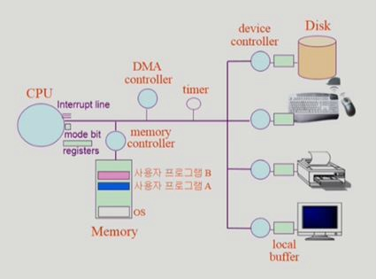

# System Structure & Program Execution 1

###### 2020.02.24

### 1. System Structure

### I. i/o 디바이스

#### 1) 디바이스 종류
  - 인풋 디바이스 : 키보드, 마우스
  - 아웃풋 디바이스 : 프린터, 모니터
  - 하드디스크 : 인풋, 아웃풋 모두 수행

#### 2) 동작
  - **디바이스 컨트롤러**를 통해 동작
  - 디바이스 컨트롤러 : 각 i/o 디바이스만의 작은 cpu
  - 디바이스 컴트롤러도 그들만의 메모리(작업공간)이 존재하는데 이를 **로컬 버퍼**라 한다.
  - cpu와 i/o 디바이스는 성능차이가 많이 나기 때문에 직접 cpu가 장치를 관리하지 않고 device controller가 관리한다.

#### 3) 디바이스 컨트롤러, 디바이스 드라이버
 - device driver : os 코드 중 각 장치별 처리 루틴(software)
 - device controller : 각 장치를 통제하난 작은 cpu(hardware)

 

### II. CPU

#### 1) register

  - memory보다 더 빠르면서 정보를 저장할 수 있는 작은 공간

#### 2) mode bit

  - 지금 cpu에서 실행되는 것이 운영체제인지 사용자프로그램인지 구분해 주는 것

#### 3) interrupt line

  - cpu는 메모리의 인스트럭션만 실행한다.
  - 인스트럭션 하나를 실행하고 나면 다음 인스트럭션을 실해는 것의 반복
  - 키보드나 디스크 등 i/o 장치들과의 교류 등을 위해 존재
  - cpu는 i/o 디바이스에 직접 접근하지 않고 계속 메모리에만 접근해 메모리 인스트럭션만 실행한다.
  - 그러면 디스크에서 뭘 읽어오라는 인스터력션은 ?
    - 디스크 컨트롤러한테 특정 데이터를 가져오라고 일을 시킨다. (그런 인스트럭션이 있다.)
    - 그리고 자기가 할 일을 한다. (당장 cpu를 주면 다른 일을 할 수 있는 프로그램에게 cpu 할당)

 

### III. timer

- 특정 프로그램이 cpu를 톡정하는것을 막기 위한 장치
- 처음 컴퓨터를 키면 운영체제가 cpu를 가지고 있다가 여러 사용자 프로그램에게 cpu를 넘겨주는데, 그냥 넘겨주는 것이 아니라 타이머에 값을 세팅한 다음에 넘겨준다.
- 타이머의 값은 클럭을 의미하는데 한번 cpu를 할당받았을 때, 몇개의 인스트럭션을 실행시키는지의 값이다.
- 타이머가 다 되면, 타이머는 cpu 인터럽트라인을 추가한다.
- cpu는 모든 인스트럭션을 실행하면서 하나의 인스트럭션이 끝나면 인터럽트라인을 체크한다.
- 인터럽트 라인이 비어있으면 다음 인스트럭션을 실행한다.
- 인터럽트 들어온게 있으면 cpu의 제어권을 사용자 프로그램에서 운영체제로 넘긴다. (mode bit를 0으로 바꾼다.)
- cpu 제어권이 운영체제에서 한번 사용자 프로그램으로 넘어가면 마음대로 다시 빼앗아올 수는 없는데, 인터럽트가 발생하면 운영체제에게 cpu 제어권이 다시 넘어간다.
- e.g
  - 사용자 프로그램에서 키보드 입력을 받는다.
  - 사용자가 키보드에 입력을 하면 키보드 디바이스 컴트럴러가 cpu에 인터럽트를 건다.
  - cpu는 어떤 인스트럭션을 실행한 후, 인터럽트 라인을 체크한다.
  - 인터럽트 라인이 있으니까 cpu는 운영체제에게 제어권이 넘어간다.
  - 운영체제는 인터럽트가 왜들어왔나, 인터럽트 벡터와 인터럽트 루틴을 통해 실행을 한다. (예를 들어, 아까 어떤 프로그램이 요청했던 키보드 인터럽트가 들어왔으니까, 입력된 키보드 버퍼 값을 요청했던 사용자프로그램의 메모리에 카피를 해주고, 보통은 해당 사용자프로그램한테 cpu 제어권을 준다.)
  

 

### IV. Mode bit

- cpu의 제어권을 사용자 프로그램이 가지고있는지 운영체제가 가지고있는지 구분해 주는 것
- 모드 비트
  - 0 : 커널 모드, 모든 인스트럭션을 실행할 수 있다.
  - 1 : 유저 모드, 제한된 인스트럭션만 실행할 수 있다.

 

### V. DMA

- 직접 메모리에 접근할 수 있는 컨트롤러
- 메모리 컨트롤러는 cpu와 dma중 어떤게 메모리에 접근하는지에 대한 접근 (동기화)
- cpu가 계속 인터럽트 라인을 받고 운영체제로 제어권을 넘기고 하는 것이 오버헤드가 커서, i/o장치에서 직접 메모링 접근할 수 있도록 한 것
- dma로 인한 작업이 끝나면 cpu에 인터럽트를 한번만 걸어서 모든 내용이 메모리에 올라 왔다고 보고를 한다.

 

### VI. Interrupt

#### 1) System call

- 소프트웨어 인터럽트 (트랩)
- 사용자 프로그램이 I/O 작업을 해야 할때, 직접 I/O 장치에 접근 할 수 없기 때문에 (mode bit = 1) 운영체제에게 부탁을 해야 하는데, 그러기 위해서는 인터럽트 라인을 설정해야 한다.
- 시스템 콜이란 **사용자 프로그램이 운영체제에 cpu제어권을 주기 위해 직접 인터럽트 라인을 설정하는 것**
- 또다른 소프트웨어 인터럽트로는 예외가 있다.

#### 2) 하드웨어 인터럽트

- 하드웨어가 발생시킨 인터럽트
- i/o 디바이스에서 일이 다 끝났다고 말하는것

#### 3) 인터럽트 관련 용어

- 인터럽트 벡터 : 해당 인터럽트의 처리 루틴 주소를 가지고 있는 것 (1번이 오면 어떤 인터럽트 처리 루틴을, 2번이 오면 엉떤 인터럽트 처리 루틴을 실행할지 적혀있는 것)
- 인터럽트 처리 루틴 (=인터럽트 핸들러) : 해당 인터럽트를 처리하는 커널 함수

#### 4) 예시 (i/o작업을 하기 위한 인터럽트)

1. 사용자 프로그램에서 **시스템 콜**을 요청해 cpu제어권을 운영체제에게 준다. 운영체제는 디바이스 컨트롤러에 접근한다.
2. cpu는 다른 사용자 프로그램을 실행하고 있고, i/o디바이스에서 일이 다끝나면 **하드웨어 인터럽트**를 건다.