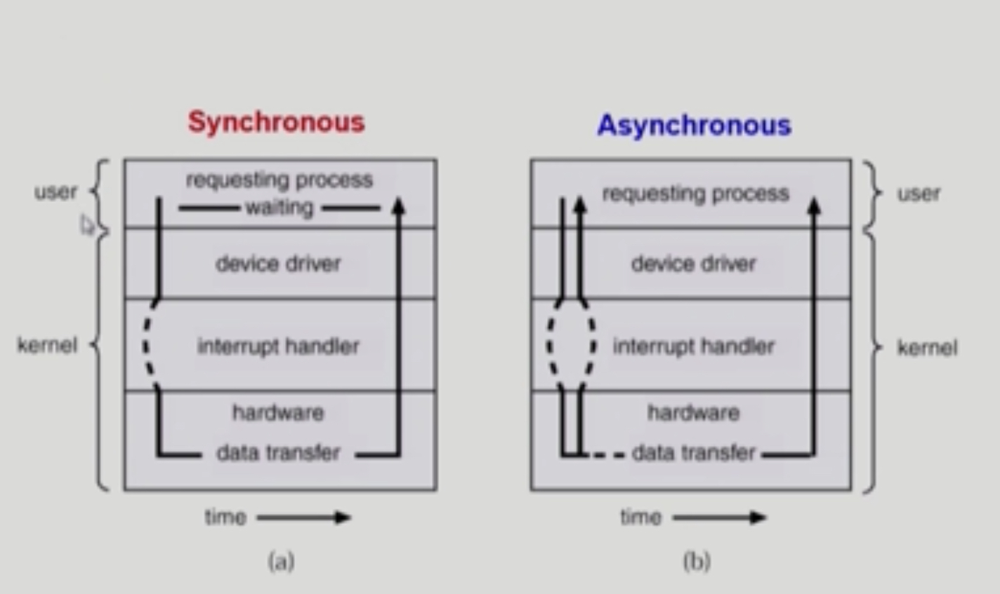
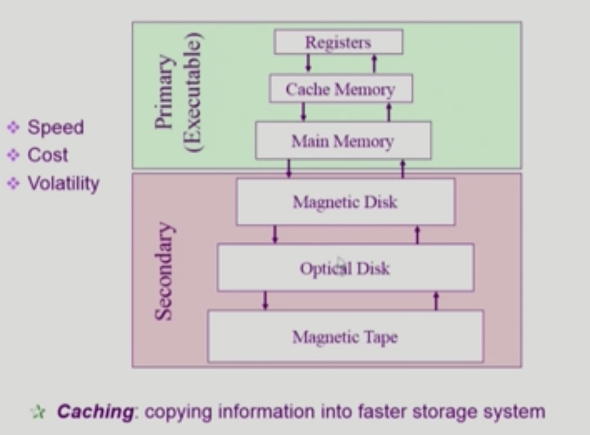
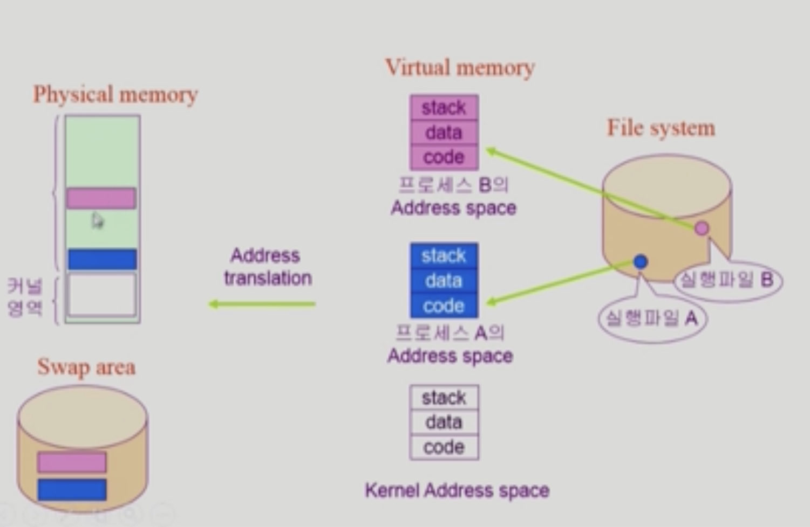
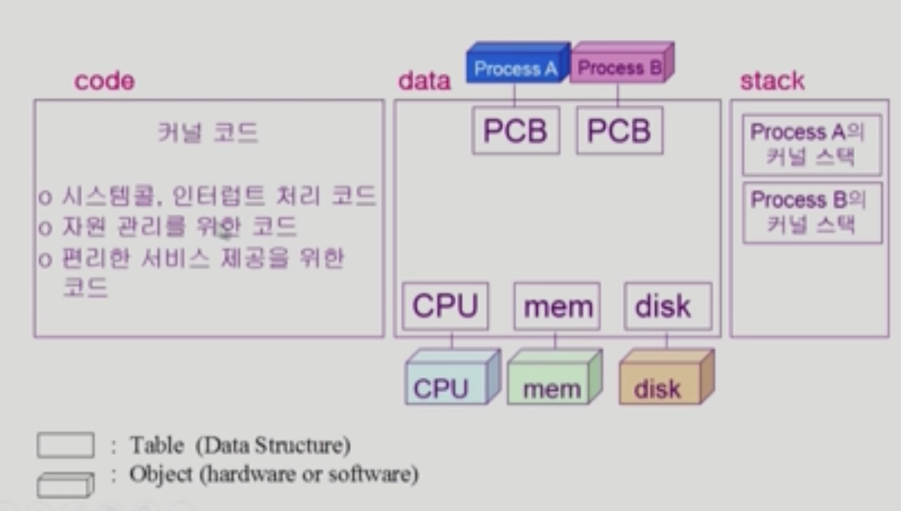

# System Structure & Program Execution 2

###### 2020.02.25

### I. 동기식 입출력과 비동기식 입출력

#### 동기식 입출력 Synchronous I/O

- I/O 요청 후 입출력 작업이 완료된 후에야 제어가 사용자 프로그램에 넘어감
- 구현 방법 1
  - I/O가 끝날 때까지 CPU를 낭비시킴
  - 매시점 하나의 I/O만 일어날 수 있음
- 구현 방법 2
  - I/O가 완료될 때까지 해당 프로그램에게서 CPU를 빼앗음
  - I/O 처리르 기다리는 줄에 그 프로그램을 줄 세움
  - 다른 프로그램에게 CPU를 줌
  
#### 비동기식 입출력 Asynchronous I/O

- I/O가 시작된 후 입출력 작업이 끝나기를 기다리지 않고 제어가 사용자 프로그램에 즉시 넘어감

***두 경우 모두I/O의 완료는 인터럽트로 알려줌***

 

### II. DMA

- **D**irect **M**emory **A**ccess
- CPU의 중재 없이 device controller가 device의 buffer storage의 내용을 메모리에 block 단위로 직접 전송
- 바이트 단위가 아니라 block단위로 인터럽트를 발생시킴

 

### III. 저장장치 계층 구조

- 속도, 비용, 휘발성에 따른 구분
- 캐싱 : 재사용을 목적으로 사용

 

### III. 프로그램의 실행

- 프로그램은 실행파일 형태로 하드디스크에 저장이 되어있다. (파일 시스템에)
- 프로그램을 실행시키면 메모리로 올라가 프로세스가 된다.

**virtual Memory**
- 어떤 프로그램을 실행시키게 되면 0번지부터 시작하는 그 프로그램만을 위한 독자적인 주소공간이 메모리에 생성된다.
  - A프로그램을 실행시키면 0번지부터 시작하는 프로세스A의 주소공간이 생성된다.
  - B프로그램을 실행시키면 0번지부터 시작하는 프로세스B의 주소공간이 생성된다.
- 각 프로세스의 주소공간은 code, data, stack으로 구성된다.
  - 코드는 기계어 코드를 담고 있다.
  - 데이터는 전역 변수라던지 자료구조를 담고 있다.
  - 스택은 함수와 지역변수를 담고 있다.
- 물리적 메모리에 커널은 항상 상주해 있지만 너무 많은 프로그램이 실행될 경우 모두 물리적 메모리에 올릴 수 있다.
  - 당장 필요한 부분만 메모리에 올려 놓고
  - 잠시 없어도 되는 부분은 Hard disk의 Swap area로 잠시 빼 놓는다.
  - Swap area와 파일 시스템의 하드디스크는 용도가 다르다. ( 컴퓨터가 꺼지면 Swap Area의 데이터는 메모리처럼 모두 사라진다. - 휘발성)
- 0번지부터 시작하는 각 주소공간은 가상 주소이고, 물리적인 메모리 주소로 바뀌려면 주소 변환이 필요한데 이는 하드웨어의 도움을 받는다.

 

### IV. 커널 주소 공간의 내용

- data
  - 운영체제가 사용하는 여러 자료구조들
  - PCB : 각 프로세스들을 관리하기 위한 자료구조
  - 하드웨어를 관리하기 위해 하드웨어 종류마다 자료구조를 만들어 가지고 있다.
- Stack
  - 운영체제도 함수이기 때문에 Stack영역 존재

 

### V. 사용자 프로그램이 사용하는 함수

- 사용자 정의 함수
  - 자신의 프로그램에서 정의한 함수
- 라이브러리 함수
  - 자신의 프로그램에서 정의하지 않고 갖다 쓴 함수
  - 자신의 프로그램의 실행 파일에 포함되어 있다.
- 커널 함수
  - 운영체제 프로그램의 함수
  - 커널 함수의 호출 = 시스템 콜
