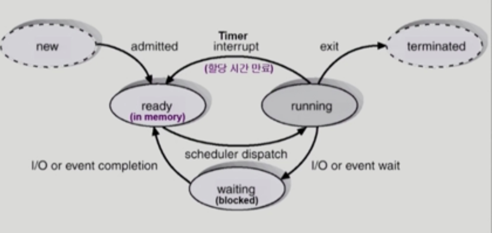
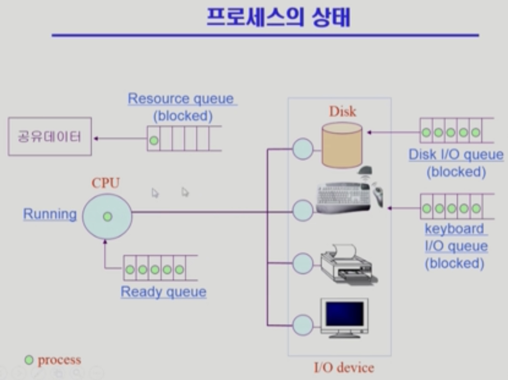
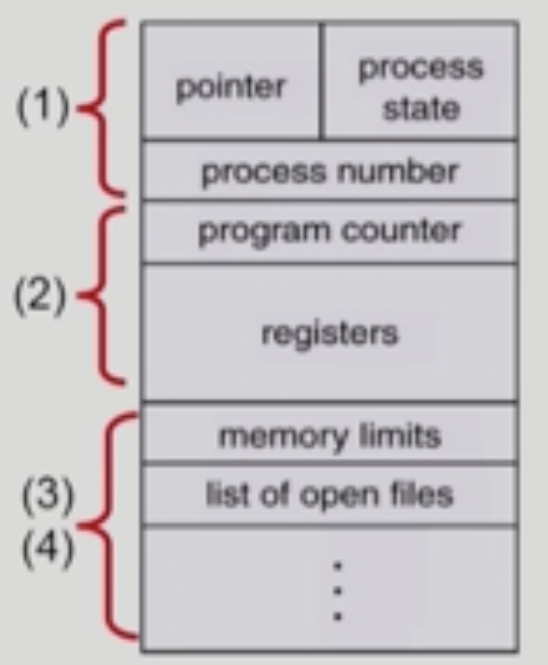
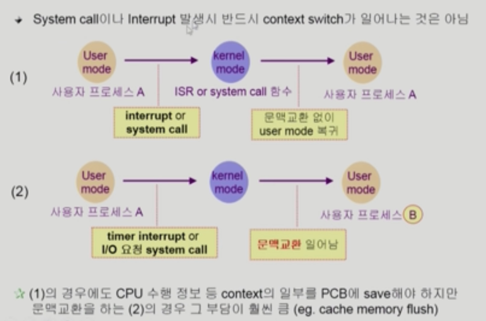
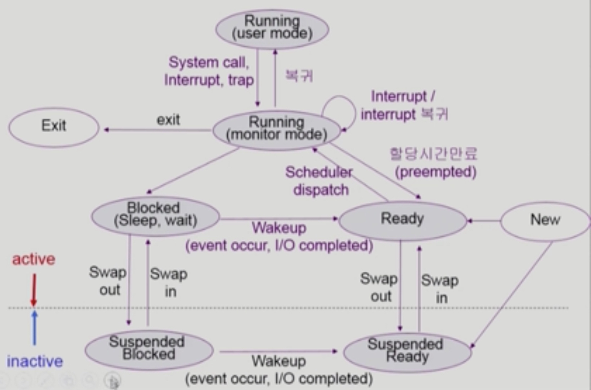

# Process 1

###### 2020.02.26

### I. 개념

- Program in execution
- **프로세스의 문맥(context)**
  - CPU 수행 상태를 나타내는 하드웨어 문맥
    - Program Counter, 각종 register
    - PC에는 뭐가 들어있고, 각종 register에는 뭐가 들어있고, 어떤 인스트럭션까지 실행했는가 등의 정보
  - 프로세스의 주소 공간 (code, data, stack)
  - 프로세스 관련 커널 자료 구조 (PCB, Kernel stack)

 

### II. 프로세스 상태(Process State)

#### Running
- CPU를 잡고 instruction을 수행중인 상태

#### Ready
- CPU를 기다리는 상태 메모리 등 다른 족건을 모두 만족하고)

#### Blocked (wait, sleep)
- CPU를 주어도 당장 instruction을 수행할 수 없는 상태
- Process 자신이 요청한 event가 즉시 만족되지 않아 이를 기다리는 상태
- (예) 디스크에서 file을 읽어와야 하는 경우, 어떤 instruction을 실행 시키고자 하는데 메모리에 안올라와있고 Swap area에 있을때 당장 CPU를 줘봤자 할 수 있는게 없을 때

##### New : 프로세스가 생성중인 상태
##### Terminated : 수행이 끝난 상태, **종료 중**인! 상태

- 프로세스를 스케쥴링하기 위한 큐
  - Job queue : 현재 시스템 내에 있는 모든 프로세스의 집합
  - Reqdy queue : 현재 메모리 내에 있으면서 CPU를 잡아서 실행되기를 기다리는 프로세스의 집합
  - Device queues : I/O device마다 각각의 처리를 기다리는 프로세스의 집합
  - 프소세스들은 각 큐들을 오가며 수행한다.

 

### III. PCB (Process Control Block)

- 운영체제가 각 프로세스를 관리하기 위해 프로세스당 유지하는 정보
- 다음 구성 요소를 가진다.(구조체로 유지)
  1. OS가 관리상 사용하는 정보
     - Process state, Process ID
     - scheduling information, priority
  2. CPU 수행 관련 하드웨어 값
     - Program counter, registers
  3. 메모리 관련
     - Code, data, stack의 위치정보
  4. 파일 관련
     - Open file descriptors...

 

### IV. 문맥 교환(context switch)

- CPU를 한 프로세스에서 다른 프로세스로 넘겨주는 과정
- CPU가 다른 프로세스에게 넘어갈 때 운영체제는 다음을 수행
  - CPU를 내어주는 프로세스의 상태를 그 프로세스의 PCB에 저장
  - CPU를 새롭게 얻는 프로세스의 상태를 PCB에서 읽어옴
  - 여기서 프로세스의 상태는 Register값들, PC 값 등
- **System call이나 Interrupt 발생시 반드시 context swtich가 일어나는 것은 아니다.**

 

### V. 스케쥴러

#### Long-term scheduler (장기 스케쥴러 or job 스케줄러)
- 시작 프로세스 중 어떤 것들을 ready queue로 보낼지 결정
- 프로세스에 memory를 주는 문제
- degree of Multiprogramming을 제어
- **time sharing system에는 보통 장기 스케쥴러가 없음 (무조건 ready)**

#### Short-term scheduler (단기 스케줄러 or CPU 스케줄러)
- 어떤 프로세스를 다음번에 running 시킬지 결정
- 프로세스에 CPU를 주는 문제
- 충분히 빨라야 함 (millisecond 단위)

#### Medium-Term scheduler (중기 스케줄러 or Swapper)
- 여유 공간 마련을 위해 프로세스를 통째로 메모리에서 디스크로 쫒아냄
- 프로세스에게서 memory를 뺏는 문제
- degree of Multiprogramming을 제어

 

### VI. 중기스케쥴러에서 프로세스의 상태

#### Running
- CPU를 잡고 instruction을 수행중인 상태

#### Ready
- CPU를 기다리는 상태 메모리 등 다른 족건을 모두 만족하고)

#### Blocked (wait, sleep)
- CPU를 주어도 당장 instruction을 수행할 수 없는 상태

#### **Suspended (Stopped)**
- 외부적인 이유로 프로세스의 수행이 정지된 상태
- 프로세스는 통째로 디스크에 Swap out된다.
- (예) 사용자가 프로그램을 일시 정지시킨 경우(break key), 시스템이 여러 이유로 프로세스를 잠시 중단시킴 (메모리에 너무 많은 프로세스가 올라와 있을 때)

<h5 style='color:red'>Blocked : 자신이 요청한 event가 만족되면 ready</h5>
<h5 style='color:red'>Suspended : 외부에서 resume해 주어야 Active</h5>

