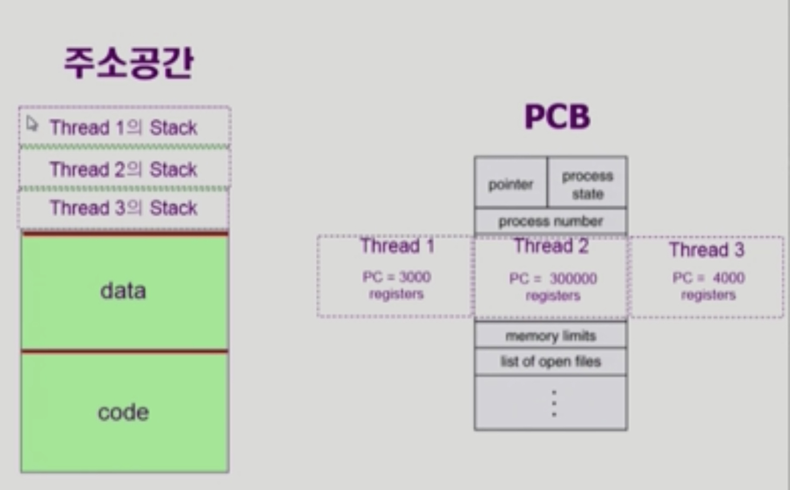

# Process 2

###### 2020.02.26

### I. Thread

- basic unit of CPU utilization
- Thread의 구성
  - program counter
  - register set
  - stack space
- Thead가 동료 thread와 공유하는 부분 (=task)
  - code section
  - data section
  - OS resources
- 전통적인 개념의 heavyweight process는 하나의 thread를 가지고 있는 task로 볼 수 있다.
- Process하나에 CPU수행 단위(PC, registers)만 여러개 두고 있는 것을 thread라고 한다.

 

### II. 스레드의 효과
- 다중 스레드로 구성된 태스크 구조에서는 하나의 서버 스레드가 blocked 상태인 동안에도 동일한 태스크 내의 다른 스레드가 실행되어 빠른 처리를 할 수 있다.
- 자원을 아낄 수 있다.
- 동일한 일을 수행하는 다중 스레드가 협력하여 높은 처리율과 성능 향상을 얻을 수 있다.
  - 스레드를 생성하는것보다 프로세스 생성하는 것의 오버해드가 훨씬 높고 (solaris경우 30배)
  - 스레드를 스위치하는것보다 프로세스를 스위치하는 것의 오버헤드가 훨씬 높다 (solaris경우 5배)
- 스레드를 사용하면 병렬성을 높일 수 있다. (멀티 코어에서 가능)

 

### II. 스레드의 실행

- 커널 스레드와 유저 스레드로 나뉜다.
- 커널 스레드는 스레드가 여러개 있다는 것을 운영체제가 알고 있다.
- 유저 스레드는 라이브러리르 통해 지원되고 운영체제는 프로세스 내에 여러개의 스레드가 있는지 모른다.