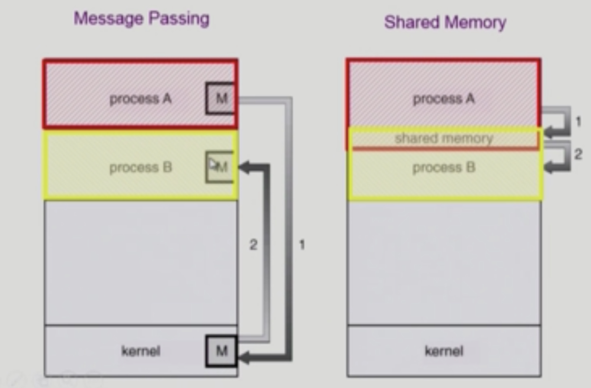

# Process Management

###### 2020.02.27

### I. 프로세스가 어떻게 만들어지는가

- **부모 프로세스가 자식 프로세스를 생성**
  - 보통 복제 생성
- 프로세스의 트리 형성
- 프로세스는 자원을 필요로 함
  - 운영체제로부터 받는다
  - 부모와 공유한다
- 자원의 공유
  - 전혀 공유하지 않는 모델 (일반적으로는 공유하지 않는다.)
  - 부모와 자식이 모든 자원을 공유하느 모델
  - 일부를 공유하는 모델
    > COW (Copy on Write) <br />
    > 
    > - Write가 발생했을 때(내용이 바뀌면), Copy하는 기법
    > - 자식프로세스는 부모프로세스를 복사해서 생성되는데, 그러면 똑같은 데이터가 메모리상에 두개가 존재하는 것이다. 이것은 메모리 낭비이기 때문에 **공유 모델**에서는 일단! 복사할 필요 있는 데이터만 복사해 놓는다. 그러다가 각자의 길을 가게 되면 그제서야 부모의 메모리를 일부 복사해서 사용한다. (e.i. Linux)<br />
- 수행
  - 부모와 자식은 공존하며 수행되는 모델
  - 자식이 종료될 때까지 부모가 기다리는 모델
  
<br />

#### 어떻게 생성하느냐?
- `fork()`시스템 콜을 통해 새로운 프로세스를 생성하고(부모의 공간 복사), `exec()` 시스템 콜을 통해 새로운 프로그램을 그 자리에 덮어 씌움
  - **fork()**
    - 부모프로세스의 주소공간을 자식 프로세스가 그대로 복사한다.
    - 운영체제의 PCB 등의 데이터도 그대로 복사한다.
  - **exec()**
    - 그리고 그 복제된 공간에 새로운 프로그램을 덮어씌운다.
- 두개의 명령 모두 시스템 콜이기 때문에 부모 프로세스 자신이 직접하진 못하고, 운영체제에게 시키는 것

<br />

#### 어떻게 종료하느냐?

- 프로세스가 마지막 명령을 수행한 후 운영체제에게 이를 알려준다. (`exit()` 시스템 콜) - 자발적인 종료
  - c언어로 작성할때 중괄호를 닫게되면 명시적으로 exit()시스템콜을 하지 않았더라도 컴파일러가 자동으로 넣어주게 된다.
  - 자식이 부모에게 output data를 보냄 (`wait()` 시스템 콜을 통해)
  - 프로세스의 각종 자원들이 운영체제에게 반납됨
- 부모 프로세스가자식의 수행을 종료시킴 (`abort()` 시스템 콜) - 비자발적인 종료
  - 자식이 할당 자원의 한계치를 넘어섬
  - 자식에게 할당된 태스크가 더 이상 필요하지 않음
  - 부모가 종료(exit)하는 경우
    - 운영체제는 부모 프로세스가 종료하는 경우 자식이 더이상 수행하게 두지 않는다.
    - 단계적인 종료

<br />

### II. fork() 시스템 콜

- 프로세스는 `fork()`시스템 콜을 통해 생성된다.
  
    ```c
    int main() {
        int pid;
        pid = fork();
        if (pid == 0)       /* this is child */
            print("\n Hello, Iam child!\n");
        else if (pid > 0)   /* this is parent */;
            print("\n Hello, Iam parent!\n");
    }
    ```
- 자식 프로세스는 fork이후부터 실행이 된다.
- PCB를 고대로 복사하기 때문에 다음 실행 시점부터 실행을 한다.
- 처음 pid = 0으로 초기화되는데, 복제된 시점에서 자식 프로세스는 pid=0을 그대로 받아서 사용하고, 부모는 fork()로부터 리턴된 값을 pid로 사용하기 때문에 pid가 0이면 자식프로세스를, 양수이면 부모프로세스를 실행한다.

<br />

### III. exec() 시스템 콜

- 어떤 프로그램을 완전 새로운 프로세스로 태어나게 하는 역할을 한다.

    ```c
    int main() {
        int pid;
        pid = fork();
        if (pid == 0)       /* this is child */
            print("\n Hello, Iam child!\n");
            execlp("/bin/date", "/bin/date", (char *)0);
        else if (pid > 0)   /* this is parent */;
            print("\n Hello, Iam parent!\n");
    }
    ```
    > 부모프로세스가 fork()를 해서 복제된 자식프로세스가 만들어지면, 자식 프로세스는 date라는 새로운 프로그램을 덮어 씌우고 있다.
- 한 번 exec을 하면되돌아올 수 없다.


<br />

### IV. wait() 시스템 콜

- 프로세스 A가 `wait()` 시스템 콜을 호출하면
  - 커널은 child가 종료될 때까지 프로세스 A를 sleep시킨다. (block 상태)
  - 자식 프로세스가 종료되면 커널은 프로세슬 A를 깨운다. (ready 상태)
- 부모프로세스에서 wait()을 호출하면 자식 프로세스가 다 끝난 후에 wait이후의 명령어를 처리한다.
    ```c
    main {
        int childPID;

        childPID = fork();

        if(childPID == 0) 
            <code for child process>
        else {
            wait();
        }
        ...
    }
    ```
- 예시
  - 프로그램을 입력하라고 터미널 커서가 떠있는 그거가 하나의 프로그램(shell)이고
  - 거기에 프로그램 이름을 치고 (e.i python) 엔터를 누르면 파이썬 프로그램을 실행하고 커서에 다른 프로그램을 입력할 수는 없어진다.
  - 파이썬 프로그램이 종료된 후에야 다시 다른 프로그램을 실행시킬 수 있는 커서가 뜬다.(shell 프로세스가 block이 풀린다.)
  - 이게 사실 wait()시스템 콜을 사용한 것.


<br />

### V. exit() 시스템 콜

- 자발적 종료
  - 마지막 구문을 수행 후 `exit()` 시스템 콜을 통해
  - 프로그램에 명시적으로 적어주지 않아도 main 함수가 리턴되는 위치에 컴파일러가 넣어줌
- 비자발적 종료
  - 부모 프로세스가 자식 프로세스를 강제 종료시킴
    - 자식 프로세스가 한계치를 넘어서는 자원 요청
    - 자식에게 할당된 태스크가 더 이상 필요하지 않음
  - 키보드로 kill, break 등을 친 경우
  - 부모가 종료하는 경우
    - 부모 프로세스가 종료하기 전에 자식들이 먼저 종료됨


<br />

### VI. 프로세스 간 협력

#### 독립적 프로세스
- 프로세스는 각자의 주소공간을 가지고 수행되므로 원칙적으로 하나의 프로세스는 다른 프로세스의 수행에 영향을 미치지 못함

#### 협력 프로세스
- 프로세스 협력ㅍ 메커니즘을 통해 하나의 프로세스가 다른 프로세스의 수행에 여향을 미칠 수 있음

#### 프로세스 간 협력 메커니즘 (IPC)

- 메세지를 전달하는 방법 (message passing)
  - 커널을 통해 메세지 전달
  - 프로세스 사이에 공유 변수를 일체 사용하지 않고 통신하는 시스템
  - direct communication : 통신하려는 프로세스의 이름을 명시적으로 표시
  - indirect communication : mailbox 또는 port를 통해 메세지를 간접 전달
- 주소 공간을 공유하는 방법 (shared memory)
  - 원칙적으로 프로세스는 독자적인 메모리 공간(코드, 데이터, 스택)을 사용하는데, 그럼에도 불구하고 일부 주소 공간을 두 프로세스가 공유하는 방법
  - 서로 다른 프로세스 간에도 일부 주소 공간을 공유하게 하는 shared memory 메커니즘이 있음
  - 공유 메모리 역시 커널에게 공유 메모리 쓴다고 말 해놓고 사용