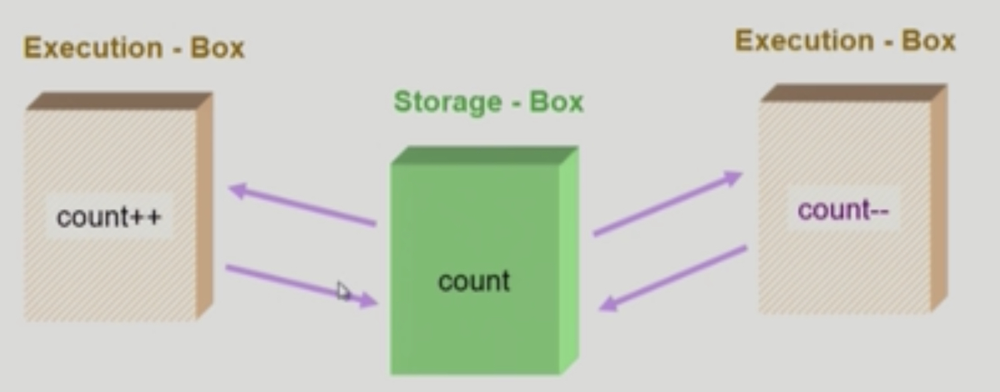
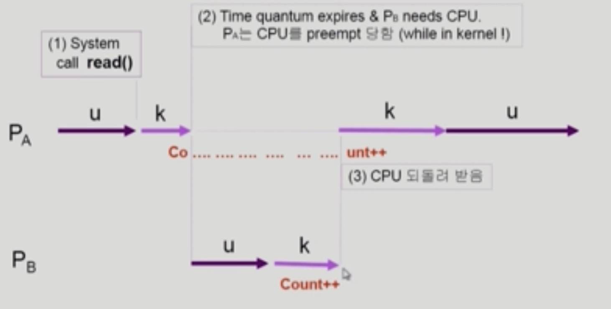
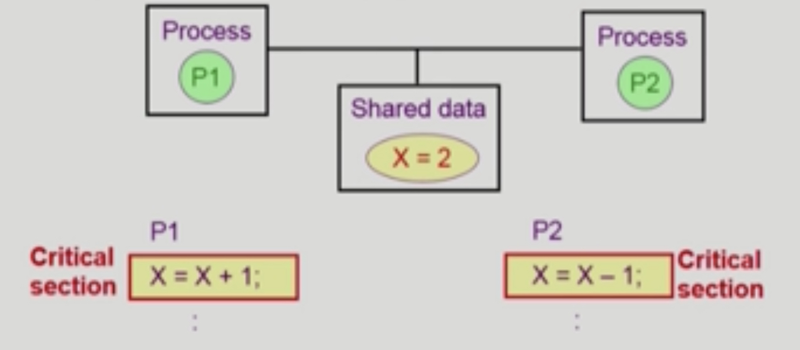

# Process Synchronization 1

###### 2020.02.29

### I. 데이터 접근 패턴

- Storage box 에서 연산할 data를 가져와 Execution Box에서 연산을 하고 연산 결과를 원래 위치인 Storage box에 저장한다.
- Storage-box를 여러 Execution box가 공유할 경우 동기화 문제가 생긴다.
- Race-condition(경쟁상태) : 여러 주체가 하나의 데이터를 동시에 접근하려 할때 생기는 문제
    
- 하나의 프로세스가 A라는 데이터를 읽는 동안 또다른 프로세스가 A라는 데이터를 읽어 갈 수 있는 Multiprocessor system에서 밝생할 수 있다.
- 공유메모리를 사용하는 프로세스들간에 커널 내부 데이터를 접근하는 루틴들간에 발생할 수 있다.
- 멀티스레딩 환경에서도 일어날 수 있다.

### II. OS에서 race condition은 언제 발생하는가?
1. kernel 수행 중 인터럽트 발생 시
2. Process가 System call을 하여 kernel mode로 수행 중인데 context switch가 일어나는 경우

    - 커널 모드에서 수행중일 때에는 할당 시간이 끝나도 CPU를 preempt하지 않는다. 커널 모드에서 유저모드로 돌아갈 때 preempt한다.
3. Multiprocessor에서 shared memory 내의 kernel data에 접근할 경우
    - 이런 경우 interrupt enable/disable로 해결되지 않는다.
    - 방법1 : 한번에 하나의 CPU만 커널에 들어갈 수 있게 하는 방법
    - 방법2 : 커널 내부에 있는 각 공유 데이터에 접근할 때마다 그 데이터에 대한 lock/unlock을 하는 방법

### III. Process Synchronization 문제
- 공유 데이터의 동시 접근은 데이터의 불일치 문제를 발생시킬 수 있다.
- 일관성 유지를 위해서 협력 프로세스 간의실행 순서를 정해주는 메커니즘 필요
- Race condition
  - 여러 프로세스들이 동시에 공유 데이터를 접근하는 상황
  - 데이터의 최종 연산 결과는 마지막에 그 데이터를 다룬 프로세스에 따라 달라짐
- race condition을 막기 위해서는 concurrent process는 동기화되어야 한다.

#### Critical section
각 프로세스에서 공유 데이터에 접근하는 코드!!
