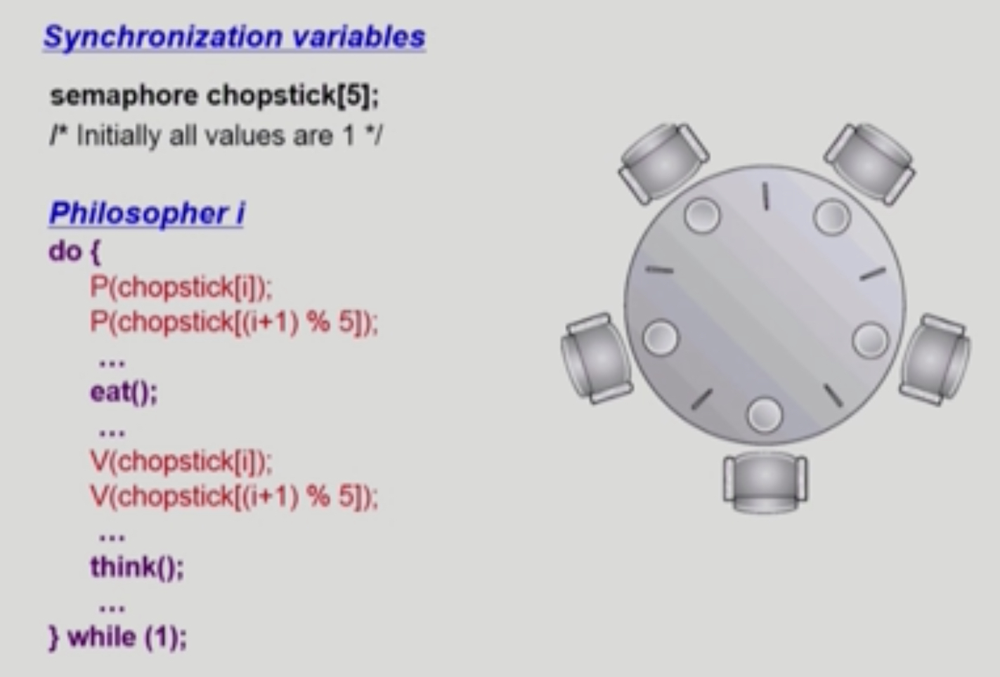

# Process Synchronization 2

###### 2020.03.01

### I. 크리티컬 섹션에 대한 프로그램적 해결법의 충족 조건

1. Mutual Exclusion
    - 프로세스 Pi가 critical section 부분을 수행 중이면 다른 모든 프로세스들은 거들의 critical section에 들어가면 안된다.
2. Progress
    - 아무도 critical section에 있지 않은 상태에서 critical section에 들어가고자 하는 프로세스가 있으면 critical section에 들어가게 해주어야 한다.
3. Bounded Waiting
    - 기다리는 시간이 유한해야 한다.
    - 기아현상(starvation)이 없어야한다.
    - 프로세스가 critical section에 들어가려고 요청한 후부터 그 요청이 허용될 때까지 다른 프로세스들이 critical section에 들어가는 횟수에 한계가 있어야 한다.

- 가정
  - 모든 프로세스의 수행 속도는 0보다 크다.
  - 프로세스들 간의 상대적인 수행 속도는 가정하지 않는다.


### II. 크리티컬 섹션의 문제 (락을 잘 걸었다 푸는) 알고리즘들

#### 1) Algorithm 1

- Process가 두개(P0, P1)이 있다고 가정
  - Synchronization variable
    ```c
    int turn = 0; // Pi can enter its citical section if(turn == i)
    ```
  - Process P0
      ```c
      do {
          while (turn != 0);      /* My turn? */
          // critical section
          turn = 1;               /* Now it's your turn */
          // remainder section
      } while(1);
      ```
  - Process P1
      ```c
      do {
          while (turn != 1);      /* My turn? */
          // critical section
          turn = 0;               /* Now it's your turn */
          // remainder section
      } while(1);
      ```
- 설명
  - turn이 0이면 0번 프로세스, 1이면 1번프로세스의 차례라는 뜻이다.
  - turn은 공유 데이터이다.
  - turn이 0이 아닐때, 0번 프로세스의 차례가 아닐때는 계속 while문을 돌면서 기다린다.
  - turn이 0으로 바꾸는 순간(프로세스 1번이 바꿔줄 것이다.) 0번프로세스의 critical section에 들어간다.
- Mutual exclution은 만족한다. (하나 이상이 들어갈 수 없다.)
- 하지만 Progress조건을 만족하지 않는다. (아무도 못들어갈 수 있다.)
- 하나의 프로세스가 더 빈번히 크리티컬 섹션에 들어가고 싶을 경우에도, 다른 프로세스가 turn을 줄때까지 들어갈 수 없다.


#### 2) Algorithm 2

- 코드
  - Synchronization variable
    ```c
    boolean flag[2];
    initially flag[모두] = false;  /* No one is in Critical Section */
    // Pi ready to enter its critical section if (flag[i] == true)
    ```
  - Process Pi
      ```c
      do {
          flag[i] = true;       /* Pretene I am in */
          while (flag[j]);      /* Is he(Pj) also in? then wait */
          // critical section
          flag[i] = false;      /* I am out now */
          // remainder section
      } while(1);
      ```
- Mutual Exclusion은 만족하나, Progress 조건은 만족하지 않는다.
- Process i가 본인의 깃발을 든 상태에서 CPU를 뺏기고 다른 프로세스에게 넘어가면 그 프로세스도 깃발을 true로 바꾸고 기다리다가 CPU를 빼앗기게 되고 누구도 CPU에 들어갈 수 없는 상태가 된다.


#### 3) Algorithm 3 (Peterson's algorithm)

- algorithm 1과 2 동기화 변수 병합
- 코드
  - Process Pi
      ```c
      do {
          flag[i] = true;                 /* Pretene I am in */
          turn = j                        /* Set to his turn */
          while (flag[j] && turn == j);   /* wait only if ... */
          // critical section
          flag[i] = false;
          // remainder section
      } while(1);
      ```
- 세개의 모든 요건 충족
- ***Busy Waiting** (게속 CPU와 memory를 쓰면서 wait)* (=spin lock)
  - 본인의 할당시간이 되면 계속 while문을 돌 것이다. (낭비)


### III. Synchronization Hardware

- 하드웨어적으로 Test & Modify 를 atomic하게 수행할 수 있도록 지원하는 경우 앞의 문제는 간단히 해결


- Mutual Exclusion with Test & Set
    ***Synchronization vairable***
    ```c
    Synchronization variable:
        boolean lock = false;
    ```
    ***Process Pi***
    ```c
    do {
        while (Test_and_set(lock));
        // critical section;
        lock = false;
        // remainder section
    }
    ```
- 지금까지의 문제는 사실 데이터를 읽는것과 데이터를 쓰는것을 동시에 할 수 없어서 발생했던 문제였다.
- 이게 하나의 인스트럭션으로 실행 가능하면 문제가 해결된다.
- 인스트럭션을 실행하는 도중에는 CPU를 빼앗길 일이 없기 때문이다!!!


### IV. Semaphores
- 공유 자원을 획득하고 반납하는 그러한 처리를 세마포가 해주는 것이다.
- 앞의 방식들을 추상화시킴
- Semaphore S
  - integer variable (S는 정수이다.)
  - 아래의 두 가지 atomic 연산에 의해서만 접근 가능
  - S로 P연산, V연산 두가지의 연산 가능
    - P연산 : 세마포 변수 값을 획득하는 과정, 공유 데이터를 획득하는 과정
        ```c
        while (S<=0) do no_op; // i.e. wait
        S--;
        ```
        > If positive, decrement & enter <br />
        > Otherwise, wait until positive (busy-wait)
    - V연산 : 다 사용하고나서 반납하는 과정
        ```c
        S++;
        ```
  - 변수값 S가 5다?
    - 자원이 5개 있는 것이다. 
    - 어떤 프로세스가 P연산을 하면 자원 하나를 가져가는 것으로 4개가 된다.
    - V연산을 하면 다시 돌아간다.
- 코드 (Busy-wait)
  - Synchronization variable
    ```c
    semaphore mutex;    /* initially 1: 1개가 CS에 들어갈 수 있다. */
    ```
  - Process Pi
    ```c
    do {
        P(mutex);
        // ciritical section
        V(mutex);
        // remainder section
    } while(1);
    ```
    > busy-wait는 효율적이지 못함(=spin lock)<br />
- 코드 (Block - Wakeup)
  - Semaphore를 다음과 같이 정의
    ```c
    typedef struct {
        int value;          /* semaphore */
        struct process *L;  /* process wait queue */
    } semaphore;

  - block과 wakeup을 다음과같이 지정
    - block : 커널은 block을 호출한 프로세스를 suspend시킴, 이 프로세스의 PCB를 semaphore에 대한 wait queue에 넣음
    - wakeup(P) :block된 프로레스 P를 wakeup시킴, 이 프로세스의 PCB를 ready queue로 옮김
  - 연산 구현
    - P(S)
        ```c
        S.value--;          /* prepare to enter */
        if (S.value <0)     /* Oops, negative, I cannot enter */
        {
            add this process to Semaphore List;
            block();
        }
        ```
    - V(S)
        ```c
        S.value++;
        if (S.value <= 0)
        {
            remove a process P from Semaphore List;
            wakeup(P);
        }
        ```
        > S.value가 양수이면 아까 필요할때 쓰고 있었고 기다리는 프로세스가 없다는 것 <br />
        > 자원을 내놓았는데도 불구하고 S.value가 0 이하라는 것은 위에서 여럿이 -를 했다는 것이다.
- S.value가 자원의 갯수를 세는 의미와는 좀 다르다. 음수면 어떤 프로세스가 자원을 기다리고 있다는 뜻이고, 양수면 자원에 여분이 있기 때분에 기다리지 않고 쓰고있다는 의미이다. 누군가 깨워야 할것이 있는지 없는지를 확인하기 위함.
- witch is better?
  - Block/wakeup overhead v.s Critical Section 길이
- Critical Section 의 길이가 긴 경우 Block/Wakeup이 적당
- Critical Section 의 길이가 매우 짧은 경우 Block/Wakeup 오버헤드가 busy-wait 오버헤드보다 커질 수 있음
- 일반적으로는 Block/wakeup 방식이 더 좋음
- Two types of Semaphores
  - Counting semaphore
    - 도메인이 0 이상인 임의의 정수값
    - 주로 resource counting에 사용
  - Binary semaphore
    - 0 또는 1 값만 가질 수 있는 semaphore
    - 주로 mutual exclusion (lock/unlock)에 사용

### V. Deadlock and Starvation
- Deadlock
  - 둘 이상의 프로세스가 서로 상대방에 의해 충족될 수 있는 event를 무한히 기다리는 현상
- Starvation
  - 특정한 친구가 자원을 얻지 못하고 영원히 기다리는 상황
  - indefinite blocking. 프로세스가 suspend된 이유에 해당하는 세마포가 큐에서 빠져나갈 수 없는 현상
- **Deadlock**은 모두가 아무것도 못하고 Lock에 걸려버린 것이고, **Starvation**은 특정 프로세스들만 CPU를 사용하고 나머지는 굶는 걸 말한다.
- Dining Philosophers Problem (식탁의 철학자들 문제)
    
    > Deadlock : 모든 사람이 오른쪽 젓가락을 집을경우 <br />
    > Starvation : 어떤 사람의 양쪽 사람이 번갈아가면서 젓가락을 사용할 경우 가운데사람 굶어 죽음