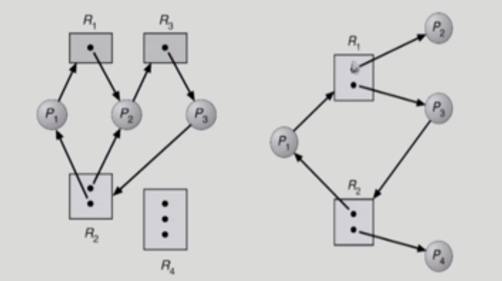

# Deadlock

###### 2020.03.06

### I. Deadlock Problem

- Deadlock
  - 일련의 프로세스들이 서로가 가진 자원을 기다리면 block된 상태
- Resource
  - 하드웨어, 소프트웨어 등을 포함하는 개념
  - 예 : I/O device, CPU cycle, memory space, semaphore 등
  - 프로세스가 자원을 사용하는 절차 : request -> allocate -> use -> release
- Deadlock Example 1
  - 시스템에 2개의 tape drive가 있다.
  - 프로세스 P1과 P2 각각이 하나의 tape drive를 보유한 채 다른 하나를 기다리고 있다.
- Deadlock Example 2
  - Binary semaphores A and B

### II. Deadlock 발생의 4가지 조건
#### Mutual Exclusion (상호 배제)
- 매 순간 하나의 프로세스만이 자원을 사용할 수 있음
#### No Preemption (비선점)
- 프로세스는 자원을 스스로 내어놓을 뿐 강제로 빼앗기지 않음
#### Hold and wait (보유 대기)
- 자원을 가진 프로세스가 다른 자원을 기다릴 때 보유 자원을 놓지 않고 계속 가지고 있음
#### Circular wait (순환 대기)
- 자원을 기다리는 프로세스간에 사이클이 형성되어야 함
- 프로세스 P0, P1, ..., Pn이 있을 때
  - P0는 P1이 가진 자원을 기다림
  - P1는 P2이 가진 자원을 기다림
  - Pn-1는 Pn이 가진 자원을 기다림
  - Pn는 P0이 가진 자원을 기다림

### III. 자원 할당 그래프

- 그래프에 cycle이 없으면 deadlock이 아니다.
- 그래프에 cycle이 있으면, 그림의
  - 첫번째 경우는 데드락,
  - 두번째 경우는 데드락이 아니다.

### IV. Deadlock의 처리 방법
- Deadlock Prevention
  - 자원 할당 시 Deadlock의 4가지 필요 조건 중 어느 하나가 만족되지 않도록 하는 것
- Deadlock Avoidance
  - 자원 요청에 대한 부가적인 정보를 이용해서 Deadlock의 가능성이 없는 경우에만 자원을 할당
  - 시스템 state가 원래 state로 돌아올 수 있는 경우에만 자원 할당
- Deadlock Detection and recovery
  - Deadlock 발생은 허용하되 그에 대한 detection루틴을 두어 Deadlock발견시 recover
- Deadlock Ignorance
  - Deadlock을 시스템이 책임지지 않음
  - UNIX를 포함한 대부분의 OS가 채택
  - 현대 시스템에는 미연에 방지하는 것이 더비효율적이기 때문

#### 1) Deadlock Prevention
- Mutual Exclusion
  - 공유해서는 안되는 자원의 경우 반드시 성립해야한다.
- Hold and Wait
  - 프로세스가 자원을 요청할 때 다른 어떤 자원도 가지고 있지 않아야 한다.
  - 방법 1. 프로세스 시작시 모든 필요한 자원을 할당받게 하는 방법
  - 방법 2. 자원이 필요할 경우 보유자원을 모두 놓고 다시 요청
- No Preemption
  - process가 어떤 자원을 기다려야 하는 경우 이미 보유한 자원이 선점됨
  - 모든 필요한 자원을 얻을 수 있을 때 그 프로세스는 다시 시작한다.
  - state를 쉽게 save하고 restore할 수 있는 자원에서 주로 사용(CPU, memory)
- Circular Wait
  - 모든 자원 유형에 할당 순서를 정하여 정해진 순서대로만 자원 할당
  - 예를 들어 순서가 3인 자원 Ri를 보유중인 프로세스 순서가 1인 자원 Rj를 할당받기 위해서는 우선 Rj를 release해야한다.
 

##### 이 방법은 생기지도 않은 데드락을 미연에 예방해 다음과 같은 문제점을 야기한다 : Utilization 저하, throughput 감소, starvation 문제

#### 2) Deadlock avoidance
- 자원 요청에 대한 부가정보를 이용해서 자원 할당이 deadlock으로부터 안전한지를 동적으로 조사해서 안전한 경우에만 할당
- 가장 단순하고 일반적인 모델은 프로세스들이 피요로 하는 각 자원별 최대 사용량을 미리 선언하도록 하는 방법
- safe state
  - 시스템 내의 프로세스들에 대한 safe sequence가 존재하는 상태
- safe sequence
  - 프로세스의 sequence <P1, P2, ..., Pn>이 safe하려면 Pi의 자원 요청이 "가용 자원 + 모든 Pj의 보유 자원"에 의해 충족되어야 함
- 두가지로 경우의 avoidance 알고리즘
  - 자원의 인스턴스가 하나씩밖에 없을 때 : **Resouce Allocation Graph algorithm**
  - 여러개 있을 때 : **Banker's algorithm** - 어떠한 프로세스들이 자원요청을 했을때 그것을 받아들일 것이냐 받아들이지 않을 것이냐를 판단하는 알고리즘

#### 3) Deadlock Detection and recovery
- 데드락이 생기들 말든 그냥 두자
- 데드락은 빈번히 발생하는 event가 아니기 때문에, 이것을 미연에 방지하기위해 비효율적인 방법을 쓰지말자
- 자원을 요청하면 남아있대로 모두 주고, 갑자기 시스템이 느려지거나 상황이 이상하면 Deadlock Detection을 하고 발견되면 recovery를 하는 방법

#### 4) Deadlock Ignorance
- 데드락이 일어나든 말든 아무일도 안하는 것
- 3번 또한 시스템이 조금만 느려져도 Deadlock detection 루틴이 발동하기 때문에 효율이 좋지 않다.
- 사용자가 알아서 처리하도록 하고 운영체제는 Deadlock에 대해 대처하지 않는 것
- 현대 대부분 운영체제들이 채택하고 있는 방법