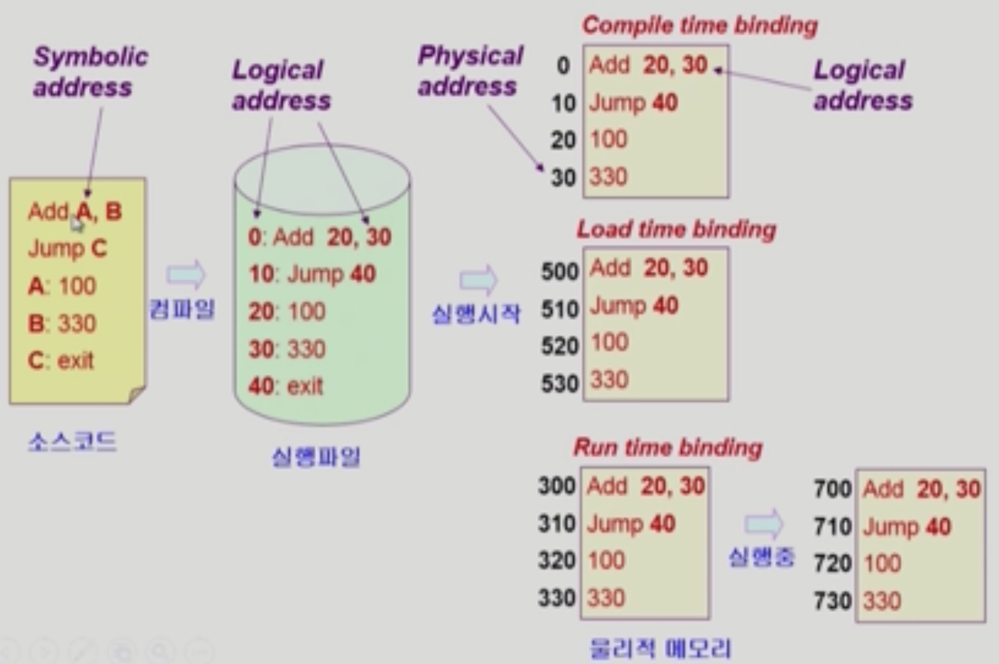
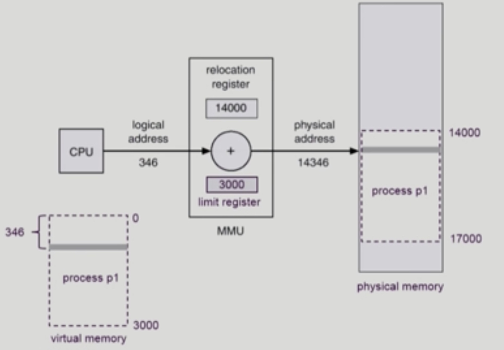
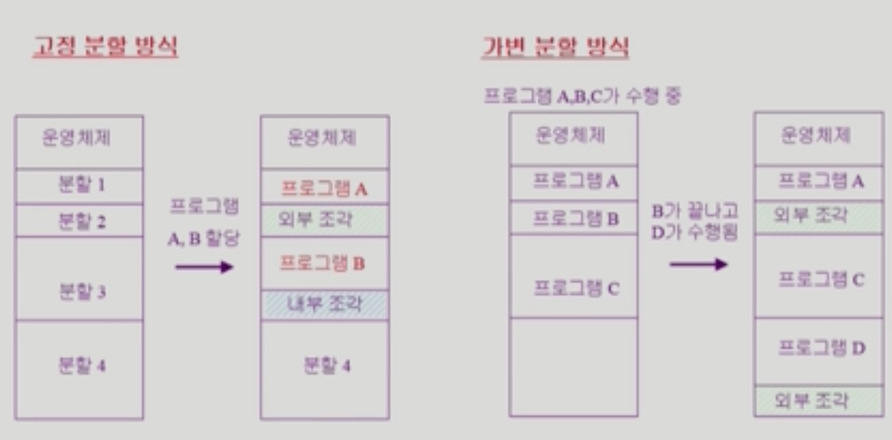

# Memory Management

##### 2020.03.07

### I. Logical vs Physical Address

>메모리는 주소를 통해서 접근하는 매체, 메모리에는 주소가 매겨진다.  
>메모리는 두가지로 나눌 수 있다.

#### Logical address (=virtual address)
- 프로세스마다 가지는 독자적인 주소공간
- 각 프로세스마다 0번지부터 시작
- CPU가 보는 주소는 logical address임

#### Physical address
- 메모리에 실제 올라가는 위치
- 아랫부분에는 운영체제 커널이 올라가있고
- 상위 부분에는 나머지 프로세스들이 올라가 있다.

 

### II. 주소 바인딩 (Address Binding)

- 프로그램이 물리적인 메모리 어디에 올라갈지 결정하는 것
- Symbolic Address -> Logical Address -> Physical Address
- 프로그래머는 변수나 함수명 등 메모리를 사용하는 방법 : Symbolic Address
- 그것이 컴파일 되면 숫자로 된 주소로 변경 된다 : Logical Address
- 이것이 실행이 되기 위해서는 물리적인 메모리에 올라가야 하기 때문에 주소 변환이 이루어져야 한다 : Physical Address

#### 1) 주소변환이 이루어지는 시점
- Compile time binding
  - 뭄리적 메모리 주소가 컴파일 시 알려짐
  - 시작 위치 변경시 재컴파일
  - 컴파일러는 절대 코드(absolute code) 생성
  - 컴파일 하기 전에 코드 주소를 미리 정한다.
  - 다른 주소에 위치시키고싶으면 재컴파일해서 실행해야한다.
- Load time binding
  - 시작 될 때 주소변환이 이루어지는 것
  - Loader의 책임하에 물리적 메모리 주소 부여
  - 컴파일러가 재배치가능코드(relocatable code)를 생성한 경우 가능
  - 실행시킬 때, 절대적인 주소가 아닌 비어있는 주소에 코드를 넣는다.
  - 메모리 상에 올라갈때 시작 위치는 바뀌지만, 논리적인 주소는 바뀌지 않는다.(바꾸려면 재컴파일해야함)
- Execution time binding (=Run time binding)
  - 수행이 시작된 이후에도 프로세스의 메모리 상 위치를 옮길 수 있음
  - CPU가 주소를 참조할 때마다 binding을 점검 (address mapping table)
  - 하드웨어적인 지원이 필요 (i.e. base and limit registers, MMU)
  - 지금 우리가 사용하는 컴퓨터 시스템은 런타임 바인딩때 사용한다.
  

#### 2) Memory-Management Unit (MMU)
- logical address를 physical address로 매핑해주는 Hardware device
- MMU scheme
  - 사용자 프로세스가 CPU에서 수행되며 생성해내는 모든 주소값에 대해 **base register**(=relocation register)의 값을 더한다.
- user program
  - logical address만을 다룬다.
  - 실제 physical address를 볼 수 없으면 알 필요가 없다.
- MMU 안의 register 2개에(relocation register, limit register) 의해 주소변환이 실행됨
- CPU가 logical address 346번지의 값을 요청하면 MMU는 그 값을 물리적 주소 14346번지로 바꿔서 물리적 메모리에서 가져온다.
    
- limit register는 프로그램의 크기를 담고 있다. 만약 logical address가 limit register값을 초과하는 주소이면 (i.e. 악의적인 요청. 위 그림의 경우, logical address 4000번지를 요청받으면 해당프로그램에 있지도 않은 18000번지를 달라는 것이다.) 그럴 경우 trap(addressing error)이 걸리게 된다. - CPU제어권이 운영체제한테 넘어가고 운영체제는 trap이 왜걸렸는지 보고 인터럽트 처리루틴을 시행한다.

 

### III. 몇가지 용어

#### 1) Dynamic Loading
- 그때그때 필요할때마다, 해당 루틴이 불려질 때마다 메모리에 올리는 것
- *(static loading : 프로그램이 시잘할 때 메모리에 통째로 올리는것)*
- 프로세스 전체를 메모리에 미리 다 올리는 것이 아니라 해당 루틴이 불려질 때 메모리에 load하는 것
- memory utilization의 향상
- 가끔씩 사용되는 많은 양의 코드의 경우 유용 (예:오류 처리 루틴)
- 좋은 프로그램들은 이상한 인풋들에 대한 방어적인 구현이 되어 있기 때문에 오류 처리루틴은 많은양의 코드임에도 불구하고 잘 안쓰인다. -> 비효율적
- 운영체제의 특별한 지원없이 프로그램 자체에서 구현 가능(OS는 라이브러리를 통해 지원 가능)

#### 2) Overlays
- 메모리에 프로세스의 부분 중 실제 필요한 정보만을 올림
- 프로세스의 크기가 메모리에보다 클 때 유용
- **운영체제의 지원없이** 사용자에 의해 구현
- 작은 공간의 메모리를 사용하던 초창기 시스템에서 수작업으로 프로그래머가 구현 (프로그래밍이 매우 복잡)

#### 3) Swapping
- 프로세스를 일시적으로 메모리에서 backing store로 쫒아내는 것
- Backing store (=swap area)
  - 디스크
  - 많은 사용자의 프로세스 이미지를 담을 만큼 충분히 빠르고 큰 저장 공간
- Swap in / Swap out
  - 일반적으로 중기 스케줄러(swapper)에 의해 swap out 시킬 프로세스 선정
  - priority-based CPU scheduling algorithm
    - priority가 낮은 프로세스를 swapped out 시킴
    - priority가 높은 프로세스를 메모리에 올려 놓음
  - Compile time 혹은 load time binding에서는 원래 위치로 swap in 해야 함
  - Excution time binding에서는 추후 빈 메모리 영역 아무 곳에나 올릴 수 있음
  - swap time은 대부분 transfer time (swap되는 양에 비례하는 시간)임

#### 4) Dynamic Linking
> Linking을 실행 시간(execution time)까지 미루는 기법
- Static linking
  - 라이브러리가 프로그램의 실행 파일 코드에 포함됨
  - 실행 파일의 크리가 커짐
  - 동일한 라이브러리를 각각의 프로세스가 메모리에 올리므로 메모리 낭비(i.e. printf함수의 라이브러리 코드)
- Dynamic linking
  - 라이브러리가 프로그램의 실행 파일 코드에 포함이 되지 않고 있다가 필요할때 로드
  - 라이브러리가 실행시 연결됨
  - 라이브러리 호출 부분에 라이브러리 루틴의 위치를 찾기 위한 stub이라는 작은 코드를 둠
  - 라이브러리가 이미 메모리에 있으면 그 루틴의 주소로 가고 없으면 디스크에서 읽어옴
  - 운영체제의 도움이 필요
  - dynamic linking 을 해주는 라이브러리
    - shared library
    - 리눅스에서 : shared object
    - 윈도우에서 : dll

 

### IV. 물리적 메모리를 어떻게 관리하는가? (Allocation of Physical Memory)

#### 메모리는 일반적으로 두 영역으로 나누어 사용
- OS 상주 영역 : interrupt vector와 함께 낮은 주소 영역 사용
- 사용자 프로세스 영역 : 높은 주소 영역 사용

#### 사용자 프로세스 영역의 할당 방법
- Contiguous allocation (연속 할당) : 각각의 프로세스가 메모리의 연속적인 공간에 적재되도록 하는 것
  
  - Fixed partition allocation (고정 분할 방식)
    - 물리적 메모리를 몇 개의 영구적 분할로 나눔
    - 분할의 크기가 모두 동일한 방식과 서로 다른 방식이 존재
    - 분할당 하나의 프로그램 적재
    - 융통성이 없음 (동시에 메모리에 load되는 프로그램의 수가 고정됨, 최대 수행 가능 프로그램 크기 제한)
    - Internal fragmentation(내부조각) 발생 (external fragmentation도 발생)
  - Varibale partition allocation (가변 분할 방식)
    - 프고르램의 크기를 고려해서 할당
    - 분할의 크기, 개수가 동적으로 변함
    - 기술적 관리의 기법 필요
    - External fragmentation(외부조각) 발생
  - Hole
    - 가용 메모리 공간
    - 다양한 크긱의 Hole들이 메모리 여러 곳에 흩어져 있음
    - 프로세스가 도착하면 수용가능한 hole을 할당
    - 운영체제는 할당공간, 가용공간(hole)에 대한 정보를 유지
  - Dynamic Storage Allocation Problem
    - 가변 분할 방식에서 size n인 요청을 만족하는 가장 적절한 hole을 찾는 문제
    - First-fit
      - Size가 n이상인 것 중 최초로 찾아지는 hole에 할당
    - Best-fit
      - Size가 n 이상인 가장 작은 hole을 찾아서 할당
      - Hole들의 리스트가 크기순으로 정렬되지 않은 경우 모든 hole의 리스트를 탐색해야 함
      - 많은 수의 아주 작은 hole들이 생성됨
    - Worst-fit
      - 가장 큰 hole에 할당
      - 역시 모든 리스트를 탐색해야 함
      - 상대적으로 아주 큰 hole들이 생성됨
    - First-fit과 Best-fit이 Worst-fit보다 속도와 공간 이용률 측면에서 효과적인 것으로 알려짐
  - Compaction
    - external fragmentation 문제를 해결하는 한가지 방법
    - 남은 홀들을 한군데로 다 밀어 넣는 방법
    - 사용중인 메모리 영역을 한군데롤 몰고 hole들을 다른 한 곳으로 몰아 큰 block을 만드는 것
    - 매우 비용이 많이 드는 방법
  - 최소한의 메모리 이동으로 compaction하는 방법 (매우 복잡한 문제)
  - Compaction은 프로세스의 주소가 실행시간에 동적으로 재배치 가능한 경우에만 수행될 수 있다.
- Noncontiguous allocation (불연속 할닫) : 하나의 프로세스가 메모리의 여러 영역에 분산되어 올라갈 수 있음
  - Paging
    - 프로그램을 구성하는 주소공간을 같은 크기의 page로 자르는 것
    - 물리적 메모리 역시 page 크기로 자른다.
    - 홀들의 크기에 따른 문제가 사라짐
    - 주소 변환이 복잡해짐
    - 잘라진 각각의 페이지가 물리적 메모리 어디에 올라가있는지를 알아야함
  - Segmentation
    - 프고르램의 주소 공간을 어떤 의미있는 단위로 자르는 것
    - code segment, data segment, stack segment 등
    - 아니면 각각의 함수를 segment단위로 자른다.
    - 의미 단위이기 때문에 크기가 균일하지 않다.
    - Dynamic Storage allcation problem 문제가 생김
  - Paged Segmentation