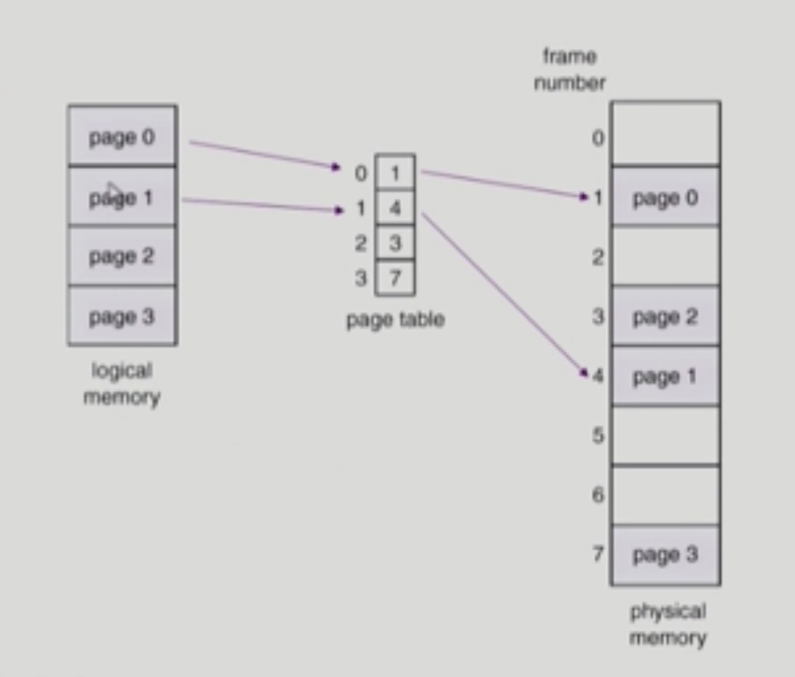
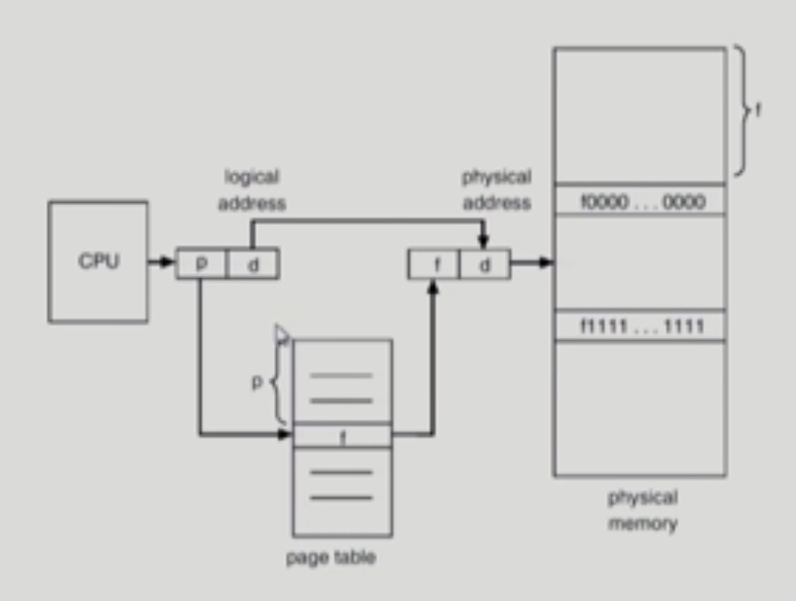
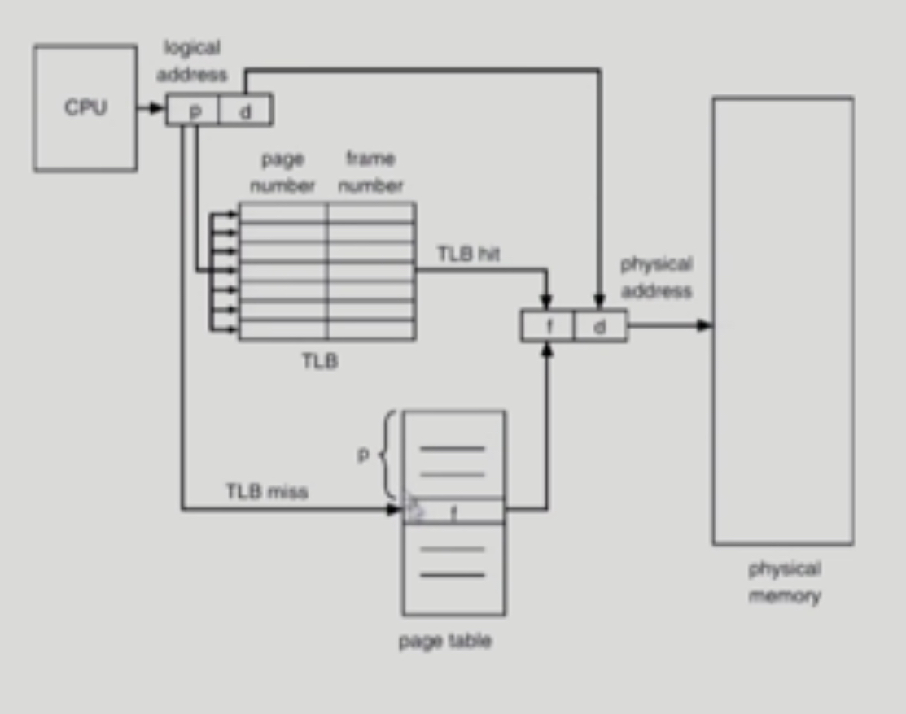
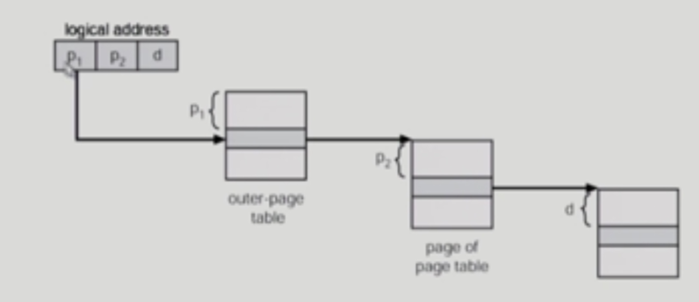

# Paging

###### 2020.03.08

## One Level Page Table
- Process의 virtual memory를 동일한 사이즈의 page 단위로 나눔
- virtual memory의 내용이 page 단위로 noncontiguous하게 저장됨
- 일부는 backing storage에, 일부는 physical memory에 저장
  
  

### I. Basic Method
- physical memory를 동일한 크기의 frame으로 나눔
- logical memory를 동일 크기의 page로 나눔 (frame과 같은 크기)
- 모든 가용 frame들을 관리
- **page table**을 사용하여 logical address를 physical address로 변환
- external fragmentation 발생 안함
- internal fragmentation 발생 가능

### II. Implementation of Page Table
- Page table은 main memory에 상주
- Page table은 각각의 프로세스마다 가지고 있다.
- Page-table base register(PTBR)가 page table을 가리킴
- Page-table length register(PTLR)가 테이블 크기를 보관
- 모든 메모리 접근 연산에는 **2번의 memory access** 필요
  - page table 접근 한번 : 주소 변환을 통해 실제 물리주소 찾기
  - data/instruction 접근 한번 : 실제 물리주소로 가서 data 혹은 instruction 가져오기
- 속도 향상을 위해 **associative register** 혹은 **translation look-aside buffer(TLB)**라 불리는 고속의 lookup hardware cache 사용

### III. Paging을 위한 하드웨어 TLB

- page number와 frame number 쌍을 저장하는 일종의 캐쉬 저장 장치
- CPU가 요청한 논리적 주소의 page number에 대한 frame number를 가지고 있다.
- 해당 page number에 접근한적이 있어 tlb에 해당 쌍이 있을 경우 (TLB hit) 그걸 이용해 바로 메모리로 접근하고
- 없을 경우 (TLB miss) 메모리에서 해당 frame number를 찾아솨 TLB에 저장한 후, 다시 해당 메모리로 접근한다.
- page table이 배열이라면, TLB는 딕셔너리. -> 모든 것을 가지고 있는 것이 아니라 필요한 것만 가지고 있다.
- TLB 동작 방법
  - 해당 paging에 대한 정보가 TLB에 있는지 확인하기 위해서는 전체 항목을 검사해야한다.
  - 즉, TLB는 특정항목만 보는게 아니라 전체를 서치해야한다. 
  - 그래서 TLB는 parallel search(병렬적 탐색)이 가능한 Associative registers를 사용한다.

 

## Two Level Page Table
- 시간은 조금 더 걸리지만 공간을 절약할 수 있다.
- Page table이 안쪽 테이블과 바깥쪽 테이블 두단계로 존재하는 것
- 현대의 컴퓨터는 address space 가 매우 큰 프로그램 지원
  - 32 bit address 사용 시: - 4GB의 주소 공간 (각 프로그램이 가질 수 있는 최대 메모리 크기)
    - page size가 4K일때, 프로세스당 약 100만개의 page table entry 필요
    - 그럼 page table에는 약 100만개의 page tabble entry가 필요한데, 각 page table entry가 4byte일때 프로세스당 4MB의 page table 필요
    - **그러나, 대부분의 프로그램은 4G의 주소 공간 중 지극히 일부분만 사용하므로 page table 공간이 심하게 낭비됨**
    - index로 접근해야 되는 page table이기에, 필요없는 page를 빼고 page table을 만들 수는 없다.
- page table 자체를 page로 구성
- 사용되지 않는 주소 공간에 대한 outer page table의 엔트리 값은 null (대응하는 inner page table이 없음)
  - 프로세스에서 실제로 사용되지 않는 page가 상당하다. 
  

### Two-Level Paging Example
- logical address(on 32-bit machine with 4K page size)의 구성
  - 12 bit의 page offset
    - page 하나가 4Kb(2**12 byte)이기 때문에 페이지 내에서 data/instruction(1 byte)을 찾기 위해서는 12개의 비트를 가지고 찾아야 한다.
  - 20 bit의 page number
    - 나머지
- page table 자체가 page로 구성되기 때문에 page number는 다음과 같이 나뉜다. (각 page table entry가 4byte)
  - 10 bit의 page number
  - 10 bit의 page offset
- 따라서, logical address는 다음과 같다.
  
  - P1은 outer page table의 index이고
  - P2는 outer page table의 page에서의 범위 (displacement)

 

## Memory Protection
- page table에는 각 인덱스(논리적 주소)에 상응하는 frame number가 저장되는데, 사실 주소전환정보(frame number) 뿐만 아니라 부가적인 비트들이 더 들어있다.
- Page table의 각 entry마다 아래의 bit를 둔다.

### I. Protection bit
- page에 대한 접근 권한 (read/write/read-only)

### II. Valid / Invalid Bit in a Page Table
- 프로그램에는 사용하는 부분과 사용하지 않는 부분들이 있는데, 테이블의 특성상 사용하지 않는 부분도 모두 paging table 안에 넣어야 한다.
- 이걸 표현하기 위한 비트이다.
- **valid**는 해당 주소의 frame에 그 프로세스를 구성하는 유요한 내용이 있음을 뜻함 (접근 허용)
- **invalid**는 해당 주소의 frame에 유효한 내용이 없음을 뜻함 (접근 불허)
  - 프로세스가 그 주소 부분을 사용하지 않는 경우
  - 해당 페이지가 메모리에 올라오 있지 않고 swap out 되어있는 경우

 

## Inverted Page Table
- page table이 매우 큰 이유
  - 모든 프로세스 별로 그 logical address에 해당하는 모든 page에 대해 page table entry가 존재
  - 대응하는 page가 메모리에 있든 아니든 간에 page table에는 entry로 존재
- Inverted page table
  - page frame 하나당 page table에 하나의 entry를 둔 것 (system-wide)
  - 각 page table entry는 각각의 물리적 메모리의 page frame이 담고 있는 내용 표시 (process-id, process의 logical address)
  - 단점 : 테이블 전체를 탐색해야함
  - 조치 : associative register 사용 (expensive)

 

## Shared Page
- shared code
  - Re-entrant code (=Pure code)
  - read-only로 하여 프로세스 간에 하나의 code만 메모리에 올림 (i.e text editors, compilers, window systems)
  - shared code는 모든 프로세스의 logical address space 에서 동일한 위치에 있어야 함
- Private code and data
  - 각 프로세스들은 독자적으로 메모리에 올림
  - Private data는 logical address space의 아무 곳에 와도 무방