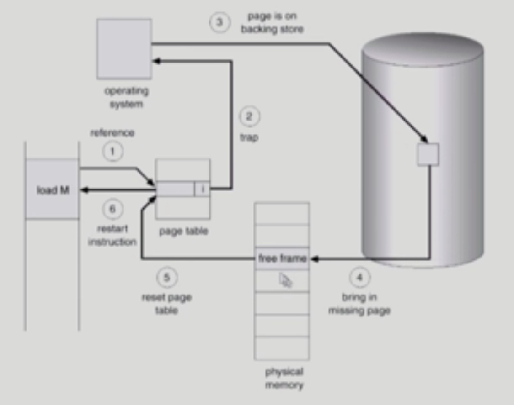
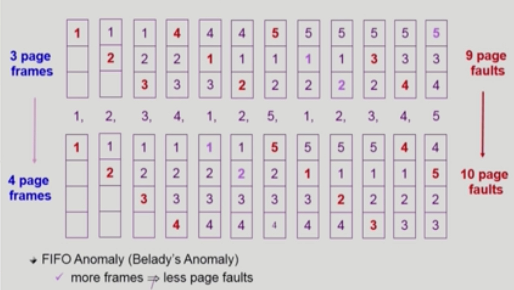
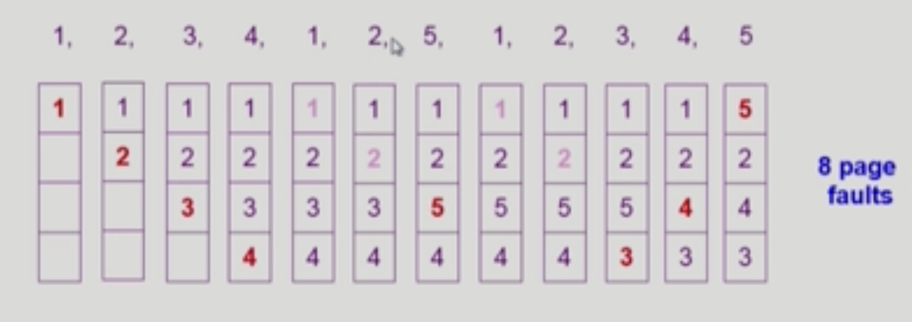

# Virtual Memory 1

###### 2020.03.10

> 물리적인 메모리의 주소변환은 운영체제가 관여하지 않는다. 하지만, 가상메모리기법은 전적으로 운영체제가 관여하고 있다.

## Page Fault

### I. Demand Paging
- 요청이 있으면 그 페이지를 메모리에 올리겠다.
- 실제로 필요할 때 page를 메모리에 올리는 것
  - 한정된 메모리 공간을 더 효율적으로 사용
  - I/O 양의 감소
  - Memory 사용량 감소
  - 빠른 응답 시간
  - 더 많은 사용자 수용
- Valid / Invalid bit의 사용
  - Invalid 의 의미
    - 사용되지 않는 주소 영역인 경우 (하나의 프로그램에는 원래 사용되자 않는 페이지가 굉장히 많다.)
    - 페이지가 물리적 메모리에 없는 경우 (Swap area에 있을 경우)
  - 처음에는 page entry가 invalid로 초기화
  - address tranlation시에 invalid bit가 set되어 있으면 **page fault**

### II. Page Fault
- 요청한 페이지가 메모리에 없는 경우, **page fault**가 났다고한다.
- invalid page를 접근하면 MMU(주소변환을 해주는 하드웨어)가 trap(software interrupt)를 발생시킨다.
- page fault trap : page fault가 나면 CPU는 자동적으로 운영체제에게 넘어간다.
  - 운영체제에는 page fault에 대한 처리 루틴이 정의가 되어 있다.
  - Kernel mode로 들어가서 page fulat handler가 invoke된다.
  - i.e. 운영체제가 CPU를 가지고 fault난 페이지를 메모리에 올리는 등의 행동을 한다.
- page fault 처리 순서
    1. Invalid reference ? (i.e. bad address, protection violation) -> abort process
    2. Get an empty page frame (없으면 뺏어온다 : replace)
    3. 해당 페이지를 disk에서 memory로 읽어온다.
       1. dist I/O가 끝나기까지 이 프로세스는 CPU를 preempt 당함 (block)
       2. Disk read가 끝나면 page table entry 기록, valid/invalid bit = "valid"
       3. ready queue에 process를 insert -> dispatch later
    4. 이 프로세스가 CPU를 잡고 다시 running
    5. 아까 중단되었던 instruction을 재개
   
- page fault가 나서 disk에 접근해 해당 페이지를 가져오는 것이 굉장히 오래걸리는 작업이기 때문에, page fault가 얼마나 나는지가 성능에 영향을 미친다.
- page fault rage(0 <= p <= 1.0)이 지표이다. 
  - if p = 0, no page faults
  - if p = 1, every reference is a fault

### III. Free frame이 없는 경우
- Page replacement
  - 어떤 frame을 빼앗아올지 결정해야 함
  - 곧바로 사용되지 않을 page를 쫒아내는 것이 좋음
  - 동일한 페이지가 여러 번 메모리에서 쫒겨났다가 다시 들어올 수 있음
- Replacement Algorithm
  - page-fault rate을 최소화하는 것이 목표
  - 알고리즘의 평가 : 주어진 page reference string에 대해 page fault를 얼마나 내는지 조사
  - reference string의 예
    - 1, 2, 3, 4, 1, 2, 5, 1, 2, 3, 4, 5

 

## Page Replacement 알고리즘들

>하지만 사실상 아래의 알고리즘들은 사용할 수 없다. 
>LRU나 LFU는 Buffer caching이나 Web caching 같은 곳에 사용 
>[사용할 수 있는 알고리즘](15_Virtual_memory_2.md)

### I. Optimal Algorithm
- 가장 좋은 Page replacement 알고리즘
- MIN(OPT): 가장 먼 머리에 참조되는 page를 replace
- 먼 미래에 사용되는 것을 참고로 짠 알고리즘이기 때문에, 미래를 볼 수 없는 실제에선 사용할수 없다.
- 대신 upper bound를 제공한다.

### II. FIFO Algorithm
- 먼저 들어온 것을 먼저 내쫒음
  

### III. LRU (Least Recently Used) Algorithm
- 가장 오래전에 사용한거 쫒아낸다.
- double linked list로 구현
- O(1)의 시간복잡도
  

### IV. LFU (Least Frequently Used) Algorithm
- 참조 횟수가 가장 적은 페이지를 지움
  - 최저 참조횟수인 page가 여럿인 경우
    - LFU 앍고리즘 자체에서는 여러 page중 임의로 선정한다.
    - 성능 향상을 위해 가장 오래 전에 참조된 page를 지우게 구현할 수도 있다.
  - 장단점
    - LRU처럼 직전 참조 시점만 보는 것이 아니라 장기적인 시간 규모를 보기 때문에 page의 인기도를 좀 더 정확히 반영할 수 있음
    - 참조 시점의 최근성을 반영하지 못함
    - LRU보다 구현이 복잡함
  - 힙으로 구현
  - O(log n)의 시간복잡도