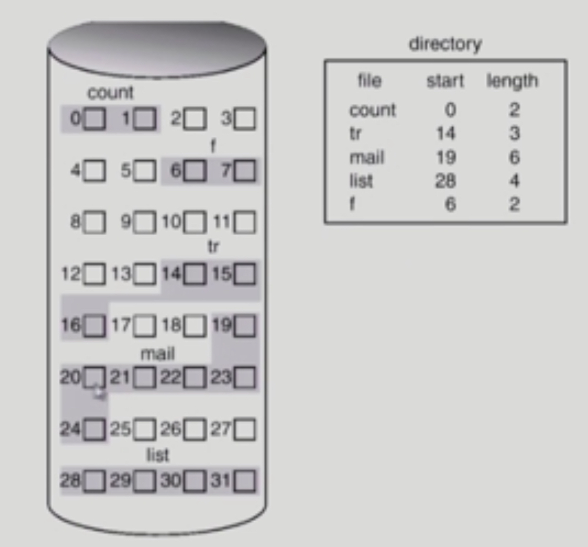

# File System Implementation

###### 2020.03.12

## Allocation of File Data in Disk

> 파일은 동일한 크기의 블럭단위로 나뉘어서 디스크에 저장됨 (paging과 유사)

### I. Contiguous Allocation

- 연속할당 방법
- 단점
  - external fragmentation; 외부 조각이 생길 수 있다. (비어있는 공간임에도 활용될수 없는 공간이 생긴다.)
  - file grow(파일이 커지는 것)가 어려움
    - 그걸 대비해 file 생성시 얼마나 큰 hole을 배당할 것인가?
    - grow 가능 vs 낭비 (internal fragmentation)
- 장점
  - Fast I/O
    - 한번의 seek/rotation으로 많은 바이트 transfer
    - Realtime file 용으로, 또는 이미 run 중이던 process의 swap area 용
  - Direct access(=random access) 가능

### II. Linked Allocation

- 파일의 데이터를 디스크에 연속적으로 배치하지 않고, 빈 위치에 아무대나 배치한다.
- 장점
  - external fragmentation 발생 안함
- 단점
  - No random access
  - Reliability 문제
    - 한 sector가 고장나 pointer가 유실되면 많은 부분을 잃음
  - Pointer를 위한 공간이 block의 일부가 되어 공간 효율성을 떨어뜨림
    - 512 bytes/sector, 4 bytes/pointer
- 변형
  - File-allocation table(FAT) 파일 시스템
    - 포인터를 별도의 위치에 보관하여 reliability와 공간효율성 문제 해결

### III. Indexed Allocation

- 장점
  - external fragmentation이 발생하지 않음
  - Direct access 가능
- 단점
  - Small file의 경우 공간 낭비 (실제로 많은 file들이 small)
  - Too Large file의 경우 하닁 block으로 index를 저장하기에 부족
    - 해결 방안 : linked scheme, multi-level index

 

## UNIX File System

> boot block은 어떤 파일시스템이던지 가장 앞쪽에 있다.

### UNIX 파일 시스템의 중요 개념
- Boot block
  - 부팅에 필요한 정보 (bootstrap loader)
- Super block
  - 파일 시스템에 관한 총체적인 정보를 담고 있다.
  - 어디서부터가 Inode list이고 어디서부터가 Data block인지 등 총체적인 정보 관리
- Inode
  - 파일 이름을 제외한 파일의 모든 메타 데이터를 저장
- Data block
  - 파일의 실제 내용을 관리
  - 디렉터리에 가면 해당 파일 이름에 대한 inode 번호가 있다.
    

 

## Fat File System

- FAT
  - 파일의 위치 정보를 FAT에다가 따로 담고 있다.
  - 그 블럭의 다음 블럭을 가지고 있다.
  - 계속 찾다가 EOF가 뜨면 "이 파일이 끝났다"라는 뜻

 

## Free-Space Management

### I. bit map or bit vector
- bit map은 부가적인 공간을 필요로 함
- 연속적인 n개의 free block을 찾는데 효과적

### II. Linked list
- 모든 free block들을 링크로 연결 (free list)
- 연속적인 가용공간을 찾는 것은 쉽지 않다.
- 공간의 낭비가 없다.

### III. Grouping
- linked list 방법의 변형
- 첫번째 free block이 n개의 pointer를 가짐
  - n-1 pointer 는 free data block을 가리킴
  - 마지막 pointer가 가리키는 block은 또 다시 n pointer를가짐

### IV. Counting
- 프로그램들이 종종 여러개의 연속적인 block을 할당하고 반납한다는 성질에 착안
- (first free block, # of contiguous free blocks)을 유지

 

## Directory Implementation

### I. Linear list
- \<file name, file의 metadata\>의 list
- 구현이 간단
- 디렉터리 내에 파일이 있는지 찾기 위해서는 linear search 필요(time-consuming)

### II. Hash Table
- linear list + hashing
- Hash table은 file name을 이 파일의 linear list의 위치로 바꾸어줌
- search time을 없앰
- Collision 발생 가능

### III. File metadata의 보관 위치
- 디렉터리 내에 직접 보관하거나
- 디렉터리에는 포인터를 두고 다른 곳에 보관 (inode, FAT 등)

### IV. Long file name의 지원
- \<file name, file의 metadata\>의 list에서 각 entry는 일반적으로 고정 크기
- file name이 고정 크기의 entry길이보다 길어지는 경우 entry의 마지막 부분에 이름의 뒷부분이 위치한 곳의 포인터를 두는 방법
- 이름의 나머지 부분은 동일한 directory file의 일부에 존재

 

## VFS & NFS

### I. Virtual File System (VFS)
- 서로 다른 다양한 file system에 대해 동일한 시스템 콜 인터페이스 (API)를 통해 접근할 수 있게 해주는 OS의 layer

### II. Network File System (NFS)
- 분산 시스템에서는 네트워크를 통해 파일이 공유될 수 있음
- NFS는 분산 환경에서는 대표적인 파일 공유 방법임

 

## Page Cache & Buffer Cache

### I. Page Cache
- Virtual memory의 paging system에서 사용하는 page frame을 caching의 관점에서 설명하는 용어
- Memory-Mapped I/O를 쓰는 경우 file의 I/O에서도 page cache 사용

### II. Memory-Mapped I/O
- 파일에 접근할때 `read()`나 `write()` 시스템 콜을 이용해 접근하는 것이 아니라, 파일의 일정 부분을 그 프로세스의 메모리 영역에 mapping을 시켜놓고 쓰는 것
- File의 일부를 virtual memory에 mapping 시킴
- 매핑시킨 영역에 대한 메모리 접근 연산은 파일의 입출력을 수행해야 함

### Buffer Cache
- 파일 시스템을 통한 I/O 연산은 메모리의 턱정 영역인 buffer cache 사용
- File 사용의 locality 활용
  - 한번 읽오온 block에 대한 후속 요청시 buffer cache에서 즉시 전달
- 모든 프로세스가 공용으로 사용
- Replacement algorithm 필요 (LRU, LFU 등)

### Unified Buffer Cache
- 최근의 OS에서는 기존의 buffer cache가 page cache에 통합됨