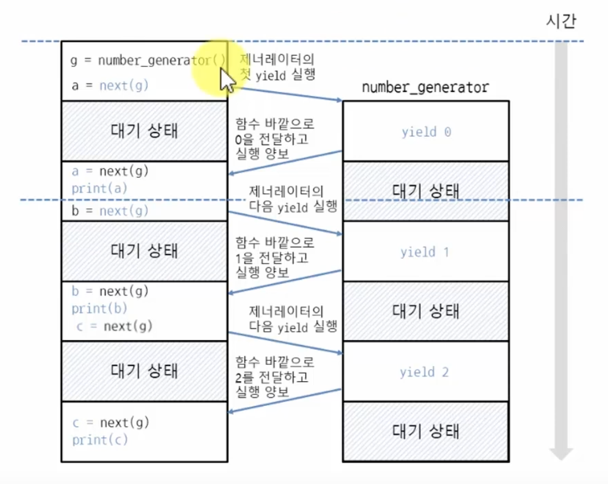

# Generator and Yield

###### 2020.03.19

## Generator

- 제너레이터는 이터레이터를 생성해주는 함수임
- 이터레이터는 클레스에 `__iter__`, `__next__` 또는 `__getitem__` 메서드를 구현해야 하지만 제너레이터는 함수 안에서 `yield`라는 키워드만 사용하면 끝임
- 제너레이터는 이터레이터보다 훨씬 간단하게 작성할 수 있음
- 제너레이터는 발생자라고 부르기도 함
- 함수 안에서 `yield`를 사용하면 함수는 제너레이터가 되며, `yield`에는 값(변수)를 지정함
  ```python
  # yield 값

  def number_generator():
      yield 0
      yield 1
      yield 2

  for i in number_generator():
      print(i)
  ```

### 제너레이터 객체가 이터레이터인지 확인하기
- 다음과 같이 `dir`함수로 메서드 목록읋 확인해보자
  ```python
  g = number_generator()
  g
  # >>> <generator object number_generator at 0x03A190F0>

  dir(g)
  # ['__class__', ..., __iter__, __next__]
  ```
  - number_generator 함수를 호출하면 제너레이터 객체가 반환됨
  - 이 객체를 `dir` 함수로 살펴보면 이터레이터에서 볼 수 있는 `__iter__`, `__next__` 메서드가 들어있음
  - 함수에 `yield`만 사용해서 간단하게 이터레이터를 구현할 수 있음
  - 이터레이터는 `__next__`메서드 안에서 직접 return을 ㅗ값을 반환했지만 제너레이터는 `yield`에 지정한 값이 `__next__`메서드의 반환값으로 나옴
  - 이터레이터는 raise로 StopIteration 예외를 직접 발생시켰지만 제너레이터는 함수의 끝까지 도달하면 StopIteration 예외가 자동으로 발생함
  - 제너레이터는 제너레이터 객체에서 `__next__` 메서드를 호출할 때마다 함수 안의 `yield`까지 코드를 실행하며 `yield`에서 값을 발생시킴(generate)

### for와 제너레이터
- 다음과 같이 for 반복문은 반복할 때마다 `__next__`를 호출하므로 `yield`에서 발생시킨 값을 가져옴
  ```python
  for i in number_generater():
      print(i)
  ```
  >number_generater()실행으로 만들어진 객체는 \_\_iter__()를 가지고 있어 반복문에서 자동으로 이터레이터를 만든다. 그리고 해당 이터레이터 객체는 순회가 한번 실행될때마다 \_\_next__() 함수를 실행시키고 그것은 yield 를 통해 값을 발생시킨다. 마지막으로 StopIteration 예외가 발생하면 순회가 끝났다는걸 알린다.

### yield의 동작 과정을 알아보기 위해 for 반복문 대신 next 함수로 `__next__` 메서드를 직접 호출해보자
  ```python
  def number_generator():
      yield 0   # 0을 함수 바깥으로 전달하면서 코드 실행을 함수 바깥에 양보
      yield 1   # 0을 함수 바깥으로 전달하면서 코드 실행을 함수 바깥에 양보
      yield 2   # 0을 함수 바깥으로 전달하면서 코드 실행을 함수 바깥에 양보

  g = number_generator()

  a = next(g)
  print(a)
  # 0

  b = next(g)
  print(b)
  # 1

  c = next(g)
  print(c)
  # 2
  ```

- yield 0 의 실행 양보
  

- return은 반환 즉시 함수가 끝나지만, yield는 잠시 함수 바깥의 코드가 실행되도록 양보를 해서 갑을 가져가게 한 뒤 다시 제너레이터 안에 있는 코드를 계속 실행하는 방식이다.

## Generator 만들기

### range(횟수)처럼 동작하는 제너레이터 만들기

```python
def number_generator(stop):
    n = 0               # 숫자는 0부터 시작
    while n < stop:     # 현재 숫자가 반복을 끝낼 숫자보다 작을 때 반복
        yield n         # 현재 숫자를 바깥으로 전달
        n += 1          # 현재 숫자를 증가시킴

for i in number_generator(3):
    print(i)
```

### 리스트에 들어있는 문자열을 대문자로 변환하여 함수 바깥으로 전달
```python
def upper_generator(x):
    for i in x:
        yield i.upper()   # 함수의 반환값을 바깥으로 전달
    
fruits = ['apple', 'pear', 'grape', 'pineapple', 'orange']
for i in upper_generator(fruits):
    print(i)
```

## yield from으로 값을 여러번 바깥으로 전달하기
- before
  ```python
  def number_generator():
      x = [1, 2, 3]
      for i in x:
          yield i

  for i in number_generator():
      print(i)
  ```
- after
  ```python
  def number_generator(x):
      yield from x

  for i in number_generator():
      print(i)
  ```

- i.e.
  ```python
  def number_generator(stop):
      n = 0
      while n < stop:
          yield n
          n += 1
  
  def my_range(x):
      yield from number_generator(x)

  for i in my_range(3):
      print(i)
  ```