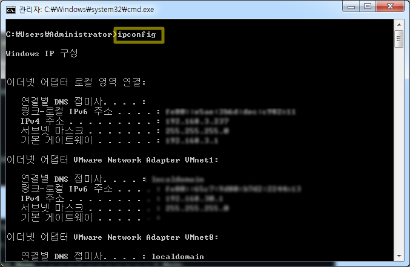

# IP 주소와 서브넷 마스크, 기본 게이트웨이의 의미

###### 2020.02.04

>현재 컴퓨터의 네트워크 정보 보는 방법
>
>terminal에 **ipconfig(window)** 혹은 **ifconfig(unix)** 입력
>
>
>
>| 항목 | 결과 |
>| --- | --- |
>|IPv4 주소 | 192.168.0.13 |
>|서브넷 마스크 | 255.255.255.0 |
>|기본 게이트웨이 | 192.168.0.1 |

### I. 이더넷
- **이더넷 어뎁터**란 **LAN 카드** 의미 (LAN : **NIC**라고도 불림)

- **이더넷**이란 LAN영역에서 사용하는 기술 중 표준 방식

### II. IP

- **IP주소**란 인터넷 공간에서 자기 PC가 사용하는 고유한 식별자를 의미

- 보통 IPv4 주소를 의미

- IPv4는 0.0.0.0~255.255.255.255 까지 8비트.8비트.8비트.8비트 총 32비트로 이루어진 체계이다.

- IPv6는 128비트로 이루어졌다.

- **PC에서 사용하는 IP주소는 데이터를 송신하는 주체이기 때문에 출발지 주소에 해당**(요청의 경우)

- 192.168.0.13에서 첫번째 자리가 192번으로 시작하는 경우, C클래스에 속한다고 말한다.

    | 구분 | IP 주소의 첫 번째 자리 범위 |
    | --- | --- |
    |A 클래스 | 1~126 |
    |B 클래스 | 128~191 |
    |C 클래스 | 192~223 |

    >127번으로 시작하는 IP주소는 일반적으로 127.0.0.1번으로 사용하는 특별한 주소.
    >
    >자기가 사용하는 LAN 카드 자신을 의미하는 루프백 주소

### III. 서브넷 마스크

>  |192.168.0.13|
>  |---|
>  |255.255.255.0|

- 서브넷 마스크는 IP 주소와 쌍으로 사용하는 개념

- **주어진 IP 주소의 네트워크 ID와 호스트 ID를 구분하기 위한 식별자**

- 192.168.0번이 255.255.255 번에 대응하고

- 13번이 0번에 대응하는 구조를 이룬다.

- 255.255.255에 대응하는 192.168.0번까지를 **네트워크 ID**라 부르고

- 0번에 대응하는 13번을 **호스트 ID**라 부른다.

    *서브넷 마스크의 예*
    | IP - subnetmask | 네트워크 ID | 호스트 ID |
    | --- | --- | --- |
    | 10.10.10.10 - 255.0.0.0 | 10 | 10.10.10 |
    | 172.16.10.10 - 255.255.0.0 | 172.16 | 10.10 |
    | 192.168.10.10 - 255.255.255.0 | 192.168.10 | 10|    

### IV. 기본 게이트웨이

- 게이트웨이 : **라우터** (게이트웨이 : 소프트웨어 측면 강조, 라우터 : 하드웨어 측면 강조)

- 보통 무선 공유기가 게이트웨이의 정체!

- 인터넷으로 접속하기 위한 일종의 관문 역할을 수행하는 장비

- 각기 다른 호스트 사이를 연결해주는 기능을 수행

- 게이트웨이 주소와 내 PC의 IP 주소를 비교해보면 네트워크 ID가 동일하다. (255.255.255에 대응하는 부분)

- `***동일한 네트워크 ID를 공유하는 장치들의 집합 공간 : LAN 영역!!!!!!!!!!***`

- 즉, **네트워크 ID**란 무수한 LAN 영역에서 자기 LAN 영역을 구분하기 위한 식별자 또는 해당 LAN 영역을 식별하는 고유 IP 주소 대역을 의미한다.

- **호스트 ID**란 LAN 영역 내의 무수한 호스트 각각을 구분하기 위한 식별자이다.

- **라우터**란 다른 네트워크 ID를 사용하는 LAN 영역 사이를 연결해주는 장치!!!

- 다른 네트워크 ID를 가진 IP끼리는 LAN 영역이 달라 **스위칭 통신**을 할 수 없으므로 라우터를 통해 **라우팅 통신**을 해야한다.

    - 스위칭 : 동일한 LAN 영역 속 호스트끼리의 통신
    - 라우팅 : 상이한 LAN 영역 속 라우터끼리의 통신