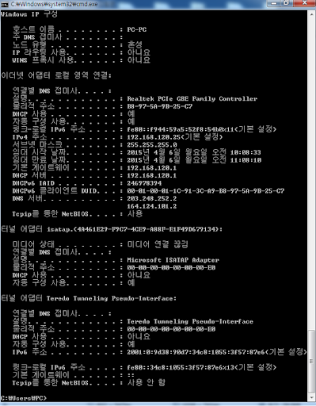

# DHCP 서비스와 DNS 서비스, 맥주소의 의미

###### 2020.02.04

>현재 컴퓨터의 네트워크 정보 보는 방법
>
>terminal에 **ipconfig(window)** 혹은 **ifconfig(unix)** 입력
>
>
>
> | 항목 | 결과 |
> |---|---|
> |DHCP 사용 | 예|
> |임대 시작 날짜 | 2015년 12월 17일 목요일 오후 12:56:12|
> |임대 만료 날짜 |  2015년 12월 17일 목요일 오후 2:56:12|
> |DHCP 서버 | 192.168.0.1|
> |DNS 서버 | 168.126.63.1 168.126.63.2|
> |물리적 주소 | 00-24-1D-DF-8C-47|
> |설명 | REALTEK RTL8168D/8111D|

### I. DHCP 서버

- 주소 식별자로 사용하는 IP 주소는 원래 사용자가 IP 주소와 서브넷 마스크, 기본 게이트웨이 등을 직접 입력해야한다.

- **DHCP 서비스**는 사용할 IP 주소 범위를 서버에서 미리 등록하면 PC 사용자에게 IP주소와 서브넷 마스크, 게이트웨이 IP 주소 등을 자동으로 할당해주는 기능이다.

- DHCP 서버가 제공하는 주소
    - IP 주소 : 192.168.0.13
    - 서브넷 마스크 : 255.255.255.0
    - 기본게이트웨이 : 192.168.0.1
    - DNS 서버 IP 주소 : 168.126.63.1 168.126.63.2

- 기본 게이트웨이의 IP 주소와 DHCP 서버의 IP 주소 모두 192.168.0.1로, 무선고유기가 게이트웨이 및 DHCP 서버 기능도 수행한다.

### II. DNS 서버

> `168.126.63.1`과 `168.126.63.2`는 KT에서 제공하는 DNS 서버 IP주소이다.

- 우리가 웹 브라우저의 주소창에 `police.go.kr` 과 같은 도메인 네임을 입력하면 **DNS 서버**는 해당 도메인 네임을 `116.67.118.148` 같은 IP 주소로 변환해준다.

- **DNS 서비스**란 도메인 네임과 IP 주소의 대응 관계를 아래와 같이 데이터베이스 형태로 저장하는 기능
| 도메인 네임 | IP 주소 |
| --- | --- |
| police.go.kr | 116.67.118.148 |

### III. 물리적 주소 (MAC 주소)

- LAN 영역에서 스위치 같은 집선 장치에 물린 호스트 사이에서 일어나느 통신을 내부 통신이라 한다.
    
    (내부통신은 LAN 영역안에서만 통신할 수 있다.)

- **맥주소** 란 LAN 영역에서 내부 통신을 수행하기 위해 필요한 주소.

- LAN 카드에 새겨진 주소 (물리적 주소)

- **스위칭 통신** 이란 스위치 장비가 맥 주소에 기반해 호스트 사이에서 내부 통신을 구현하는 기능

- **포워딩** 이란 맥주소 인식을 통해 오직 목적지 맥 주소가 있는 해당 포트로만 데이터를 전송하는 것