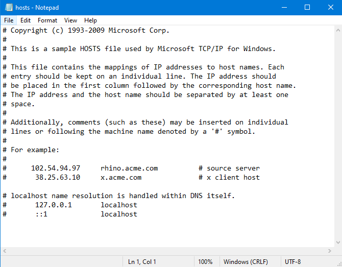

# DNS 캐시 테이블

###### 2020.02.04

>도메인 네임과 IP 주소의 대응관계를 저장한 테이블
>
>ipconfig/flushdns : dns 캐시테이블 초기화
>
>ipconfig/displaydns : dns 캐시테이블 출력

## I. `police.go.kr` 도메인 네임을 `116.67.118.148` IP 주소로 바꿔주는 과정

1. 사용자가 도메인 네임을 입력하면 해당 도메인 네임에 대응하는 IP 주소를 다음 위치에서 검색한다.

    `C:\Windows\System32\drivers\etc\hosts`

    

2. `police.go.kr` 도메인 네임이 없으므로 **DNS 캐시 테이블**에서 해당 도메인 네임에 대응하는 IP 주소를 검색한다.

3. DNS 캐시 테이블에서 police.go.kr 도메인 네임을 검색했다면, 도메인 네임에 대응하는 IP 주소를 참조해 해당 사이트로 접속한다.

4. DNS 캐시 테이블에 해당 도메인 네임이 없다면 운영체제는 로컬 DNS 서버 IP 주소로 police.go.kr 도메인 네임에 대한 질의를 요청한다.

5. 로컬 DNS 서버로부터 도메인 네임에 대한 IP 주소를 응답받으면 해당 내용을 DNS 캐시 테이블에 반영한다.

### II. 공격들

#### 1) ARP 스푸핑 공격 : ARP 캐시테이블을 조작하는 공격

#### 2) DNS 스푸핑 공격 (파밍 공격) : DNS 캐시테이블을 조작하는 공격

#### 3) DHCP 스푸핑 공격 : 클라이언트에게 DNS 서버 IP 주소를 할당하는 DHCP 서버를 조작하는 공격