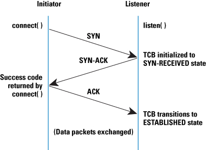

# UDP 방식과 TCP 방식

###### 2020.02.04

> UDP : 송신 측 호스트에서 송신 데이터가 생기면 곧바로 수신 측 호스트에게 전송
> TCP : 우아한 형태로 전송

### I. TCP 전송방식

#### 1) 3단계 연결 설정

1. 송신 측 호스트에서 송신 데이터가 생기면, 수신 측 호스트에게 **SYN**이라는 동기화 신호를 전송한다.

    (SYN : 수신 가능 여부를 붇는 내용)

2. 수신 측에서는 송신 측에서 보낸 SYN 신호에 대해 **SYN/ACK**라고 부르는 신호로 응답을 보낸다.

    (ACK : 송신 측 요청에 대한 수락을 의미, SYN : 수신 측에서 역으로 송신 측으로 동기화를 요청)

3. 송신 측 호스트가 수신 측으로부터 SYN/ACK 신호를 받으면 다시 **ACK** 신호를 전송한다.

    (ACK : 수신 측 동기화 여부를 요청하는 SYN 신호애 대한 응답)

#### 2) 연결을 확립한 뒤, 실제 데이터 전송 과정

1. 송신 측에서 데이터를 전송한 뒤, 수신 측으로부터 ACK 신호를 받을 때까지 대기한다.

2. 임의의 시간을 대기한 뒤에도 수신 측으로부터 ACK 신호가 없다면, 전송 중 로류가 발생했다고 판단하고 해당 데이터를 다시 전송한다.

3. 수신 측으로부터 ACK 신호가 오면 비로소 송신측에서는 그 다음 데이터를 전송한다.

#### 3) 3(4)단계 연결 종료

1. 송신 측에서 데이터를 모두 전송했다면 **FIN**이라 부르는 신호를 전송한다.

    (수신 측과 연결을 종료한다는 뜻)

2. 그럼 수신 측에서는 **ACK/FIN** 신호라고 부르는 신호로 응답을 보낸다.

    - 만약 송신 측에서 FIN 신호를 보낸 직후 수신 측에서 아직 데이터를 처리하는 중이라면, **ACK** 신호를 먼저 보내고 처리가 끝나면 **FIN** 신호를 보낸다.

3. 마지막으로 송신측에서 수신 측으로부터 받는 FIN 신호에 대한 응답으로 **ACK** 신호를 마지막으로 보낸 뒤 최종적으로 연결을 종료한다.

>TCP 방식이 이러한 3단계 연결 설정과 3(4)단계 연결 종료를 수행할 수 있는 이유는 버퍼링 때문이다.
>
>TCP와 UDP 방식은 버퍼링의 유무에 따라 구분할 수 있다.
>
>UDP는 시간에 민감한 환경에서, TCP는 안정적인 전송을 요구하는 환경에서 사용한다.
>
>**TCP방식에 따른 외부와의 연결 상태를 확인할 수 있는 방법 :  `netstat -n`**

### II. 포트번호

- 맥 주소와 IP 주소처럼 인터넷 공간에서 사용하는 주소로 16비트로 이루어진다.

- 소켓 : 운영체제가 논리적인 방식에 따라 서로 떨어진 두 대의 호스트를 연결해주는 인터페이스

- 주요 포트번호

    |포트 번호 | 해당 서비스 | 비고 |
    |---|---|---|
    |20/21번 |FTP| TCP 방식|
    |22번 | SSH| TCP 방식|
    |23번 | TELNET | TCP 방식|
    |25번 | SMTP | TCP 방식|
    |53번 | DHCP | UDP/TCP 방식|
    |67/68번 | DHCP | UDP 방식|
    |80번 | HTTP | TCP 방식|
    |110번 | POP3 | TCP 방식|
    |161/162번 | SNMP | UDP/TCP 방식|
    |443번 | SSL | TCP 방식|