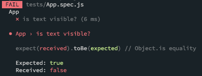
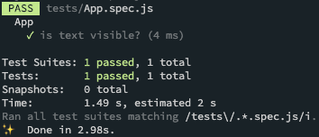

# 앱 Desing 및 Component 정의

###### 2020.06.05

## I. 앱 디자인 및 컴퍼넌트 정의


### 1) AddToDo Component
- Rendering
  - TextInput Component를 표시한다.
  - Button Component를 표시한다.
- Interaction
  - Button을 클릭했을 때 TextInput의 입력을 가지고 콜백 함수를 호출한다.

### 2) ToDoList Component
- Rendering
  - FlatList를 표시한다.
- Interaction
  - 전달된 인자를 정확하게 FlatList로 전달한다.

### 3) ToDoItem
- Rendering
  - Text를 표시한다.
  - Button을 두개 표시한다.
  - Uncompleted일때는 normal 상태를 표시한다.
  - Completed일때는 completed 상태를 표시한다.
- Interaction
  - Complete 버튼을 누르면 index 값을 onComplete로 전달한다.
  - Delete 버튼을 누르면 index 값을 onDelete로 전달한다.


## II. App E2E 테스트

### 1) 추가
1. 입력필드에 내용을 입력한다.
2. 추가 버튼을 누른다.
3. 목록에 내용이 표시되는지 확인한다.

### 2) 완료
1. 입력필드에 내용을 입력한다.
2. 추가 버튼을 누른다.
3. Normal 상태인지 확인한다.
4. 완료 버튼을 누른다.
5. Completed 상태인지 확인한다.

### 3) 삭제
1. 입력필드에 내용을 입력한다.
2. 추가 버튼을 누른다.
3. 목록에 내용이 표시되는지 확인한다.
4. 삭제 버튼을 누른다.
5. 목록에 내용이 표시되지 않는지 확인한다.

## III. 첫번째 테스트 코드 작성
- `tests/App.spec.js`

> jest가 e2e테스트까지 해버리는거 막아주기 : package.json에서 scripts - test를 바꿔주기 ("jest tests/.*.spec.js")

### 1) RDD
```js
describe("App", () => {
  it("is text visible?", () => { })

  it("is addToDo visible?", () => { })

  it("is todoList visible?", () => { })
})
```

### 2) Make it fail
1. 코드 작성 (`tests/App.spec.js`)
```js
describe("App", () => {
  const wrapper = shallow(<App></App>);

  it("is text visible?", () => {
    expect(wrapper.find("Text").contains("To Do List")).toBeVisible(true);
  });

  // it("is addToDo visible?", () => { })
  // it("is todoList visible?", () => { })
});
```
2. 테스트 (`yarn test`)
  

### 3) Make it green
> 주의 : 테스트 코드를 작성 한 부분만 코드를 작성하는 것이 TDD 방법론의 약속

1. 코드 작성 (`src/App.js`)
```js
import React from 'react';
import { View, Text } from 'react-native';

export default () => {
  return (
    <View>
      <Text>To Do List</Text>
    </View>
  )
}
```
2. 테스트(`yarn test`)
  


## III-2. 위와 유사한 코드 진행
> Make it fail, Make it green 반복
